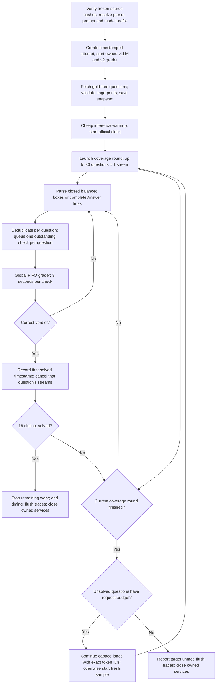

# Mathematical reasoning speedruns

Run streamed mathematical reasoning, verify prospective answers with a serial
grader, and measure time to 18 distinct correct questions. The current entrypoint
is **`python -m runner_final.run_frozen_v2`**. Its frozen core supports exact
mathematical expressions and obtains gold-free questions from the grader. AIME
2025 is the development dataset; AIME 2026 and the Apex shortlist are separate
configured datasets. Earlier runners and their evidence remain available.

## Run the frozen core v2

Run from the repository root on `callosum`, after local tests, commit/push and
`git pull --ff-only`. Check `nvidia-smi` and existing services first; the runner
requires an available GPU and free ports 8000/8077 when it owns the services.
Use a durable `tmux` session for experiments.

```bash
ssh callosum
cd /home/azureuser/aime-bench
git pull --ff-only
nvidia-smi
tmux new -s aime-core-v2
~/.venvs/vllm/bin/python -m runner_final.run_frozen_v2 \
  --benchmark-year 2025 --seed 20261011
```

The default [math preset](runner_final/presets/math_core_v2.json) selects the
settings below. `--preset FILE` selects another configuration;
`--system-prompt-file FILE` overrides its prompt. Other CLI arguments override
preset defaults. `--help` displays options without starting an experiment.

| Setting | Default |
| --- | --- |
| Model | `r0b0tlab/VibeThinker-3B-NVFP4` |
| Inference | NVFP4 Marlin weights, BF16 activations/KV, FlashInfer attention |
| Model profile | `~/models/r0b0tlab/VibeThinker-3B-NVFP4/vllm-flashinfer.yaml` |
| GPU allocation / total context | 95% / 65,536 tokens |
| Coverage | All 30 AIME 2025 questions, one initial stream each |
| Scheduling | Barrier: finish the current coverage round before starting the next |
| Output budget | 8,192 initially; up to 16,384 **additional** tokens per later request |
| Per-question cap | Four generation requests total, including continuations |
| Sampling | Temperature 0.8, top-p 0.95; deterministic request seed offsets |
| Stop target / grader toll | 18 distinct verified correct / three seconds per FIFO check |
| Warmup / instrumentation | Cheap 30-stream × 32-token warmup / benchmark mode |

The server profile is included as [a reference](runner_final/vllm-flashinfer.yaml).
Weights and the deployed profile must already exist under `~/models`; read that
machine's `~/models/README.md` for provisioning. vLLM runs in `~/.venvs/vllm`;
the runner launches the grader with `grader/.venv/bin/python`. For a new checkout,
create that environment and install `grader/requirements-local.txt`:

```bash
python3 -m venv grader/.venv
grader/.venv/bin/pip install -r grader/requirements-local.txt
```

The root
`requirements.txt` supports local analysis and tests; it does not provision vLLM.
All commands below assume those remote environments are ready.

```bash
# Transfer check on AIME 2026, with the same policy.
~/.venvs/vllm/bin/python -m runner_final.run_frozen_v2 \
  --benchmark-year 2026 --seed 20261021

# Small plumbing check: selected question indices and a smaller target.
~/.venvs/vllm/bin/python -m runner_final.run_frozen_v2 \
  --questions 1 2 3 --target-correct 2 --seed 20261011

# Five declared, scored AIME 2025 seeds; no failed-trial replacements.
~/.venvs/vllm/bin/python -m runner_final.backtest_v2
```

### How an attempt executes



The round barrier includes each question's verification processing. A solved
question is removed from later rounds. An output-cap continuation reuses the
complete token prefix, clips its additional budget to the available context,
and consumes another request from the four-request cap. Prefix caching may help;
continuation does not guarantee that active KV state survives completion.
The selected preset has no staged or dynamic fan-out.

The [system prompt](runner_final/prompts/math_core_v2.txt) asks for a prospective
exact boxed answer before checking it. V2 accepts balanced `\boxed{...}` and
`\fbox{...}`, including fractions, radicals, variables and nested braces, or a
complete standalone `Answer:` line. It does not extract unmarked prose or
restrict answers to three-digit integers. Deduplication uses trimmed strings;
mathematical equivalence is decided by the grader. A candidate is only a solved
answer after a positive grader verdict.
The four-request cap limits generation requests, not verifier queries: every
distinct submitted candidate can incur another three-second check.

### Services, datasets and saved evidence

By default the runner owns and closes its vLLM and grader processes.
`--reuse-server` attaches to an idle matching inference server and leaves it
running. `--reuse-grader` attaches to a fresh v2 grader with zero queries and the
requested toll, leaving it running. Neither flag authorizes stopping unrelated
services. The old grader lacks `GET /questions`; use `grader/server_v2.py`.

Use `--grader-config FILE` for an owned grader with a custom dataset, or
`--preset runner_final/presets/apex_core_v2.json` for the pinned 47-question Apex
bundle. See [custom grader configuration](runner_final/README.md#frozen-core-v2-general-mathematical-answers-and-grader-fed-questions).
The solver receives only question indices and statements from the API.
Apex #25/#26 overlap AIME 2025, so it is not a fully unseen transfer set.

Each run creates `attempts/<UTC timestamp>/`. `config.json` records source/core,
prompt/preset/profile hashes, resolved settings and dataset provenance;
`questions.json` is the gold-free snapshot. `summary.json` and `solved.jsonl`
record distinct first-solved verdict timestamps and time to target.
`trace/01/`, `trace/02/`, etc. hold question and verification records;
their `rollout-01/`, `rollout-02/`, etc. hold requests, responses, exact tokens,
start/end times and time to first token.

`time_to_target_s` starts after service initialization and warmup and ends at
receipt of the target verdict; `official_latency_s` also includes cancellation
settlement. Initialization, final trace flushing and service cleanup are reported
separately. Default `--benchmark` disables optional CPU/GPU/engine
sampling and holds required evidence in RAM until timing ends; it therefore
does **not** provide a measured peak VRAM or KV eviction counter. For profiling, select
`--preset runner_final/presets/math_core_v2_profile.json`, which omits benchmark
mode and enables optional sampling. A hard crash can lose buffered evidence.

Use stdout for live question/round progress; buffered traces are not complete
until the final flush. Inspect `summary.json` for `target_reached` and
`time_to_target_s`: a finished process alone does not prove the target was met.
Graceful interruption saves partial evidence when possible; unmet and failed
attempts stay unranked.

Copy reviewed artifacts back locally, then run
`python -m runner_final.core_v2.metadata ATTEMPT_DIRECTORY` to validate v2 metadata
and annotate the intervention/reference before committing. Start the viewer with
`python -m src.viewer_server`; open [attempts](http://127.0.0.1:8765) or
[aggregate results](http://127.0.0.1:8765/results). Keep raw SSE, service logs and
grader audits on the remote machine; commit the allowlisted evidence and reports.
Full remote development instructions are in [AGENTS.md](AGENTS.md).

Core behavior is pinned by [the v2 manifest](runner_final/core_v2/manifest.json);
startup rejects drift. Change prompt/preset configuration for sweeps; behavior
changes require a new core version. Core v1 remains the measured historical
control, with its original sources and manifest preserved.

## Repository layout

```text
src/                 Common utilities and reusable libraries
  experiments/       Runners grouped by research question
  viewer/            Canonical attempt viewer and fixed exploratory archive
data/                Problem statements, answer key, provenance, scope annotations
runs/                Saved experiment records, generated reports, and plots
attempts/            Canonical remote attempts, traces, and telemetry
configs/vllm/        Versioned remote model launch profiles
test/                Unit tests and offline regression checks
docs/                Experiment guide, report index, and research reports
requirements.txt     Python dependencies
.env.example         API configuration template
```

## Setup

Use Python 3.11 or newer. Run commands from the repository root:

```bash
python3 -m venv .venv
.venv/bin/pip install -r requirements.txt -r grader/requirements-local.txt
```

The remote vLLM runner does not need an OpenRouter key. For the older API
experiments below, copy `.env.example` to `.env` and set `OPENROUTER_API_KEY`,
or export it in your environment. The dataset is included in `data/`; to fetch
it again:

```bash
.venv/bin/python -m src.fetch_dataset
```

## Earlier API experiments and viewers

Start a new 30-question benchmark (makes paid OpenRouter requests):

```bash
.venv/bin/python -m src.experiments.baseline.benchmark --concurrency 10
```

Browse saved responses locally:

```bash
.venv/bin/python -m src.viewer_server
```

Open [canonical attempts](http://127.0.0.1:8765) to select locally available
`attempts/` artifacts and inspect oracle outcomes, trajectories, continuations,
timing, and GPU telemetry. Saved canonical evidence is versioned, so detailed
views work from a fresh clone. New attempts need their artifacts copied from the
VM and committed after review. Refresh rereads files.

The [exploratory viewer](http://127.0.0.1:8765/exploratory) remains fixed to the
original Qwen run `20260930-155212`, including sample votes and Jev reviews.
Other exploratory experiment families have reports and artifacts under `runs/`.

The [overall results page](http://127.0.0.1:8765/results) aggregates all saved
attempts, plots recorded time to the eighteenth distinct positive grader verdict
against each attempt's start timestamp with a dotted best-so-far Pareto step,
and marks the 54-second minimum serial grader toll (18 × 3s). It links each
intervention to its reference attempt and exposes changed and matched controls.
Unmet targets, failed runs, and missing timing evidence remain explicitly unranked.
Each attempt's `metadata.json` follows [the metadata schema](data/attempt_metadata.schema.json).
After importing new attempts, run `python -m runner_final.core_v2.metadata --all`, then
annotate the intervention/reference fields; existing annotations are preserved.
The x-axis uses initialization timestamps; latency uses the official clock after
warmup. Plot logic can be checked with `node test/test_results_history.js`.
The final-only pass@4 and Qwen35 GPTQ baseline points (2 and 3) are excluded from
the overall history plot and its scale; they remain in the full attempt table.

The overall viewer also groups attempts into configuration families and matched-setting
repeat groups. Choose a **Cluster** to filter every plot and the controls table.
Families match model/quantization, attention backend, AIME year/question set,
solving policy, budgets, sampling and VRAM settings; seeds, source versions, dataset
revisions, instrumentation and server reuse distinguish groups within a family.
The cluster table keeps all outcomes, with reached/total counts and successful-run
median/range. Expand a group to inspect its individual attempts and provenance.
These are descriptive groups from recorded controls, not proof of independent
replication. Canonical evidence stays at `attempts/<ID>/` so existing links work.

## Original canonical remote attempts (preserved)

See [the attempt workflow](docs/attempts.md) and [repo agent instructions](AGENTS.md).
On `callosum`, with a free GPU and configured model under `~/models`:

```bash
~/.venvs/vllm/bin/python -m src.attempt --model Qwen/Qwen3.5-4B
```

This manages CUDA/inference warmup, vLLM, the grader, eight concurrent questions
with four streaming rollouts each, early-verification cancellation, and telemetry.
Qwen uses a 16,384-token generation cap.

## Documentation and checks

- [Documentation index](docs/README.md): grouped experiment reports and results.
- [Experiment guide](docs/experiments.md): commands, configuration, and limitations.
- [Script guide](docs/scripts.md): what to run and when.
- [Run provenance](runs/README.md): producers, source inputs, and experiment context.
- [Baseline report](docs/reports/report.md): original single-pass results.

```bash
.venv/bin/python -m unittest discover -s test -v
```

Tests use local fixtures and mocked requests; they do not make inference calls.
The salvage tests require locally saved raw run traces. The Python worker tests
require macOS and `/usr/bin/sandbox-exec`.

Datasets, run summaries, analysis data, reports, and plots are versioned. Canonical
`attempts/` also includes saved requests/responses, exact token records, question
and round records, verification events, GPU samples, and launch/warmup metadata.
Full SSE streams, grader audits, and legacy exploratory `runs/` raw traces remain
ignored; detailed exploratory views and their analyses need the original local
traces. Credentials, virtual environments, downloaded models, caches, and logs
are also ignored.
Offline token-based analyses need the cached tokenizers described in the
experiment guide under `.local/tokenizers/`.

### AIME 2026 generalization benchmark

AIME 2025 remains the default development set. Add `--benchmark-year 2026` to
canonical, naive pass4, or speedrun commands to use the separate 30-problem test
set. New attempt configs/metadata record year, development/generalization role,
source revision, and prompt/grader hashes. The results viewer has a benchmark-year
selector. See [benchmark instructions](docs/attempts.md#benchmark-year-and-generalization-testing)
and [data provenance](data/README.md).

AIME 2024 is bundled as a separate 30-question prewarming workload. Select it
with `--benchmark-year 2024`; its default role is `prewarming`. See
[prewarming instructions](docs/attempts.md#aime-2024-prewarming-workload).

## Measured AIME results and preserved controls

The [core-v2 AIME 2025 back-test](runs/experiments/core-v2-aime2025-five-seeds-20261004T013100Z/README.md)
reached 18 in **5/5 declared-seed trials**: median **113.415s**, range
**86.088–145.437s**. Every same-seed v2 trial was slower than its historical v1
control. V2 incurred **62 wrong checks**, versus seven in the v1 batch;
**54 were literal placeholders**, costing 162 seconds across the batch. Its
broader parser admitted boxes such as `EXPRESSION`, `...` and `?`. V2 provides generalized mathematical answer support, but this
prompt/parser bundle does not improve the measured AIME speed. The comparison
keeps model/profile, seeds, scheduling, budgets and cheap warmup matched; the
batches ran sequentially on separate server lifetimes, so it does not isolate
prompt, parser or run-state effects.

For the faster measured AIME configuration, use the preserved frozen v1 core
with its improved prompt:

```bash
~/.venvs/vllm/bin/python -m runner_final.run_frozen \
  --preset runner_final/presets/prompt_adherence.json --seed 20261011
```

[That five-seed AIME 2025 batch](runs/experiments/frozen-core-prompt-five-seeds-20261004T005416Z/README.md)
reached 18 in **5/5 trials**, median **77.277s**, range **62.783–82.492s** on one
server. These batch statistics are the supported AIME speed reference; a fastest
historical draw is secondary context. The original `baseline.json` remains a
preserved prompt control. Both immutable cores and their manifests are unchanged.

[The v1 lightweight AIME 2026 transfer check](runs/experiments/frozen-core-aime2026-lightweight-20261004T011005Z/README.md)
reached 18 in **88.669s** with one wrong check. That single declared seed is
separate from the five-run 2025 statistics and is not a v2 transfer result.
See [runner version details](runner_final/README.md) and the earlier
[audited strategy report](docs/reports/final/report.md) for historical evidence.
