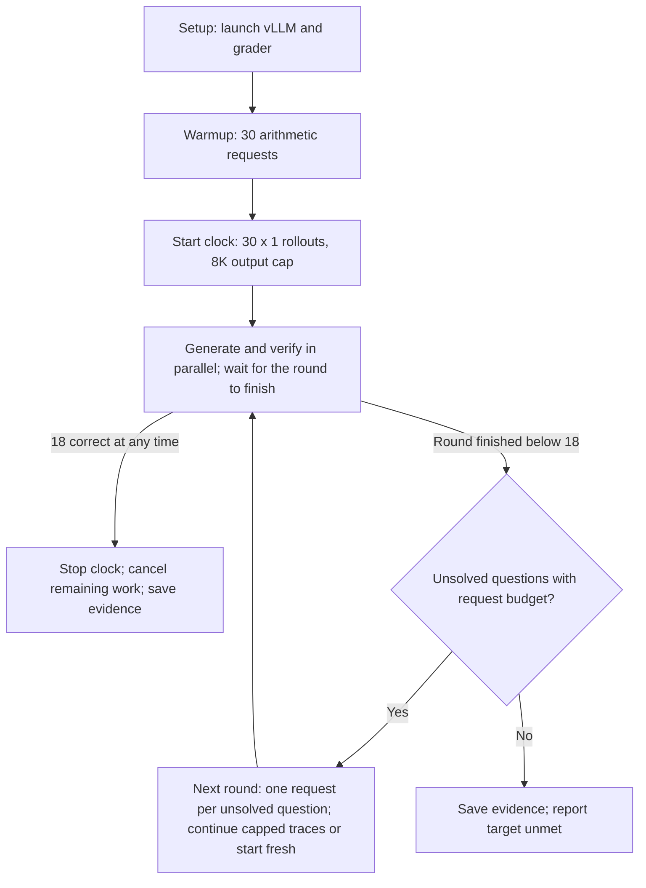

# Single-GPU AIME speedrun

Solve AIME problems with a locally hosted open-source model and minimize time to
**18 distinct grader-confirmed answers** on one A100 80GB. The final submission
uses **frozen core v1 with `prompt_adherence.json`**.

| Evaluation | Time to 18 | Evidence |
| --- | --- | --- |
| AIME 2025, five declared seeds | **5/5 reached 18; median 77.277s; range 62.783–82.492s** | [Validation and traces](runs/experiments/frozen-core-prompt-five-seeds-20261004T005416Z/README.md) |
| AIME 2025, five post-freeze extended seeds | 5/5 reached 18; median 78.305s; range 63.908–135.071s; 26–27 correct at exhaustion | [Extended curve and full baseline](results/post_freeze/measurements-v1-20261004T104200Z/README.md) |
| AIME 2026, unchanged v1 policy | **88.669s**, one wrong check | [Single transfer run](runs/experiments/frozen-core-aime2026-lightweight-20261004T011005Z/README.md) |
| Core v1.1 long rollouts, AIME 2025 | 5/5 reached 18; median 77.652s; range 60.906–92.096s | [Five-seed long-context experiment](runs/experiments/core-v1_1-five-seeds-20261004T083800Z/README.md) |
| Core v1.5 eager30, AIME 2025 | 5/5 reached 18; median 77.352s; range 65.015–85.464s | [Five-seed scheduling experiment](runs/experiments/core-v1_5-five-seeds-20261004T074500Z/README.md) |
| General-answer core v2, AIME 2025 | 5/5 reached 18; median 113.415s | [Extension back-test](runs/experiments/core-v2-aime2025-five-seeds-20261004T013100Z/README.md) |

**Read the [three-page report](docs/reports/final/output/pdf/callosum-speedrun-report.pdf)
and [evidence packet](docs/reports/final/output/pdf/callosum-evidence-packet.pdf).**
The packet includes the final five-seed marginal curve (E8) and the 54-attempt
history with frontier captions (E9), a new curve through 26 correct (E10/E11),
and complete BF16 baseline accuracy at 95% memory (E12). The historical fastest draw was 59.316s;
the final performance claim is core v1's five-run median above. Those v1 2025
trials share one inference-server lifetime; 2026 is a single fresh-server transfer check.

The [Nsight Compute diagnostic](runs/profiling/core-v1-ncu-20261004-single-pass/README.md)
adds a measured decode roofline: three graph samples attain 18–49% of nominal
HBM bandwidth, with growing context traffic as the active batch shrinks.
Its instrumented timing is excluded from the scored results above.

The [token and tail analysis](runs/analyses/core-v1-five-seeds-answer-tokens/README.md)
shows exact per-question tokens and verification slots 17/18 for the selected
five runs. An 8K cumulative cutoff would discard eight of their 90 recorded wins.

## Run the measured core v1

On the provided `callosum` node, use a tested checkout, an available GPU and free
ports 8000/8077. Run from the repository root in a durable session:

```bash
ssh callosum
cd /home/azureuser/aime-bench
git pull --ff-only
nvidia-smi
tmux new -s aime-speedrun
~/.venvs/vllm/bin/python -m runner_final.run_frozen \
  --preset runner_final/presets/prompt_adherence.json --seed 20261011
```

The node must already have vLLM in `~/.venvs/vllm`, the model weights and matching
profile at `~/models/r0b0tlab/VibeThinker-3B-NVFP4/vllm-flashinfer.yaml`, and a grader
Python environment. The [reference profile](runner_final/vllm-flashinfer.yaml)
is versioned; provisioning details are in the node's `~/models/README.md`.
Create the grader environment once if needed:

```bash
python3 -m venv grader/.venv
grader/.venv/bin/pip install -r grader/requirements-local.txt
```

| Measured setting | Value |
| --- | --- |
| Model / inference | VibeThinker-3B NVFP4, Marlin weights, BF16 activations/KV, FlashInfer attention |
| GPU allocation / total context | 95% / 65,536 tokens including the prompt |
| First round | All 30 questions, one rollout each, at most 8,192 generated tokens |
| Later rounds | One request per unsolved question; up to 16,384 additional output tokens |
| Per-question budget | Four generation requests total, including the initial request and continuations |
| Scheduling / concurrency | Round barrier; at most one active generation per question and 30 overall |
| Sampling | Temperature 0.8, top-p 0.95, recorded per-request seeds |
| Warmup | 30 requests for `Compute 1 + 1.`, each with 32 output tokens |
| Verification / stopping | Global FIFO grader, 3s per check; stop at 18 distinct positive verdicts |

### How an attempt executes



During every round, the parser submits new prospective integer answers while
generation continues. A wrong verdict leaves generation running; a correct
verdict banks the question and cancels its generation. The round finishes when
all its questions have finished generation and pending verification, unless the
18th positive verdict ends the run early.

In the next round, an unsolved trajectory that hit its output cap resumes from
its exact prompt and output token IDs, subject to the remaining 64K context.
A naturally completed trajectory or one with exhausted context starts a fresh
rollout instead. Each question gets **one continuation or one fresh rollout** in
that round. The measured preset keeps one active generation per question; it
never expands to 60 streams. Four requests means four total generation requests,
including continuations, rather than four retries after the first request.
Grader checks have a separate budget: each distinct submitted candidate costs 3s.

### Repeat, inspect, and transfer

```bash
# Repeat the five predeclared v1 seeds; retain every outcome.
~/.venvs/vllm/bin/python -m runner_final.validate_frozen

# AIME 2026 with the same v1 preset.
~/.venvs/vllm/bin/python -m runner_final.run_frozen \
  --preset runner_final/presets/prompt_adherence.json \
  --benchmark-year 2026 --seed 20261021
```

Use `--help` to inspect arguments. The explicit preset matters: `run_frozen`
without `--preset` selects the original-prompt baseline control. `--reuse-server`
attaches to an idle matching vLLM server and leaves it running; the default owns
and cleans up its inference and grader services.

Each attempt saves settings and hashes in `config.json`, the result in
`summary.json`, first-solved events in `solved.jsonl`, and per-question
requests/responses, exact tokens and verification records under `trace/`.
**`time_to_target_s`** ends at receipt of the eighteenth distinct positive verdict;
`official_latency_s` additionally includes cancellation settlement. Setup,
warmup, final trace writes and service cleanup are recorded separately.
The measured preset buffers required traces until timing ends and disables
optional profiling; GPU/engine telemetry is therefore unavailable in these runs.
See the [runner contract](runner_final/README.md) for configuration and evidence.

## Browse the evidence locally

Use Python 3.11+ from the repository root:

```bash
python3 -m venv .venv
.venv/bin/pip install -r requirements.txt -r grader/requirements-local.txt
.venv/bin/python -m src.viewer_server
```

Open [attempt traces](http://127.0.0.1:8765) or
[results and configuration groups](http://127.0.0.1:8765/results).
Canonical evidence is versioned and available from a fresh clone. Historical
hosted-model raw traces and full SSE/service logs are retained separately;
the [experiment guide](docs/experiments.md) identifies their prerequisites.
OpenRouter is used for archived exploration, and is unnecessary for the final run.

## General-answer extension and experiment archive

[Core v2.1](runner_final/core_v2_1/README.md) adds CPU syntax validation and
expression-key deduplication to v2, preserving its prompt and scheduling.
Its offline replay retained all 90 previously correct candidates and rejected
56/62 wrong submissions. One [benchmark-mode trial on each dataset](runs/experiments/core-v2_1-benchmarks-20261004T161700Z/README.md)
reached 18 on AIME 2025 in 82.445s, with two wrong checks; Apex reached 13/47
at the 900s deadline. Recorded validation CPU work was 0.166s/0.809s.
These are single-trial measurements, not repeatability statistics.

Core v2 adds arbitrary mathematical expressions and grader-provided question
statements. It reached 18 in all five AIME 2025 trials but was slower in every
same-seed comparison. Its broader parser admitted prompt placeholders, causing
54 of 62 wrong checks. The [v2 contract and commands](runner_final/README.md#frozen-core-v2-general-mathematical-answers-and-grader-fed-questions)
cover custom datasets and the Apex shortlist. Both frozen cores retain their
recorded behavior; the extension is separate from the measured v1 submission.

The [core v1.1 long-rollout experiment](runs/experiments/core-v1_1-five-seeds-20261004T083800Z/README.md)
reached 18 in all five seeds, median **77.652s** versus v1's **77.277s**. All
trials stopped on their 30 initial rollouts, so eager fresh retries were not
exercised. It used fewer requests but 2.8% more observed output IDs, with two
same-seed gains and three regressions. It does not establish a consistent speedup.

The [core v1.5 scheduling experiment](runs/experiments/core-v1_5-five-seeds-20261004T074500Z/README.md)
eagerly filled 30 request slots with continuations or fresh retries. It reached
18 in all five seeds, but did not improve the median: **77.352s versus 77.277s**.
Only one same-seed comparison was faster, despite 71.8% more generation requests.
V1.5 used a fresh server per trial; v1 shared one server lifetime. The measured
submission remains core v1.

| Location | Contents |
| --- | --- |
| [runner_final/](runner_final/README.md) | Frozen policies, prompts, presets and validation commands |
| [attempts/](attempts/) | Canonical run evidence and verdict timing |
| [runs/](runs/README.md) | Experiment reports, summaries and plots |
| [docs/](docs/README.md) | Report index, experiment guide and historical workflows |
| [src/](src/) | Common utilities, historical policies, exploration and viewers |
| [configs/](configs/) | Versioned launch profiles and experiment configurations |
| [test/](test/) | Offline checks |

Develop locally, test, commit/push, then pull the tested commit on the node before
GPU experiments; see [AGENTS.md](AGENTS.md). To run the offline suite:

```bash
.venv/bin/python -m unittest discover -s test -v
```

Some legacy checks require ignored raw traces or macOS sandbox support. Frozen
core manifests reject source drift; preserve them when adding a new policy.

The independently frozen [v2.2 correction runner](runner_final/core_v2_2/README.md)
adds batched wrong-verdict feedback after queued self-corrections have been checked:
`python -m runner_final.run_frozen_v2_2 --benchmark`. It preserves the v2.1 parser,
prompt and four-request budget; see that contract for branching and usage details.
