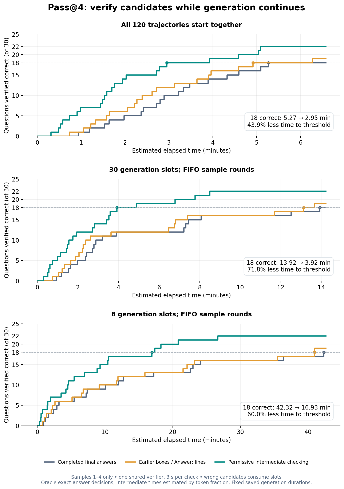

# Pass@4: verify intermediate candidates while the solver continues

Using **samples 1–4 only** from the original 240-trajectory run, permissive early
checking reaches 18 correct questions substantially earlier in this back-test.
The original first-four final answers cover exactly **18/30** questions; their
intermediate candidates cover **22/30**, recovering Q9, Q18, Q20, and Q23.



## Time to 18 distinct verified-correct questions

| Generation schedule | Completed final answers | Earlier boxes / Answer: lines | Permissive intermediate checking | Time reduction vs final |
| --- | ---: | ---: | ---: | ---: |
| All 120 selected trajectories start at zero | 315.95 s (5.27 min) | 295.11 s (4.92 min) | **177.10 s (2.95 min)** | **43.9%** |
| 30 generation slots, FIFO sample rounds | 835.19 s (13.92 min) | 787.13 s (13.12 min) | **235.48 s (3.92 min)** | **71.8%** |
| 8 generation slots, FIFO sample rounds | 2539.15 s (42.32 min) | 2456.25 s (40.94 min) | **1016.03 s (16.93 min)** | **60.0%** |

These are counterfactual replay results, not measured end-to-end streaming runs.
The top row isolates the benefit of checking earlier within a fixed set of
parallel traces. The middle and bottom rows also include generation-slot reuse
after a question is correctly verified. All schedules use the saved durations unchanged;
the provider's actual throughput may change with concurrent load.

## Policy and fairness

- One shared FIFO verifier completes **one request every three seconds when
  busy**. Every negative result consumes its full three-second service time.
- Permissive candidates include boxes, `Answer:` lines, prose answer clauses,
  tentative conclusions, and literal equations for the quantity the problem asks
  for. Exact arithmetic and explicitly requested transforms are evaluated by the
  host. Toy, formatting, and intermediate-quantity candidates are retained.
- Candidate extraction and scheduling do not select by correctness. A saved key
  is consulted **only when a scheduled verification completes**, standing in for
  an accurate external verifier. No grader, model endpoint, SSH, or local
  inference was invoked.
- Repeated `(question, integer)` candidates are checked once across all four
  samples. This prevents identical repeated answers from clogging the queue.
- A negative verification leaves every running solver attempt untouched. Only
  a correct positive result retires that question's running attempts, queued
  verification jobs, and not-yet-started samples.
- The final-answer baseline has the same verification queue and early retirement
  after a correct final answer. It does not wait for all four samples to finish.

For the 120-slot replay, permissive checking performs **22 checks to reach 18**:
18 positive and four negative. The negatives are Q25 toy answers 3, 0, and 2,
plus the wrong Q7 answer 271. Across the full replay it checks 29 distinct
candidates, with seven negatives, and verifies 22 questions. Final-only checking
verifies 18 questions in 19 checks; markers verify 19 questions in 20 checks.

For the 30-slot replay, permissive checking performs **24 checks to reach 18**:
18 positive and six negative. The additional negatives are Q22's intermediate 5
and Q23's premature 600. The continuing trajectory can still supply the correct
610 afterward. Permissive checking starts 75 of the selected 120 trajectories;
the final-only baseline starts 84, because both retire solved questions.

For the 8-slot replay, permissive checking performs **25 checks to reach 18**:
18 positive and seven negative. Across the full replay it checks 30 distinct
candidates, with eight negatives, and verifies 22 questions. It starts 60 of the
selected 120 trajectories, compared with 75 for the final-only baseline. The
18th early success is Q22/sample 2 at 1016.03 seconds; final-only reaches its
18th success on Q12/sample 4 at 2539.15 seconds.

The 18th early success can differ from the 18th final-answer success: the target
is any 18 distinct correctly verified questions, as requested. The fixed first
four samples are not replaced by a favorable subset of the eight.

## Timing estimates and sensitivity

The original run used nonstream responses. It records successful-request duration
and complete text, **not intermediate delivery timestamps**. The primary estimate
is:

`candidate arrival = trajectory start + saved duration × token fraction`

The fraction uses the official cached Qwen tokenizer, advances to the next
completed line before exposing a candidate, combines reasoning and content in
generation order, and includes the small provider token overhead. Final-answer
availability is the saved natural request endpoint. No selected first-four sample
required an HTTP retry.

A sensitivity grid uses
`first-token delay + (duration − delay) × fraction^exponent`, with first-token
delays of 0, 5, and 15 seconds, and exponents 1, 1.5, and 2. Larger exponents
represent a higher time cost for later tokens while preserving the measured
endpoint; these are illustrative assumptions, not fitted decoding measurements.

- All-start-together early time to 18 spans **118.06–182.52 seconds**, compared
  with the same 315.95-second final baseline.
- The 30-slot early time to 18 spans **184.76–235.68 seconds**, compared with
  the same 835.19-second final baseline.
- The 8-slot early time to 18 spans **930.26–1040.53 seconds** (15.50–17.34 min),
  compared with the same 2539.15-second final baseline.

The direction of the improvement survives these timing scenarios. Its exact size
requires a live streaming run. Actual abort latency, saved GPU work, token billing,
and verifier contention beyond the assumed queue are not measured here.

This replay assumes accurate verification, matching the proposed grader service.
It does not establish that the hosted Qwen 7B verifier from the earlier experiment
can serve that role: that model falsely approved five of seven wrong probes.

## Reproduce and inspect

```bash
.venv/bin/python -m unittest test.test_backtest_early_verify
.venv/bin/python -m src.experiments.intermediate_answers.backtest_early_verify
```

`backtest_early_verify.py` rebuilds the permissive inventory from the saved source
traces and cached tokenizer, preserves the original run, and writes its artifacts
under `runs/20260930-155212/early_verify_pass4/`:

- `time_to_correct.png`, `.svg`, `.pdf`: step plot.
- `summary.json`: nine main replays, twenty-seven timing sensitivity replays, all
  charged checks, queue delays, generation starts, and verification milestones.
- `milestones.csv`, `per_question.csv`: threshold sequence and per-question times.
- `candidate_inventory.json`: source-grounded extracted candidates and token fractions.
