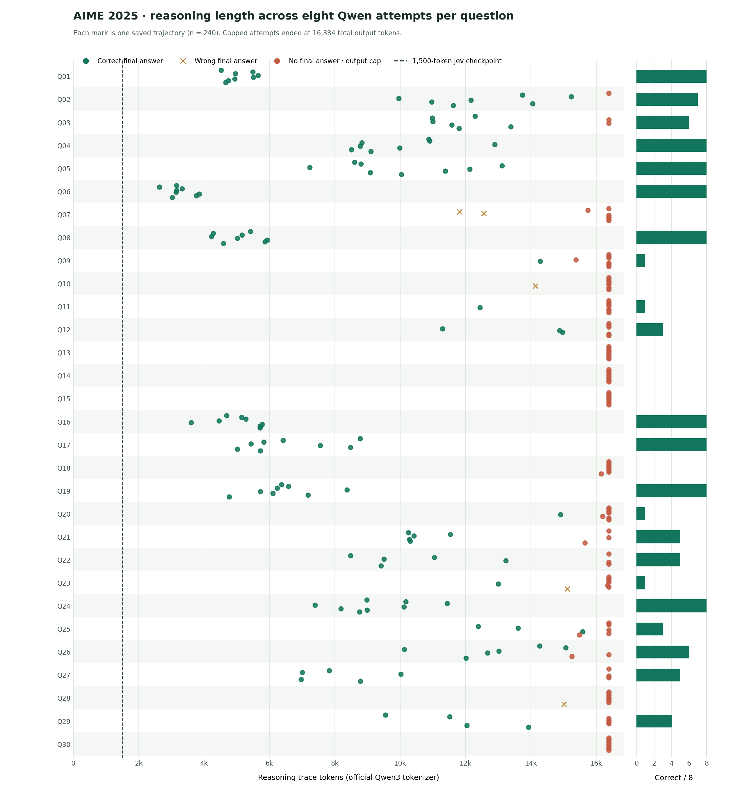

# Reasoning length and escalation checkpoints

The [SVG version](../../runs/20260930-155212/analysis/reasoning_tokens_by_question.svg)
is suitable for zooming. Each dot is one of the eight saved
`qwen/qwen3-30b-a3b` attempts per question. The x-axis uses the official Qwen3
tokenizer on the saved `message.reasoning` field, not the provider's optional
reasoning-token estimate. Green dots returned the correct final answer, amber
crosses returned a wrong final answer, and rust dots hit the 16,384 **total
output-token** cap with no final answer. The dashed line marks the earlier
1,500-reasoning-token Jev checkpoint. The complete per-attempt data is in
[`trajectory_metrics.json`](../../runs/20260930-155212/analysis/trajectory_metrics.json).

Of 240 attempts, 120 returned correct final answers, five returned wrong final
answers, and 115 reached the output cap with no final answer. Correct attempts
used a median **8,797 reasoning tokens**; capped attempts used a median
**16,384**. The median model API latency was **205 seconds** for correct
completions versus **385 seconds** for capped outputs. Five questions (13,
14, 15, 18, and 30) had no final answer across all eight attempts.

## What the same Qwen model did after a checkpoint

At each reasoning-token checkpoint, the denominator includes only trajectories
that had **not yet finished reasoning**. “Next 4k” means a correct final
response within 4,096 additional *total output* tokens. “By cap” means an
observed correct final response before the original 16,384-token cap.

| Reasoning checkpoint | Still reasoning | Correct in next 4k output | Correct by original cap |
| ---: | ---: | ---: | ---: |
| 1,500 | 240 | 14 / 240 (5.8%) | 120 / 240 (50.0%) |
| 5,000 | 220 | 30 / 220 (13.6%) | 100 / 220 (45.5%) |
| 9,000 | 176 | 28 / 176 (15.9%) | 56 / 176 (31.8%) |
| 13,000 | 135 | 17 / 135 (12.6%) | 17 / 135 (12.6%) |
| 15,000 | 120 | 3 / 120 (2.5%) | 3 / 120 (2.5%) |

These are **same-model continuation outcomes**, not the benefit of switching
models. Resampling whole questions (rather than individual attempts) gives a
95% bootstrap interval of **6.2–21.6%** for the 13,000-token “next 4k” rate
and **0–6.1%** for the 15,000-token rate. The intervals are broad because
attempts within a question are correlated and only 30 questions were sampled.
At 13,000 tokens, another full Qwen continuation has relatively little room
and a low observed success rate. Starting an escalated request earlier, around
9,000 tokens, is a **pilot hypothesis** for wall-clock savings, since waiting
until 13,000 consumes most of the original request's time. A larger model may
or may not solve the remaining cases; the current traces cannot establish
that comparison. A smaller first-pass model may have a different token-length
distribution, so the Qwen cutoffs should not be transferred without testing.
The saved Qwen calls were non-streaming, so these checkpoints were calculated
after completion. A live checkpoint requires streaming reasoning with a
tokenizer-aware counter or deliberately capping the first-pass request there.

## Generation attempts versus verification attempts

The saved first `n` Qwen generations per question yielded:

| Generations per question | Total model calls | Questions with any correct final answer | Final responses generated |
| ---: | ---: | ---: | ---: |
| 1 | 30 | 12 / 30 | 12 |
| 2 | 60 | 16 / 30 | 28 |
| 3 | 90 | 17 / 30 | 44 |
| 4 | 120 | 18 / 30 | 62 |
| 5 | 150 | 22 / 30 | 79 |
| 8 | 240 | 22 / 30 | 125 |

Here, pass@5 already equaled pass@8 **for this saved sample**. This is a
retrospective observation, not evidence that attempts 6–8 have no value in
future samples.

The 125 final responses contained only **26 distinct answer candidates**
across the 30 questions. If all eight outputs are generated but duplicate
answers are not resubmitted, verifying just the **first distinct final answer
per question** would require **25 verification submissions** and would still
cover all **22** questions solved by pass@8. A second distinct answer appeared
for only one question and did not increase the solved count. Thus in this
particular Qwen run, the verification budget is less restrictive than the
generation and latency budget. This may change substantially with a smaller
first-pass model or a stronger escalated model.

A retrospective policy that stops generating for a question at its first
parseable final answer would have used **104 rather than 240 model calls** and
kept the same 22 correct questions. It would serialize retries within each
question. Replaying the saved API latencies gives a slowest question path of
about **49 minutes**, so fewer calls do not by themselves imply a shorter
wall clock. Those latencies came from different real concurrency conditions,
and this replay is not a measured end-to-end runtime. For a wall-clock
decision, the next experiment should compare parallel first-pass and
escalation schedules under the same live concurrency limit.

## What is needed to choose an escalation point

Use an actual smaller-model pilot and a specified verification budget `N`.
For each question, record time and tokens until its first distinct final
answer, then evaluate at several checkpoints (for example 1,500, 5,000,
9,000, and 13,000 reasoning tokens):

1. Continue the smaller model alone.
2. Launch the stronger model from the original question at the checkpoint.
3. If supported, launch the stronger model with the smaller model's prefix as
   context, while keeping the same answer-selection and verification policy.

Compare pass@`N`, distinct submissions used, model requests, and **wall clock
from first inference to last needed result**. Randomize or pair these routes
by question and seed, since the hard questions dominate both latency and
accuracy. The existing Qwen traces supply a baseline for how much continued
Qwen generation was worth; they cannot estimate the improvement from a model
that has not been run.

For a concrete decision rule, compare the stronger route on the **same
unresolved questions** at a chosen checkpoint. At 13,000 Qwen reasoning
tokens, the observed continuation success rate by the original cap is 12.6%,
with a question-cluster bootstrap upper bound of about 21.6% for a 4k-output
window. A stronger route needs a measured improvement beyond that uncertainty,
after accounting for its additional API latency and how many distinct answers
the verifier can accept. At 15,000 tokens the observed Qwen success rate is
only 2.5%, but that trigger is so late that it offers little chance to reduce
end-to-end time.

[`checkpoint_summary.json`](../../runs/20260930-155212/analysis/checkpoint_summary.json)
contains all checkpoints, 2k/4k/8k lookahead windows, and question-cluster
bootstrap intervals. [`budget_summary.json`](../../runs/20260930-155212/analysis/budget_summary.json)
contains the pass@`N` and distinct-verification calculations. No external
grader script was invoked; correctness is local exact integer comparison.
