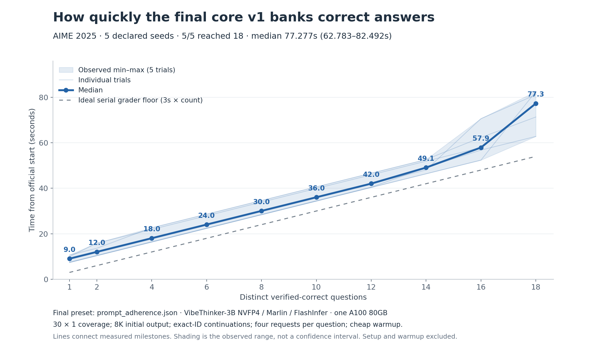

# VibeThinker evidence packet

**Callosum interview reference | 4 October 2026**

## E0. Start here: claims, decisions, and where to look

This packet supports the three-page report with **local VibeThinker-3B BF16 and NVFP4 evidence on one A100 PCIe 80GB**. Hosted-model experiments appear separately in Appendix A.

| Interview question | Evidence to open | PDF page |
| --- | --- | --- |
| What are the three latency targets? | [E1: actual verification timeline](#e1) | 2 |
| What did the experimental 30/60/120 tradeoff show? | [E2: BF16 throughput tradeoff](#e2) | 3 |
| Why buffer traces until the end? | [E3: stacked CPU profile](#e3) | 4 |
| What did dynamic fan-out and continuation achieve? | [E4: allocation and verdicts](#e4) | 5 |
| What supports NVFP4 and the backend choice? | [E5: complete trial outcomes](#e5) | 6 |
| Where is each report citation and its raw evidence? | [E6: collated docket, original IDs 1-9](#e6) | 7 |
| What happened with Qwen, CPU salvage, tools, and voting? | [Appendix A: additional experiments](#a1) | 8 |
| Did quantization improve decoding, TTFT, and first submission? | [E7: run-level latency analysis](#e7) | 9 |
| How quickly does the final core v1 bank answers? | [E8: five-seed marginal timing](#e8) | 10 |
| How did best-observed timing progress in the 54-attempt snapshot? | [E9: historical experiment snapshot](#e9) | 11 |

### The strongest observed strategy comparison

BF16 final-only pass@4 reached 18 in **336.497s**, versus **92.428s** for coverage/continuation: **3.64x observed improvement**. Both used the same model, 80% memory allocation and zero wrong checks. Other controls differed; this compares complete strategies, not isolated effects. [Baseline and strategy record](../../../attempts/20261003T202152.418590Z/README.md).

### Measurement contract

**Time to 18** ends at the eighteenth distinct positive verdict. Setup, warmup, cancellation settlement and buffered writes are separate. The global FIFO grader charges three seconds per check: a **54-second floor**, plus first-answer delay, wrong checks and idle gaps.

**TTFT measures first output; answer arrival is separate.** Generation, client CPU work and grader waits overlap, so their durations cannot be added indiscriminately.

**Selected policy.** Frozen core v1 uses NVFP4/Marlin + FlashInfer, 30 x 1 barrier and four requests per question. Dynamic60 remains experimental. Five-seed replication is in E5/E8; stopping at 18 does not establish full accuracy. Historical frontier draws are distinct from repeated performance. [Core and presets](../../../runner_final/README.md).

<!-- pagebreak -->

## E1. Verification timeline: the three latency targets

**Read the plot.** Orange triangles mark checked candidates; connectors show queue waits. Teal spans are correct checks, red spans wrong checks, and blank spans grader idle time. The lower panel counts distinct first successes.

| Improvement target | Evidence in the plot | Engineering response |
| --- | --- | --- |
| First usable answer | Time before the first triangle/check; TTFT alone misses this | Warm serving; start 30 x 1; expose intermediate proposals |
| Useful grader utilization | Blank spans and red checks between correct checks | Overlap decoding/grading; deduplicate; one pending check per question |
| Late-answer tail | Long gaps near the right edge; late steps toward 18 | Recycle freed slots; try siblings and exact-ID continuations; cancel solved work |

**BF16 30 x 1:** 5.055s to first pickup + 54.002s service + 12.076s idle gaps, approximately 71.135s. **BF16 30 x 4:** 11.332s + 57.002s + 46.279s, approximately 114.615s. The plotted NVFP4 16K trace is the **profiling-on 106.570s control**, with 60.002s service and two wrong checks, distinct from the 106.931s buffered rerun.

**Decision.** Bring useful candidates forward and reduce idle gaps. Each wrong check adds three seconds; aggressive filtering can delay correct candidates. Dynamic sampling targets the late gaps, but its effect needs measurement.

**Source and audit:** [Runner profiling and benchmarking overhead](../../../runs/profiling/20261003-cpu-review/README.md); [query-level times and CPU chart data](../../../runs/profiling/20261003-cpu-review/analysis.json). Original report references **[3], [5]**; docket E6.

<!-- pagebreak -->

## E2. Why 60 active requests? An informed compromise

**Observation.** The left panel shows higher aggregate token output at wider concurrency. The right shows the cost to individual trajectories: the wider fan-out runs decode more slowly per active request. The pooled curve is not strictly decreasing; it rises again in the highest bin. The evidence supports a throughput/speed tradeoff, rather than a universal monotonic rule.

| Initial sweep setting | Aggregate decode tok/s | Tok/s per active request |
| --- | --- | --- |
| 30 x 1 | 2,491 | 115.5 |
| 30 x 2 | 4,053 | 94.6 |
| 30 x 4 | 5,435 | 69.7 |

**Experimental interpretation.** Dynamic60 started one rollout per question for broad early coverage, then allowed up to 60 active requests as a middle ground between 30 and 120. Generation, source profiles and active question mix varied; 60 is not a measured optimum. The selected frozen core instead retains 30 x 1 barrier coverage and four requests per question. This experiment was motivated by BF16 observations, not fitted on the NVFP4 outcome.

**Method and limits.** Rates use engine-counter windows after initial first tokens, excluding warmup and windows with waiting requests at either endpoint. Windows crossing concurrency bins are excluded. Per-active rates use approximate request-seconds from sampled counts. Context lengths, question mix, cancellations, and trajectories vary; this is not a fixed-context scaling experiment. The 33-64 bin averaged 52.9 active requests, 4,056 aggregate tok/s, and 76.7 tok/s per request. It does not measure a constant 60-request workload.

The single dynamic60 NVFP4 run reached 18 at 127.565s, slower than the earlier 106.931s NVFP4 16K run. A matched repeated comparison of 30/60/90 slots would test the compromise; the current evidence does not establish 60 as best. Such a comparison would need consistent budgets, profiles, telemetry, and all outcomes retained.

**Sources:** [Observed decoding throughput versus concurrency](../../../runs/profiling/20261003-decode-throughput/README.md), [window-level data](../../../runs/profiling/20261003-decode-throughput/analysis.json), and [BF16 sweep outcomes](../../../runs/speedrun_sweeps/bf16-95pct-20261003T210226Z/README.md). Original report reference **[3]**; docket E6.

<!-- pagebreak -->

## E3. Why buffer traces? Move avoidable CPU work

**Observation.** Trace serialization/write/flush grows from **5.41 CPU-seconds at BF16 30 x 1** to **8.87 at 30 x 2** and **16.28 at 30 x 4**. Total client CPU grows from 34.40 to 55.59 to 94.13 CPU-seconds. JSON decoding and candidate parsing also grow. The hatched remainder includes HTTP/asyncio, stream handling, bookkeeping, and other unmeasured work; it cannot all be labeled profiling overhead.

**Decision.** Keep required stream rows, exact token IDs, candidates, and verdict timestamps in RAM while solving; serialize and flush them afterward. This removes synchronous trace persistence from the timed path. Live stream ingestion and candidate parsing still happen. Benchmark mode additionally disables optional CPU instrumentation, engine polling, and NVML sampling. Buffering alone and disabling profiling are separable controls; the combined trial does not isolate either one's effect.

| Matched NVFP4 30 x 1 / 16K comparison | Profiling on | Buffered benchmark |
| --- | --- | --- |
| Official runner CPU | 52.606 CPU-s | 37.509 CPU-s |
| First 18 verified correct | 106.570s | 106.931s |
| Final deferred flush | Immediate writes | 1.943s after timing |

The pair supports **28.7% lower measured CPU use**, without an observed end-to-end speedup. All initial request payloads and prompt IDs matched, but output trajectories changed. A local seven-repeat replay also reduced CPU by 27.7% with batched flushes and deferred meter aggregation; that replay excluded HTTP, GPU inference, and asynchronous concurrency.

**Costs and measurement boundary.** RAM buffering trades crash durability for less synchronous work. Graceful interruption flushes partial records; a hard crash can lose them. The measured objective excludes final flush, so retain its duration and report it if asked about total artifact-complete runtime. Optional GPU observations are unavailable in benchmark mode, rather than inferred from another run.

**Sources:** [Runner profiling and benchmarking overhead](../../../runs/profiling/20261003-cpu-review/README.md), [instrumented CPU data](../../../runs/profiling/20261003-cpu-review/analysis.json), and [matched NVFP4 benchmark audit](../../../runs/experiments/nvfp4-30x1-16k-benchmark-20261003T215349Z/README.md). Original report reference **[5]**; docket E6.

<!-- pagebreak -->

## E4. Dynamic allocation and growing generation budgets

**Implemented behavior.** Thirty 8K streams start first. The first client grader submission, at **8.935s**, opens a pool of at most 60 active requests. Ready exact-ID continuations take priority; fresh 8K samples go to the least-active unsolved questions, with rotated ties. Solved questions release their slots and cancel siblings. One candidate queue and deduplication set span all samples for each question.

**Observed outcome.** The run used **112 fresh requests + 28 continuations**, reached 60 active streams, and gave some remaining questions up to five simultaneous samples. Every question stayed within eight requests, including continuations. Thirteen winners came from initial samples, four from extra fresh samples, and one from a continuation that supplied the eighteenth success. These identify winning requests, rather than counterfactual contributions.

The 8K/16K/32K/64K ladder is cumulative generated output, clipped to context including the prompt. All 28 actual extensions were **8K to 16K**; higher stages were unexercised. Prefixes matched exact IDs, but per-request cache-hit counts were unavailable and active KV retention was not established. The run reached 18 in **127.565s**, with 57.002s grader service and 61.573s idle gaps. Dynamic allocation worked; latency superiority remains unproven.

**Audit:** [Run analysis](../../../runs/experiments/nvfp4-dynamic60-budget-benchmark-20261003T222008Z/README.md), [admission ledger](../../../attempts/20261003T222009.163270Z/allocation.json), [prefix/budget audit](../../../runs/experiments/nvfp4-dynamic60-budget-benchmark-20261003T222008Z/analysis.json), and [declared controls](../../../configs/experiments/vibe-nvfp4-dynamic60-budget-v4.json). Original report references **[1], [6]**; docket E6.

<!-- pagebreak -->

## E5. Quantization, backend choice, and repeatability

**Configuration.** On this A100, the NVFP4 profile uses packed FP4 weights with Marlin and BF16 activations/KV. The later FlashInfer experiment changes the attention backend. These local results ground the choice; Blackwell native-FP4 throughput claims do not establish performance here. [Pinned model and serving profile](../../../docs/vibethinker-nvfp4.md).

| Completed comparison | All first-18 times (s) | Median (s) |
| --- | --- | --- |
| BF16 30 x 1, benchmark repeats | 117.17 / 134.52 / 135.65 | 134.52 |
| BF16, profiling restored | 116.28 / 150.07 / 152.01 | 150.07 |
| NVFP4 30 x 1, paired repeats | 115.40 / 96.67 / 96.67 | 96.67 |
| BF16, dynamic30 policy | 92.01 / 105.40 / 114.30 | 105.40 |
| BF16, exact original source | 102.99 | Single trial |
| NVFP4, four declared different seeds | 118.19 / 94.59 / 126.43 / 114.44 | 116.31 |
| NVFP4 + FlashInfer, development | 98.327 / 64.453 / 64.399 | 64.453 |

**Decision and strength of evidence.** The paired NVFP4 batch had a lower median than BF16, making it worth pursuing. It did not reproduce 71.135s. Seventeen follow-ups before the backend change failed to recover that historical result. A different-seed batch also failed to do so. Matching seeds, payloads, and prompt IDs does not freeze realized reasoning paths.

The FlashInfer development batch produced two runs below 71.135s, while retaining the slower first run. The first trial's median initial TTFT was **3.510s**, versus **0.198/0.240s** on the later trials. A short synthetic warmup did not establish that every official prompt path was fully settled. Startup and warmup costs remain separate from official solving time.

**Frozen core with stronger prompt, five declared seeds.** All reached 18: **71.321 / 77.277 / 82.492 / 81.102 / 62.783s**, median **77.277s**, range **62.783-82.492s**: the current five-run performance claim. Wrong checks were **4/2/0/1/0** and later grader idle **4.216/13.377/24.128/18.065/4.323s**. First-detected winners were 65 prose and 25 boxed. Cheap warmup and one reused server do not isolate prompt benefit or prove restart repeatability. The core and four-request cap stayed fixed. [All five records](../../../runs/experiments/frozen-core-prompt-five-seeds-20261004T005416Z/README.md).

**Completed validation.** The settling trial took **136.048s**; the three scored trials took **87.356/59.316/86.574s** (median 86.574s). Only one beat 71.134766841s, so the predeclared all-three gate failed. Prefix caches were reset before warmup, with a fresh grader and every outcome retained. The fastest scored run had 54.003s service and 0.483s idle; the other two had 25.657/27.739s idle. [Validation records](../../../runs/experiments/nvfp4-flashinfer-validation-20261003T233628Z/README.md). E7 separates decoding, TTFT, and first submission.

**AIME 2026 transfer, one declared seed.** The unchanged improved-prompt core reached 18 in **88.669s**, with 19 checks (one wrong), 57.002s service and 25.271s later idle. All 16 continuation prefixes matched exact IDs. This fresh-server single run is a transfer check, not repeated 2026 performance or full accuracy. [Records](../../../runs/experiments/frozen-core-aime2026-lightweight-20261004T011005Z/README.md).

**Sources:** [Full replication comparison](../../../runs/experiments/best-replication-20261003/README.md), [paired NVFP4 trials](../../../runs/experiments/nvfp4-best-warm-replicate-20261003T224630Z/README.md), [declared-seed outcomes](../../../runs/experiments/nvfp4-30x1-seed-comparison-20261003T231357Z/README.md), [FlashInfer development outcomes](../../../runs/experiments/nvfp4-flashinfer-best-replicate-20261003T233008Z/README.md), and [validation protocol](../../../configs/experiments/vibe-nvfp4-flashinfer-validation-v1.json). Original report reference **[4]**; docket E6.

<!-- pagebreak -->

## E6. Collated docket: preserve the report's citation IDs

Use these original IDs when a claim in the main report is challenged. Each entry gives the question it answers, packet location, and a route to the recorded evidence. Links point into the workspace; the PDF embeds all figures so the visual evidence travels with it. [Copied-figure hashes and provenance](evidence-assets/manifest.json).

### [1] Frozen policy and historical v4 -> E0/E4, pages 1/5

**Claim:** the selected frozen core uses 30 x 1 barrier coverage, four requests per question, streamed extraction/deduplication, one pending grader request per question, exact-ID continuation and cancellation. [Frozen core contract and presets](../../../runner_final/README.md). V4 admission rules below describe a separate experimental policy. [Runner catalogue](../../../src/attempt_runners/README.md); [canonical semantics and timing](../../../docs/attempts.md); [v4 allocation implementation](../../../src/attempt_runners/_allocation_v4.py); [v4 declared configuration](../../../configs/experiments/vibe-nvfp4-dynamic60-budget-v4.json).

### [2] Intermediate-answer replay -> Appendix A, page 8

**Claim:** earlier answers motivated the live runner; the hosted Qwen pass@4 replay estimates 315.95s to 177.10s with 120 simultaneous trajectories. [Replay report and limits](../../../docs/reports/early-verify-pass4.md); [machine-readable replay](../../../runs/20260930-155212/early_verify_pass4/summary.json). This is additional-model simulation evidence.

### [3] Concurrency tradeoff -> E1-E2, pages 2-3

**Claim:** wider BF16 fan-out raises aggregate output and costs per-trajectory speed; 60 is a heuristic. [Throughput figure/method](../../../runs/profiling/20261003-decode-throughput/README.md); [window data](../../../runs/profiling/20261003-decode-throughput/analysis.json); [sweep outcomes, KV, preemptions, CPU](../../../runs/speedrun_sweeps/bf16-95pct-20261003T210226Z/README.md).

### [4] Quantization and repeatability -> E5, page 6

**Claim:** NVFP4 decoding improved; TTFT did not, and first-submission significance remains unestablished. [Complete comparisons](../../../runs/experiments/best-replication-20261003/README.md); [comparison data](../../../runs/experiments/best-replication-20261003/analysis.json); [development](../../../runs/experiments/nvfp4-flashinfer-best-replicate-20261003T233008Z/README.md); [validation](../../../runs/experiments/nvfp4-flashinfer-validation-20261003T233628Z/README.md). [E7](#e7) adds [run measurements](analysis/first-grader/runs.csv), [statistics/provenance](analysis/first-grader/results.json), [backend log excerpts/hashes](analysis/first-grader/backend-evidence.json), and [reproduction script](analyze_first_grader.py).

### [5] Client CPU and grader activity -> E1/E3, pages 2/4

**Claim:** trace work grows with attempts; deferring writes reduces measured CPU, while the matched pair did not improve wall time. [CPU profile, verification timeline, replay](../../../runs/profiling/20261003-cpu-review/README.md); [query times and CPU totals](../../../runs/profiling/20261003-cpu-review/analysis.json); [buffered-pair audit](../../../runs/experiments/nvfp4-30x1-16k-benchmark-20261003T215349Z/analysis.json).

### [6] Dynamic60 and continuation -> E4, page 5

**Claim:** 60 slots and exact-ID continuation worked, but only 8K-to-16K stages ran and the trial was slower. [Run report](../../../runs/experiments/nvfp4-dynamic60-budget-benchmark-20261003T222008Z/README.md); [allocation ledger](../../../attempts/20261003T222009.163270Z/allocation.json); [first-solved events](../../../attempts/20261003T222009.163270Z/solved.jsonl); [prefix audit](../../../runs/experiments/nvfp4-dynamic60-budget-benchmark-20261003T222008Z/analysis.json).

### [7] Alternative extraction, stopping, and voting -> Appendix A, page 8

**Claim:** small-model semantic judgments and voting did not warrant adoption. [CPU salvage](../../../docs/reports/local-salvage.md); [hosted extraction/verification](../../../docs/reports/chunk-answer-extraction.md); [prompt pilot](../../../docs/reports/first-answer-pilot.md); [marker audit](../../../docs/reports/streaming-answer-markers.md); [Jev calibration](../../../docs/reports/jev-calibration.md); [self-consistency](../../../docs/reports/self-consistency.md); [Reflex-8](../../../runs/qwen35-4b-no-thinking-pass8-20261003/README.md).

### [8] Python tools -> Appendix A, page 8

**Claim:** optional Python improved observed hosted Qwen coverage; local VibeThinker latency needs validation. [Matched comparison and replay limits](../../../runs/no-python-qwen35-pass2-parasail-20261003/early_verify_pass2/report.md); [paired replay summary](../../../runs/no-python-qwen35-pass2-parasail-20261003/early_verify_pass2/summary.json).

### [9] Completed baseline comparison -> E0, page 1

**Claim:** 336.497s versus 92.428s is a measured 3.64x complete-strategy comparison. [Baseline with paired comparison](../../../attempts/20261003T202152.418590Z/README.md); [baseline summary](../../../attempts/20261003T202152.418590Z/summary.json); [coverage records](../../../attempts/20261003T200718.717581Z/README.md). The coverage README's 92.503s includes cancellation settlement; 92.428s is first-18 timing.

<!-- pagebreak -->

## A1. Appendix: additional models and hosted experiments

These experiments informed the design but are not local VibeThinker latency measurements. Their results should be described as motivation, diagnostic evidence, or targets for local replication. Original citation IDs **[2], [7], [8]** remain traceable through E6.

### Intermediate extraction and prompt-only stopping [2, 7]

The hosted Qwen3-30B-A3B first-four-sample replay covered 18/30 using final answers and 22/30 using permissive intermediate candidates. At 120 simultaneous saved trajectories, estimated time to 18 fell from 315.95s to 177.10s; a 30-slot replay estimated 835.19s to 235.48s. Delivery times were inferred from token fractions, and saved durations were reused across capacities. Neither is a live A100 throughput measurement. A streamed prompt pilot showed that asking for the first answer did not reliably stop rechecking, and conservative final-answer markers missed earlier prose candidates.

### CPU salvage, semantic extraction, and model verification [7]

Local CPU Gemma added no quote-grounded candidates beyond syntax recovery in the selected controls; median tail extraction was roughly 9-15s and full-trace reads were much slower. Hosted Gemma/Qwen chunk classifiers measured lower service latency, but scope judgments depended on prompt/formatting guards and small reused controls. The hosted Qwen 2.5 7B verification probe approved five of six correct candidates and **five of seven wrong ones**, leaving it unsuitable as a correctness certificate. These findings motivate deterministic extraction plus the accurate provided grader.

### Jev trajectory scoring [7]

Low rejection thresholds discarded little work; stronger thresholds missed correct completions. A 70% threshold rejected two of 54 observed successes within the specified continuation budget, while a 60% threshold rejected 16 eventually correct completions under the longer original cap. Capped traces were censored rather than proven unsalvageable. No live speedup from confidence-based pruning was established.

### Optional Python with hosted Qwen3.5 [8]

Final-only coverage was 19/30 with optional Python versus 15/30 without; matched permissive extraction yielded 24/30 versus 22/30. A 30-slot replay estimated 1.77 versus 2.93 minutes to 18. Original runs used eight active trajectories and occurred at different times; the replay does not establish live 30-slot latency. VibeThinker tool-use reliability and arithmetic/code quality require independent evaluation before adoption.

### Self-consistency and Qwen3.5-4B Reflex-8 [7]

In the Qwen3 eight-sample cohort, pass@8 covered 22/30, a unique modal vote 21/30, and a strict majority 15/30. Waiting for votes adds latency. The no-thinking Qwen3.5-4B probe produced only two questions with four-of-eight agreement, neither correct, and no correct unique top-vote answer. Accurate cheap grading favors independent candidate checking over waiting for consensus in this task.

### What remains to transfer locally

Replicate the answer-arrival and Python findings on the scored GPU/model before treating them as VibeThinker gains. Different-model capability comparisons should hold grader policy, question set, timing boundaries, and candidate extraction constant, while recording model/provider/context differences. [Prepared Qwen3.5 A3B GPTQ coverage plan](../../../docs/qwen35-gptq-coverage.md) is a preparation record, not a completed result in this packet.

**Direct source routes:** [replay](../../../docs/reports/early-verify-pass4.md), [prompt pilot](../../../docs/reports/first-answer-pilot.md), [CPU salvage](../../../docs/reports/local-salvage.md), [semantic sidecars](../../../docs/reports/chunk-answer-extraction.md), [Jev](../../../docs/reports/jev-calibration.md), [Python comparison](../../../runs/no-python-qwen35-pass2-parasail-20261003/early_verify_pass2/report.md), [voting](../../../docs/reports/self-consistency.md), and [Reflex-8](../../../runs/qwen35-4b-no-thinking-pass8-20261003/README.md).

<!-- pagebreak -->

## E7. Quantization: three separate claims

**Primary comparison:** three 30 x 1 / 8K warmed runs per profile, with FLASH_ATTN fixed. Saved server logs confirm FLASH_ATTN for BF16 and standard NVFP4, including the earlier BF16 best run. FlashInfer was an explicit later change. [Backend excerpts and hashes](analysis/first-grader/backend-evidence.json).

| Metric | BF16 | NVFP4 | Supported claim |
| --- | --- | --- | --- |
| Observed decode rate | 112.5 tok/s | 136.6 tok/s | +21% received-token rate; workload observation |
| Initial-request TTFT | 163ms | 205ms | 26% slower; no TTFT improvement |
| First grader submission | 6.713s | 4.482s | 33% lower mean; one-sided Welch p=0.056 |

**Definitions.** Decode and TTFT entries average each run's median over 30 initial streams. Approximate decode rate is received token IDs divided by the interval between first and last output delta; it includes the first delta's tokens. Cancellation, changing active load, contexts, and trajectories affect this rate. It is not fixed-concurrency GPU throughput. First submission is the earliest client verification-start timestamp minus official run start, before grader queueing or service.

**Statistical boundary.** BF16 first-submission times were 5.028/7.555/7.557s; NVFP4 times were 4.125/4.662/4.660s. One-sided unequal-variance Welch gives t=-2.590, df=2.179, p=0.0561. The NVFP4-minus-BF16 mean difference is -2.231s; its one-sided 95% upper bound is +0.149s. This does not establish improvement at alpha=0.05. The analysis is retrospective, with only three runs per group, sequential model batches, shared warmed servers/fixed seeds, and different source commits. Trial numbers do not justify pairing; 30 concurrent questions are not 30 independent runs.

**FlashInfer interpretation.** Scored validation averaged 146.7 tok/s, 189ms TTFT, and 4.780s first submission. Its strongest first-18 result came with only 0.483s later grader idle. Faster decoding and useful later arrivals remain promising; a first-submission improvement over standard NVFP4 is not observed here, and the repeatability gate failed.

**Next test:** randomized interleaved blocks across model/backend combinations, predeclared seeds and endpoints, consistent warmup, and repeated server starts. Analyze run-level outcomes; use paired differences only for deliberately matched blocks.

**Audit:** [per-run measurements](analysis/first-grader/runs.csv), [initial-stream counts/rates](analysis/first-grader/initial-streams.csv), [tests, caveats, and input hashes](analysis/first-grader/results.json), [reproduction script](analyze_first_grader.py). Method: [SciPy Welch/one-sided test](https://docs.scipy.org/doc/scipy/reference/generated/scipy.stats.ttest_ind.html). Original citation **[4]**; docket E6.

<!-- pagebreak -->

## E8. Final core v1: marginal time to verified answers

**Headline.** All five trials reached 18: median **77.277s**, range **62.783-82.492s**. The solid curve is the pointwise median; faint lines show individual trials and shading shows their observed minimum and maximum, not a confidence interval. The dashed line is the ideal three-second serial-grader service floor. Connected milestones do not imply that the pointwise median is one actual trajectory.

**Recorded milestone medians (seconds):** 1: **9.035**; 2: **12.037**; 4: **18.038**; 6: **24.037**; 8: **30.040**; 10: **36.038**; 12: **42.039**; 14: **49.086**; 16: **57.903**; 18: **77.277**. No time to 20 or higher was measured because these trials stopped at 18.

**Measured policy.** Frozen core v1 with the prompt-adherence preset; NVFP4 VibeThinker-3B, Marlin weights and FlashInfer attention on one A100 80GB. All 30 questions start one stream; barrier scheduling, 8K initial output, exact-ID continuations and four requests per question. The five declared seeds are 20261011-20261015, using one reused inference server, a fresh grader and cleared prefix cache per trial. Only the cheap warmup precedes timing; setup, warmup and teardown are excluded.

**Sources:** [five-seed validation and audit](../../../runs/experiments/frozen-core-prompt-five-seeds-20261004T005416Z/README.md), [per-seed milestones](analysis/reporting-figures/core-v1-milestones.csv), [milestone summary](analysis/reporting-figures/core-v1-milestone-summary.csv). All 18 distinct first-solved events per trial were checked against saved positive grader verdicts. These figures reuse recorded evidence and launch no new inference.

<!-- pagebreak -->

## E9. Historical snapshot: 54 successful AIME 2025 attempts

**A - 92.428s: coverage and early verification.** BF16 VibeThinker, one stream per question, streamed candidates and exact-ID continuation. Several controls differ from the final-only pass@4 baseline.

**B - 85.546s: quantized coverage.** NVFP4/Marlin with a 95% memory envelope. Checkpoint, kernels and memory allocation changed together.

**C - 77.029s: smaller initial fan-out.** BF16 eager scheduling with two samples per question, down from four; remaining requests permit continuations.

**D - 71.135s: one stream, barrier schedule.** BF16 30 x 1, 8K initial output and four-request cap. This historical best draw was followed by slower repeats.

**E/F - 64.453/64.399s: FlashInfer development.** Two consecutive NVFP4/Marlin/FlashInfer trials set new bests. The earlier 98.327s development trial is also plotted.

**G - 59.316s: fastest observed validation trial.** The three scored FlashInfer times were 87.356/59.316/86.574s; the predeclared repeatability gate failed. This single-run best is separate from the final v1 headline: **5/5, median 77.277s**.

**Scope and reading.** This fixed source snapshot excludes later post-freeze measurements. Colors identify model/configuration groups; the dotted step tracks historical bests, not isolated causal effects. The axis break omits 165-300s. Both retrospective baselines are included among the 54 dots but excluded from the frontier, matching the viewer's frontier convention. Six AIME 2025 attempts without a measured time to 18 and the separate AIME 2026 transfer run are outside this figure. The x-axis is initialization time; the y-axis excludes setup and warmup and ends at the eighteenth distinct positive verdict.

**Sources:** [54-point data and frontier labels](analysis/reporting-figures/aime2025-history-54.csv), [fixed source snapshot](analysis/reporting-figures/source-snapshot.json), [canonical aggregation logic](../../../src/attempt_results.py), [viewer frontier convention](../../../src/viewer/results/viewer.js). The five core v2 extension results are included as a separate color; they do not replace the final core v1 measurements.

<!-- pagebreak -->

## E10. Extended core v1: five declared seeds

All five declared seeds are retained, with no replacement trials. Only the global solve target changes from 18 to 30; per-question cancellation, four requests, improved prompt, 8K initial and 16K additional continuations remain frozen. The external 900-second deadline starts at official solving, after initialization and cheap warmup.

| Seed | 14 | 16 | 18 | 20 | 22 | 24 | 26 | 28 | 30 |
| --- | ---: | ---: | ---: | ---: | ---: | ---: | ---: | ---: | ---: |
| 20261011 | 57.110 | 63.111 | 78.305 | 93.449 | 138.130 | 232.523 | 450.780 | n/r | n/r |
| 20261012 | 51.907 | 57.908 | 63.908 | 93.129 | 187.541 | 267.565 | 322.685 | n/r | n/r |
| 20261013 | 49.369 | 58.370 | 87.065 | 93.774 | 135.464 | 254.057 | 348.623 | n/r | n/r |
| 20261014 | 48.037 | 54.037 | 135.071 | 158.116 | 193.590 | 252.871 | 333.859 | n/r | n/r |
| 20261015 | 46.559 | 58.637 | 67.483 | 82.655 | 110.306 | 196.309 | 253.388 | n/r | n/r |
| Median | 49.369 | 58.370 | 78.305 | 93.449 | 138.130 | 252.871 | 333.859 | n/r | n/r |
| Minimum | 46.559 | 54.037 | 63.908 | 82.655 | 110.306 | 196.309 | 253.388 | n/r | n/r |
| Maximum | 57.110 | 63.111 | 135.071 | 158.116 | 193.590 | 267.565 | 450.780 | n/r | n/r |
| Reached | 5/5 | 5/5 | 5/5 | 5/5 | 5/5 | 5/5 | 5/5 | 0/5 | 0/5 |

Times are seconds; n/r means unreached. Medians/minima/maxima use reached identity-valid trials. Shading is an observed range, not a confidence interval. The orange reference is the historical stop-at-18 batch, not an earlier segment spliced into the extended curve.

**Cold boundary.** The first server-start phase through 18 took **135.249s**, including launch and cheap warmup. Its official time to 18 was 78.305s. This is one first-after-launch observation; official solving still excludes initialization.

**Sources:** [declared commands and hashes](../../../results/post_freeze/measurements-v1-20261004T104200Z/config.json), [per-seed CSV](../../../results/post_freeze/measurements-v1-20261004T104200Z/milestones-per-seed.csv), [all first-correct ranks/query IDs](../../../results/post_freeze/measurements-v1-20261004T104200Z/first-correct-ranks.csv), [aggregate comparison](../../../results/post_freeze/measurements-v1-20261004T104200Z/milestone-summary.csv), [offline audit](../../../results/post_freeze/measurements-v1-20261004T104200Z/analysis.json).
<!-- pagebreak -->

## E11. Extended-run diagnostic and control audit

| Milestone | Historical E8 median (s) | New median (s) | Difference (s) |
| --- | ---: | ---: | ---: |
| 1 | 9.035 | 9.033 | -0.003 |
| 2 | 12.037 | 12.035 | -0.002 |
| 4 | 18.038 | 18.035 | -0.003 |
| 6 | 24.037 | 24.036 | -0.001 |
| 8 | 30.040 | 30.037 | -0.003 |
| 10 | 36.038 | 36.036 | -0.002 |
| 12 | 42.039 | 42.037 | -0.002 |
| 14 | 49.086 | 49.369 | 0.283 |
| 16 | 57.903 | 58.370 | 0.467 |
| 18 | 77.277 | 78.305 | 1.028 |

The early curve and the eighteenth-verdict endpoint are measured again, not tuned to match E8. The frozen core, prompt, serving profile, runtime versions and all 150 initial payloads match their historical same-seed controls. Every required continuation prefix is checked against saved parent IDs. Five seeds reuse one owned inference server with prefix-cache resets, fresh graders and cheap warmup.

| Seed | Time to 18 (s) | First pickup (s) | Total service (s) | Wrong service (s) | Later idle (s) |
| --- | ---: | ---: | ---: | ---: | ---: |
| 20261011 | 78.305 | 6.105 | 63.003 | 9.000 | 9.198 |
| 20261012 | 63.908 | 3.901 | 60.002 | 6.000 | 0.004 |
| 20261013 | 87.065 | 4.364 | 60.003 | 6.000 | 22.698 |
| 20261014 | 135.071 | 6.032 | 54.002 | 0.000 | 75.037 |
| 20261015 | 67.483 | 4.554 | 54.002 | 0.000 | 8.927 |

Total service already contains wrong service. First pickup + total service + later idle reconstructs the eighteenth grader response, with a small additional HTTP receipt delay for the client first-solved timestamp.

**The 135.071s outlier had no wrong checks.** Its first 16 positives arrived by 54.037s, Q23 was verified at 84.075s, and Q07 at 135.071s. Q07's candidate had zero grader queue wait and needed 8,192 initial tokens plus 9,462 received continuation tokens by cancellation. The 75.037s idle gap is candidate-production time, rather than added incorrect-check service.

**Full outcomes.** All five ended by request-budget exhaustion with checks drained, solving 26/27/26/27/26. No 900-second timeout or replacement trial occurred.

Each trial's never-solved questions, total checks, wrong checks, full service/idle, request counts and start/end timestamps are in [Task A records](../../../results/post_freeze/measurements-v1-20261004T104200Z/task_a.json). [Readable results](../../../results/post_freeze/measurements-v1-20261004T104200Z/summary.md) retain unreached milestones without assigning 900s or removing outcomes.
<!-- pagebreak -->

## E12. Full naive baseline accuracy at 95% memory

The separate full-accuracy runner uses BF16 VibeThinker-3B, 16K total context, 30 questions x four independent samples, temperature 0.8, top-p 0.95 and seed 20261003. The original helpful-assistant/final-box prompt and final_answer function are unchanged. Correct verdicts do not cancel siblings and 18 correct does not stop the batch.

| Metric | Result | Scoring rule |
| --- | --- | --- |
| Completed samples | 120/120 | All terminal stop/length records validated |
| Mean pass@1 | 57/120 (47.50%) | Average correct fraction across 30 questions |
| pass@4 | 18/30 | At least one correct sample |
| Unique-plurality vote | 18/30 | Ties/no votes incorrect; missing abstain |
| Strict three-of-four vote | 13/30 | At least three identical correct final votes |
| Token capped | 63/120 (52.50%) | Capped responses never extracted or graded |
| No answer | 63/120 (52.50%) | Cap or no eligible final integer |
| Unique checks | 18 | Deduplicate each question/answer pair |
| All generation complete | 385.848s | Official start to last generation end |
| Generation and grading complete | 385.857s | Drain every distinct final candidate |
| Eighteenth distinct positive | 366.706s | Measured within the uncancelled full run |

All 57 naturally completed samples were correct; all 63 missing answers were capped. Strict three-of-four voting covers 13/30, separate from the predeclared unique-plurality metric. Naturally completed responses contribute only their last integer box. Each unique grader verdict is mapped back to every sample with that integer. Capped and absent-answer samples are incorrect for pass@1. Voting is a unique plurality over extracted integers, rather than requiring three of four votes: two equal answers and two missing answers can form a winning vote. An equal top-count tie, or no votes, is incorrect.

**Control difference.** The user explicitly chose 95% allocation. The historical 336.497s timing baseline used 80% and stopped/cancelled on correctness; this full batch preserves all samples, including work after correct verdicts. It is one complete accuracy seed, not an isolated memory or cancellation comparison.

**Memory audit.** Peak device-wide sampled use was 76.719GiB; periodic KV occupancy peaked at 49.5%, with zero observed waiting requests and no OOM/preemption messages. No eviction counter was collected. [Full-log metrics and hashes](../../../results/post_freeze/measurements-v1-20261004T104200Z/service-metrics.json).

**Evidence:** [all 120 samples/verdict mappings](../../../results/post_freeze/measurements-v1-20261004T104200Z/baseline-samples.csv), [per-question correct counts out of four and votes](../../../results/post_freeze/measurements-v1-20261004T104200Z/baseline-questions.csv), [accuracy JSON](../../../results/post_freeze/measurements-v1-20261004T104200Z/baseline_accuracy.json), [run/timing record](../../../results/post_freeze/measurements-v1-20261004T104200Z/task_b.json), [exact baseline policy diff](../../../results/post_freeze/measurements-v1-20261004T104200Z/baseline-policy-diff.patch).
<!-- pagebreak -->

## E13. Scheduling, tail patterns and handoff provenance

| Five-trial policy | Median / range (s) | Requests |
| --- | --- | --- |
| Selected core v1, improved prompt | 77.277 / 62.783-82.492 | 206 |
| Eager refill, fixed 30 slots (v1.5) | 77.352 / 65.015-85.464 | 354 |
| Long uninterrupted initial requests (v1.1) | 77.652 / 60.906-92.096 | 150 |

**Refill was exercised and did not improve the median.** V1.5 had five outcomes, all reaching 18. Only one beat its historical same-seed control; the median paired difference was +2.435s. Requests increased 71.8%, observed output IDs 32.4%, and both batches completed seven wrong checks. V1.5 used a fresh server for each trial while historical v1 reused one; this is a scheduling comparison with that lifecycle difference. [All five refill outcomes](../../../runs/experiments/core-v1_5-five-seeds-20261004T074500Z/README.md).

**Long initial requests are a different intervention.** V1.1 reached 18 in all five trials, but its median did not improve. It changed the first 8K cap to 64K total context and removed continuations/barriers. Every scored run used only its 30 initial requests, so no fresh retry was exercised. Two wrong checks in total, versus seven for v1, did not consistently reduce time. [V1.1 records](../../../runs/experiments/core-v1_1-five-seeds-20261004T083800Z/README.md).

**Selected-core tail.** Exact SSE replay places the 90 subsequently verified candidates at median 2,699.5 output tokens, p90 7,818.4 and maximum 11,385. Q12 supplied four of the ten slots 17/18; six tail winners used continuations. A 4K retrospective cutoff retained only 60/90 winners (11-13 per seed), so token savings alone cannot predict faster first-18 time. [Exact-token replay and all rows](../../../runs/analyses/core-v1-five-seeds-answer-tokens/README.md).

**Semantic rechecking has separate provenance.** The 6-27s post-result rechecking examples came from the earlier AIME 2024-warmed batch, whose 78.601s median was superseded. They are not a measured current-prompt delay estimate. First result appearance, recognized emission, submission, queueing and verdict must be measured separately before testing forced answer probes. [Earlier semantic audit](../../../runs/experiments/runner-final-five-seeds-20261004T000926Z/TAIL_REASONING.md).

**Timing and answer-field exception.** The 136.048s settling trial belongs to the earlier FlashInfer validation, not the improved-prompt final five seeds or these extended trials. The user approved existing startup answer-field provenance validation only; no reference answer is passed to the model or used by the new analysis. Correctness is exclusively a grader verdict. Raw grader audits and full SSE remain remote.

**Time allocation and reproduction.** [The time log](../../../results/post_freeze/measurements-v1-20261004T104200Z/time-allocation.md) separates actual activity intervals from unattended compute and does not invent unrecorded human focused hours. [Implementation diff](../../../results/post_freeze/measurements-v1-20261004T104200Z/implementation-diff.patch), [protocol](../../../results/post_freeze/measurements-v1-20261004T104200Z/config.json) and [gold-free analysis](../../../scripts/analyze_post_freeze.py) reproduce the measurements and figure. Preserve every outcome, version controls, and compare the eighteenth positive verdict independently of settlement or flush.
