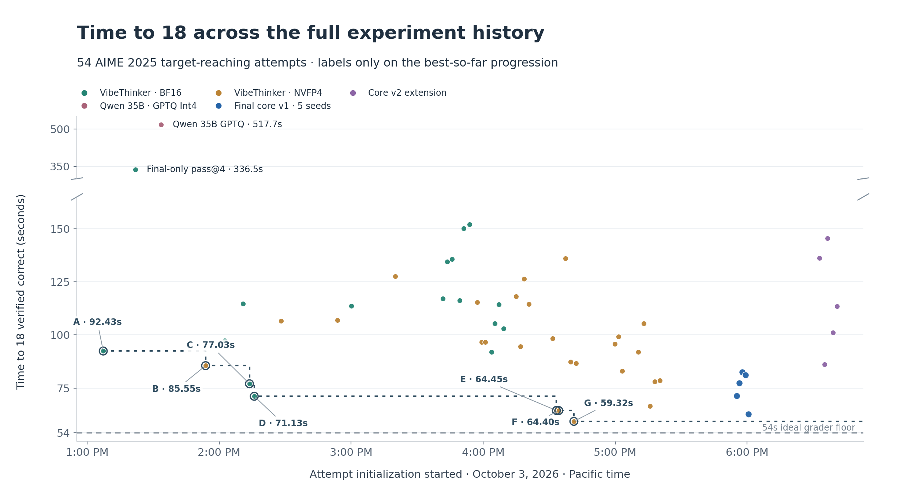

# AIME 2025 Speedrun

**Callosum speedrun report | 4 October 2026**

## 1. Objective and results overview

The objective is to reach **18 distinct verified-correct answers out of 30 AIME 2025 questions** as quickly as possible on one A100 PCIe 80GB. The provided verification grader requires 3s to process each attempt and therefore will require a floor of at 54s to achieve this target. The best run (stochastic) resolved 18 verified answers in **59.32s** while a later replication run had a median of **77.28s** (across a group of 5 attempts).

### Timeline
(format this nicer as a table)

September 30 ~11-12am: initial setup of remote A100 machine
September 30 ~3-4pm: initial data exploration of AIME benchmark using openrouter api models
October 3 ~1pm-5pm: Core focus time
October 3 ~6pm: Additional replication experiment
<CUTOFF>
October 3 ~7pm: Thinking about non integer outputs that apex-shortlist will require (need to parse things differently)
October 4 2-3pm: Final report editing/presentation preparation + repo cleaning

### Core Strategy & Approach

First, exploratory analysis on the AIME benchmark (using Qwen 3.5 35B A3B via openrouter) provided a few key insights into the problem space:
1. reasoning sequence token length distribution (see Evidence deck E14) showed some clearly hard questions that capped out at 16K seq limit.
2. reasoning trajectories backtrack and self-verify a lot, yielding quick intermediate answers but lenghty verification loops.
3. nevertheless model was capable enough of reasoning to at least 18 correct answers.

Given an attempt at the AIME benchmark, latency improvements can be roughly split into the following 3 spans:
1. time to first grader attempt (grader remains idle before first answer is generated)
2. wasted time due to incorrect grader attempts
3. time to final 18th question answer generation (tail latency on harder questions)

With the observation that intermediate answers were generated during reasoning traces but not emitted as final answers until much later, my first and core insight is simply to stream and extract intermediate answers to keep grader utilization high together with some light prompt optimizations to instruct models to emit intermediate answers with a specific format.

Thereafter, since I did not observe many incorrect attempts, my core focus was on (1) reducing initial grader attempt down from around 10s during our first serious speedrun attempt to roughly 1-2 seconds afterwards, as well as spending time to tune the vLLM request admission and concurrency settings to increase tok/s on singular requests (rather than throughput) to reduce (3).

<!-- pagebreak -->

## 2. Runner setup

Serving uses NVFP4 VibeThinker-3B, Marlin weights, BF16 activations/KV, FlashInfer attention, 95% allocation and 65,536-token total context.

The finalized runner does the following sequence of steps:
1. validate dataset and various startup tests/checks
2. start the grader service and vLLM server
3. warmup vLLM server with a batch of simple arithmetic requests `1+1`
4. (start main latency timer) fanout 1 request per question in the dataset and start inference requests on vLLM server
5. each request streams chunks back to the runner program and a static extraction policy is used (regex filter) to detect if any intermediate answers are present
6. whenever a question received a correct verdict, cancel corresponding requests for that question
7. gather initial questions attempts until 8K tok seq length
8. continue generation requests up to 64K tokens after initial pass of 30 requests complete

The runner also de-duplicates answers for each question and queues up grader verification requests per-question (so waits until that question receives a verdict before submitting another verification request).

## 3. What worked and what did not

| Measured comparison | Time to 18 | Decision |
| --- | --- | --- |
| BF16 final-only pass@4 vs coverage/continuation | 336.497s vs 92.428s | The complete strategy was 3.64x faster; controls differed. E0 |
| BF16 initial 30 x 4 | 114.615s | Wider fan-out slowed individual trajectories. E1/E2 |
| NVFP4 dynamic60 | 127.565s | More active samples did not reduce the tail. E4 |
| Eager 30-slot refill, five trials | 77.352s median | It did not improve core v1's 77.277s median. E13 |

**Concurrency trades throughput for answer latency.** Per-active-request decode fell from 115.5 to 94.6 to 69.7 tok/s at 30 x 1, 2 and 4. The 30 x 4 run accumulated 46.279s of grader idle. Zero measured preemptions and at most 20.04% KV occupancy did not support eviction as the explanation in that sweep. [E1](output/pdf/callosum-evidence-packet.pdf#nameddest=e1), [E2](output/pdf/callosum-evidence-packet.pdf#nameddest=e2)

Dynamic60 accumulated 61.573s of idle. The earlier BF16 observations showed about 115 tok/s at 30 active requests versus 77 tok/s at about 53. Eager refill also used **71.8% more requests** across five trials without improving the median. These results favor keeping individual trajectories fast before adding coverage. [E2](output/pdf/callosum-evidence-packet.pdf#nameddest=e2), [E4](output/pdf/callosum-evidence-packet.pdf#nameddest=e4), [E13](output/pdf/callosum-evidence-packet.pdf#nameddest=e13)

**Quantization improved observed decode.** NVFP4/Marlin increased 112.5 to 136.6 tok/s (+21%) with FLASH_ATTN fixed. TTFT slowed from 163 to 205ms. First submission fell from 6.71 to 4.48s, but p=0.056 did not establish improvement. FlashInfer produced the fastest observed trials; its earlier validation gate still failed. [E5](output/pdf/callosum-evidence-packet.pdf#nameddest=e5), [E7](output/pdf/callosum-evidence-packet.pdf#nameddest=e7)

**Keep extraction and verification simple.** CPU model extraction was slow, model verification accepted five of seven wrong answers, and confidence pruning rejected eventual successes. In hosted-model voting evidence, strict majority covered 15/30 versus pass@8's 22/30, while waiting for votes adds latency. These findings informed the design rather than establishing local VibeThinker gains. [A1](output/pdf/callosum-evidence-packet.pdf#nameddest=a1)

**Full baseline accuracy is now measured.** At BF16, 16K total context and 95% allocation, all **120 samples** finished: pass@1 **57/120 (47.50%)**, pass@4 **18/30**, and unique-plurality voting **18/30** (ties/no votes fail). A strict three-of-four vote covers **13/30**. All 57 naturally completed samples were correct. Token-capped and no-answer rates were **52.50% / 52.50%**. Generation took 385.848s, all grading 385.857s, and 18 correct arrived at 366.706s. This is one seed with cancellation disabled, distinct from the historical 80% timing baseline. [E12](output/pdf/callosum-evidence-packet.pdf#nameddest=e12)

<!-- pagebreak -->

## 4. Next steps and additional experiments

*additional run till completion rather than early-exit when 18 answers are verified.*

The finalized runner achieved 14 answers at a median **49.086s**, only 7.086s above the 42s floor. Its next four increased the milestone median by **28.191s**. The late-answer tail is the main latency improvement opportunity. [E11](output/pdf/callosum-evidence-packet.pdf#nameddest=e11) [E8](output/pdf/callosum-evidence-packet.pdf#nameddest=e8)

As a test of generalizability, AIME 2026 reached 18 in **88.669s**, with 19 checks and one wrong, on one seed without retuning. The selected integer parser fits AIME; broader answer domains need a separate general-answer extension (explored in v2 runner after cutoff). [E5](output/pdf/callosum-evidence-packet.pdf#nameddest=e5), [E10](output/pdf/callosum-evidence-packet.pdf#nameddest=e10)

### Future extensions
1. probing for answers instead of static parsing
2. tuning KV cache quantization for long-sequence inference speedups
3. exploring more models, particularly picking a tool-call small model and attaching python interpreter tooling to tackle some of the more enumeration-based AIME questions
4. ...