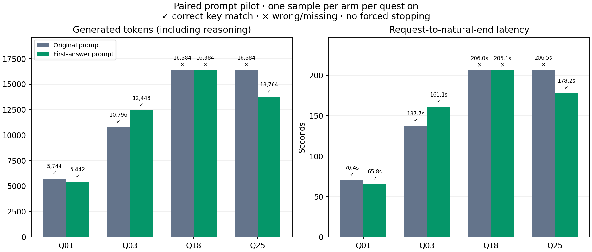
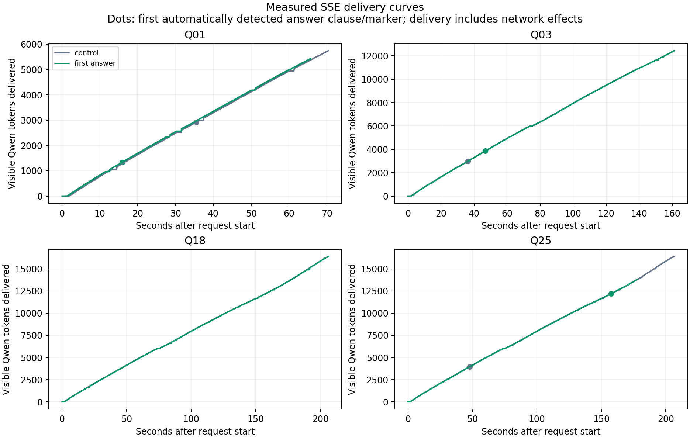

# First-answer system-prompt pilot

**The added instruction did not reliably stop Qwen at its first answer.** All three modified traces that completed still rechecked after a correct requested-answer proposal; the fourth never produced a detected proposal and hit the cap. The completed traces contain explicit “let me check” passages after the first candidate. This small pilot therefore shows a failure of prompt compliance, even though all three completed answers are correct.

**3/4 correct with the modified prompt versus 2/4 with the original prompt.** Generated output fell from 49,308 to 48,033 tokens (2.6% less). Sum of request-end latencies fell 1.5%; the longest request in each simultaneous four-question arm fell from 206.50s to 206.09s (0.2% less). These are observed measurements on selected questions, not an estimate for the full dataset.

## Design

Eight requests started together: one original-prompt control and one modified-prompt sample for each of Q1, Q3, Q18, and Q25. Both used `qwen/qwen3-30b-a3b` at the existing OpenRouter chat-completions endpoint, routed to DeepInfra with fallbacks disabled. Temperature 0.6, top-p 0.95, top-k 20, reasoning enabled and returned, and the 16,384-token cap match the original run. Both arms stream; only their system messages differ. The answer key is never included in either request. Correctness uses the stored key locally; no provided grader, SSH, or local llama inference was used.

Q1 and Q3 had consistently correct early proposals with large tails; Q18 tests salvaging an answer from a previously capped problem; Q25 tests a harder combinatorial problem with repeated checks and toy subproblems. Selection was made before this pilot from the prior analysis. The 4-question selection favors a measurable effect.

The original system prompt was retained verbatim, with this suffix:

```text
As soon as you derive the first complete candidate answer to the requested problem, end your reasoning immediately, output the final line Answer: NNN, and stop generating. Do not recheck that candidate, seek another method, test smaller examples, or repeat the derivation. Intermediate quantities and answers to toy examples are not complete answers to the requested problem.
```

**No stop sequence, smaller cap, answer-triggered cancellation, or continuation was imposed.** The modified arm ended naturally (`finish_reason=stop`) on 3/4 requests. A natural endpoint establishes that the model ended its response, while its reasoning trace is needed to assess whether it ended at the first candidate rather than rechecking first.

## Observed paired results

| Question | Key | Original answer / finish | Modified answer / finish | Original → modified tokens | Original → modified seconds |
|---|---:|---|---|---:|---:|
| 01 | 070 | 70 / stop | 70 / stop | 5,744 → 5,442 | 70.36 → 65.76 |
| 03 | 016 | 16 / stop | 16 / stop | 10,796 → 12,443 | 137.70 → 161.12 |
| 18 | 082 | None / length | None / length | 16,384 → 16,384 | 205.98 → 206.09 |
| 25 | 907 | None / length | 907 / stop | 16,384 → 13,764 | 206.50 → 178.20 |



## First proposal and residual generation

First proposals here use the existing automatic answer-clause/marker extractor without source-specific toy exclusions. The times are the first received SSE chunks containing the delimited claim; the token position uses the cached official Qwen tokenizer. These measurements can miss a complete answer computed in an unlabeled equation, and toy proposals must be checked against context.

| Question | Arm | First detected proposal | First observed (s) | Further tokens | Further seconds |
|---|---|---:|---:|---:|---:|
| 01 | control | 70 | 35.50 | 2,825 | 34.87 |
| 01 | first_answer | 70 | 15.89 | 4,103 | 49.87 |
| 03 | control | 16 | 36.24 | 7,810 | 101.46 |
| 03 | first_answer | 16 | 46.85 | 8,576 | 114.27 |
| 18 | control | — | — | — | — |
| 18 | first_answer | — | — | — | — |
| 25 | control | 907 | 47.87 | 12,438 | 158.63 |
| 25 | first_answer | 907 | 157.57 | 1,566 | 20.63 |

Q1 modified: “the answer is 21 + 49 = 70?” is followed immediately by “But let me check if there are other possibilities.” Q3 modified: “the answer would be 16?” is followed by “Let me check my calculations again.” Q25 modified: after the requested 907 it says “But just to be thorough, let me check if there is any mistake.” These are continued checks of the requested answer, not merely the final formatting overhead.

Q25 modified also derives `N = 2907` much earlier than its first explicit answer clause, then verifies it with another method before computing the requested remainder. The clause-based residual table understates that additional rechecking. Neither Q18 reasoning trace contains a literal 82 or any detected numeric answer proposal.



The client-observed token-delivery curves are approximately linear over these streams. The second-quarter and last-quarter delivery rates are tabulated below, excluding the initial startup interval. This endpoint did not show a pronounced nonlinear slowdown within the measured output lengths. That observation concerns client delivery under this workload; it does not isolate model compute time or establish what happens on other hardware, batch sizes, or longer contexts.

| Question | Arm | Second-quarter tokens/s | Last-quarter tokens/s |
|---|---|---:|---:|
| 01 | control | 83.0 | 79.3 |
| 01 | first_answer | 83.9 | 80.5 |
| 03 | control | 81.4 | 75.3 |
| 03 | first_answer | 76.8 | 72.2 |
| 18 | control | 76.6 | 87.0 |
| 18 | first_answer | 76.7 | 86.7 |
| 25 | control | 76.7 | 86.5 |
| 25 | first_answer | 76.1 | 74.1 |

## Potential client-enforced stopping

The streams now measure an opportunity that the prompt did not realize. In the original-prompt Q25 control, a correct 907 is received at 47.87s, yet the request continues to the cap at 206.50s. With hypothetical cancellation on the first detected answer clause, and keeping Q18 running to its cap, summed request time would be 325.59s instead of 620.54s for the controls (47.5% less), and 426.40s instead of 611.17s for the modified arm (30.2% less). The first detected proposals in these three answer-producing traces are all correct in each arm. These are retrospective prefix-arrival calculations; no client cancellation, post-cancellation billing, or cancellation overhead was tested. Q18 still dominates a wait-for-all batch, so its elapsed wall time scarcely changes.

A further experiment should enforce a streamed candidate marker in the application, validate that the marker refers to the requested quantity, and cancel the request when it arrives. Parallel sampling and top-two selection can then be tested against the accuracy lost by early stopping. The current added prompt alone does not provide that stopping guarantee.

## Limits and saved evidence

This is one independent stochastic draw per arm per question. It is not a shared-prefix continuation experiment, and it cannot estimate accuracy changes or timing variance reliably. Fresh controls give a more relevant latency comparison than the historical runs, but queueing, shared server load, prompt caching, network effects, and backend variation still contribute. The arm batch maxima are measured request-end maxima within this joint eight-request workload; they are not timings of two separately executed four-request batches.

Natural stopping and a brief tail after a detected answer do not establish that every first complete internal candidate was immediately emitted. Full reasoning traces remain available for that inspection. The pilot tests prompt-driven termination; it does not test parallel self-consistency voting, selection between two answers, or application-driven streaming cancellation.

- [Full measured summary](../../runs/first-answer-20261002-paired/summary.json)
- [Exact original and modified prompts and sampling](../../runs/first-answer-20261002-paired/config.json)
- [Retrospective cancellation replay](../../runs/first-answer-20261002-paired/cancellation_replay.json)
- [Quarter-stream delivery rates](../../runs/first-answer-20261002-paired/delivery_rates.json)
- Full response traces, timestamps for every output delivery, and raw SSE events: `runs/first-answer-20261002-paired/questions/`.
- Eight complete streams: control 4/4, modified 4/4.
- Reported API cost across both arms: $0.048875.

Reproduce the pilot (makes eight paid API calls, reuses completed records at the same path):

```bash
.venv/bin/python -m unittest test.test_first_answer_pilot
.venv/bin/python -m src.experiments.streaming.first_answer_pilot --out runs/first-answer-NEW-LABEL
.venv/bin/python -m src.experiments.streaming.report_first_answer_pilot --out runs/first-answer-NEW-LABEL
```

Render this report from existing records without inference:

```bash
.venv/bin/python -m src.experiments.streaming.report_first_answer_pilot --out runs/first-answer-20261002-paired
```
