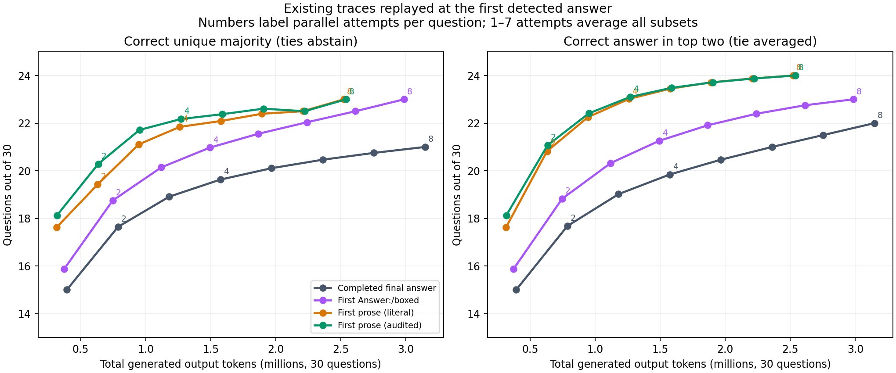
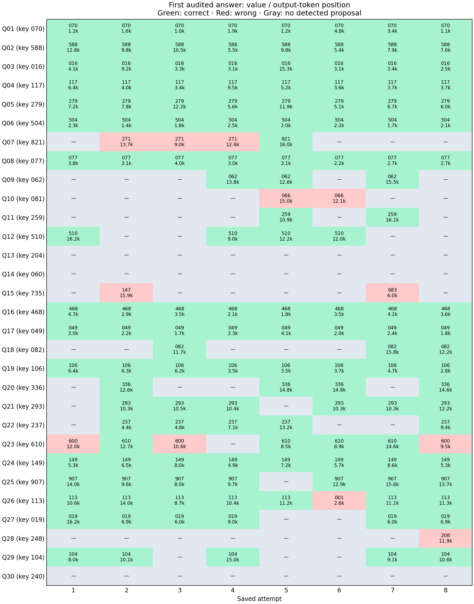

# Intermediate answers and first-answer voting

Offline analysis of **240 Qwen trajectories: 30 questions × 8 attempts**, run `20260930-155212`. No inference server was restarted, no SSH was used, and no provided grader was called. Correctness here means exact integer equality with the answer key already stored in each benchmark record; it does not certify the reasoning.

**The existing traces support testing early stopping.** The audited first detected answer is correct in 145/240 attempts, versus 120/240 completed final answers. It recovers 25/115 capped attempts and saves 19.3% of reported output tokens when attempts without a detected answer continue to their original endpoint. This is retrospective evidence, not a measured speedup or a test of the proposed new prompt.

## What changes inside a trace

Among 157 traces with an audited proposal, 145 start correct and 12 start wrong. 149 repeat the same answer; only 1 has more than one distinct detected requested-answer proposal. No completed correct final answer is lost by stopping at the first audited proposal. None of the detected initially correct proposals later changes to a wrong requested-answer proposal.

The genuine detected correction is **Q23, attempt 3: 600 at token 10,611 → 610 at token 13,633**. It fixes an off-by-one count (40 blocks versus 39 relevant blocks) and still reaches the 16,384-token cap without a final answer. First-answer stopping would miss that correction in this attempt, although other attempts vote for 610.

A clear churning example is **Q3, attempt 3**: a correct 16 appears at token 3,309, but the attempt continues to 16,384 (13,075 additional output tokens) without completing. **Q1, attempt 3** states the correct 70 at token 961. Across proposal-producing traces, the median first claim is at token 6,867 and the median tail after it is 3,542 tokens. These medians use the 157 proposal-producing traces, rather than all 240.

## Extraction policies

| Policy | Traces with a claim | First correct | Correct capped traces | Output saved |
|---|---:|---:|---:|---:|
| First literal Answer:/boxed | 133 | 127 | 7 | 5.1% |
| First numeric answer clause, uncurated | 157 | 141 | 24 | 19.8% |
| Audited asserted clause / marker | 149 | 139 | 19 | 17.3% |
| Audited tentative or asserted clause / marker | 157 | 145 | 25 | 19.3% |
| Aggressive requested-quantity equation sensitivity | 163 | 143 | 25 | 25.3% |

Numeric clauses include “the answer is”, “should be”, “would be”, and similar explicit proposals. Literal arithmetic is evaluated as a whole: “21 + 49 = 70” yields 70, not 21. Fractions, alternatives such as “145 or 129”, unsupported expressions, negations, hypotheticals, formatting examples, and remembered answers to other problems abstain. Matches in both reasoning and content are included. One trajectory contributes **one vote**; ten repetitions inside it never become ten votes.

The audited variants additionally exclude **ten toy sections in six traces** using [reviewable annotations](../../data/intermediate_exclusions.json), bound to the source reasoning SHA256. For example, Q25 tests three chairs/two people (answer 3) before solving sixteen chairs/eight people (907); Q26 checks a square (3) while solving the 24-gon (113). These exclusions are manual retrospective scope judgments, not a proven online detector. The uncurated variant saves 19.8% and has 141 correct first claims; the audited variant saves 19.3% and has 145. The identical eight-attempt vote outcomes below survive that sensitivity check.

The requested-quantity equation variant detects such forms as `m+n = ...` and converts `N = ...` to `N mod 1000` only when the question requests that operation. It is aggressive and remains vulnerable to intermediate hypotheses and toy equations; it saves 25.3% but reduces eight-attempt majority accuracy to 22/30, versus 23/30 for audited answer clauses. The claim inventory and complete trace map retain this distinction; absence of a detected claim is not proof that the trace contains no useful intermediate result.

## Parallel sampling and voting replay

| Endpoint | Attempts/question | Correct unique majority /30 | Correct in top two /30 | Output tokens |
|---|---:|---:|---:|---:|
| Completed final | 8 | 21.00 | 22.00 | 3.147M |
| First marker | 8 | 23.00 | 23.00 | 2.985M |
| First prose, uncurated | 8 | 23.00 | 24.00 | 2.523M |
| First prose, audited | 8 | 23.00 | 24.00 | 2.539M |
| Completed final | 4 | 19.63 | 19.84 | 1.573M |
| First prose, audited | 4 | 22.17 | 23.10 | 1.270M |
| First prose, audited | 2 | 20.29 | 21.07 | 0.635M |

For 1–7 attempts, metrics average **every subset** of the eight saved attempts for each question. They are expected question counts, not a newly sampled benchmark run or the original first-call result. Rank candidates by vote count, using uniform tie-breaking independent of the key; unique-majority ties abstain. Top-two means candidate coverage and requires an independent choice between candidates. It is not single-answer accuracy and does not establish that Gemma can make that choice reliably.

With all eight audited first proposals, Q7 votes **271 × 3 versus 821 × 1**. The saved key is 821, so majority is confidently wrong while the top two retain the correct answer. Q18 is newly recovered by both first-marker and first-prose majority voting. Q23 majority also flips from wrong to correct: completed answers vote 600 twice versus 610 once; audited first proposals vote 610 four times versus 600 three times. First-prose voting additionally retains Q7 in the top two. Questions 10, 13, 14, 15, 28, and 30 still have no correct first proposal in this corpus; parallelism cannot repair an answer that none of these samples proposes.



## Timing and stopping budgets

The token-work saving is 607,615 of 3,146,802 tokens. If all eight attempts must finish before voting, mean per-question maximum output length falls from 14,313 to 13,127 tokens (8.3%), a smaller improvement than total work. This is a critical-path token proxy, not elapsed time: hard no-answer attempts still reach the full cap.

| Audited first proposals, eight attempts | Majority /30 | Top-two coverage /30 | Output tokens |
|---|---:|---:|---:|
| 2,000-token ceiling | 4 | 4 | 0.474M |
| 4,000-token ceiling | 8 | 8 | 0.890M |
| 8,000-token ceiling | 14 | 14 | 1.571M |
| 12,000-token ceiling | 20 | 21 | 2.108M |
| 16,384-token ceiling | 23 | 24 | 2.539M |

A blanket 8k cutoff loses too many answers; useful difficult-question proposals appear around 12k–16k. An early-answer endpoint with escalation for abstentions is more supported here than a universal short token budget.

Saved responses are nonstreaming and contain only request-end latency, so actual time-to-first-answer, late-token slowdown, cancellation cost, and parallel throughput cannot be recovered from them. With KV caching, each new token still attends over previous tokens, and the cache grows with sequence length ([Hugging Face cache explanation](https://huggingface.co/docs/transformers/main/cache_explanation)). That makes avoiding long tails plausible, but the full wall-time curve also depends on batching, hardware, and kernels; these data do not justify a numeric nonlinear speedup claim.

The next controlled experiment should compare the existing prompt against one requiring a clearly scoped `<candidate_answer>NNN</candidate_answer>` as soon as the model has a **complete answer to the requested problem**. Stream and cancel on that tag; record actual prefix latency, token cadence, input/output tokens, and concurrent-batch wall time. Test 2/4/8 samples with top-one accuracy and top-two coverage separately, and retain an escalation path for abstentions or disagreements. Keep a paired continuation arm to measure corrections lost by cancellation. A changed prompt can change the reasoning prefix itself.

## Per-question map

Each list shows audited first answers in attempt order 1–8. `—` means no detected requested-answer proposal. The linked 240-row CSV gives token positions, first correct claim, compressed answer sequence, endpoint, and source file; the detailed JSON includes all claim contexts and classifications.

| Question | Key | Correct completed /8 | First answers, attempts 1–8 | Correct first /8 |
|---|---:|---:|---|---:|
| 01 | 070 | 8 | 070, 070, 070, 070, 070, 070, 070, 070 | 8 |
| 02 | 588 | 7 | 588, 588, 588, 588, 588, 588, 588, 588 | 8 |
| 03 | 016 | 6 | 016, 016, 016, 016, 016, 016, 016, 016 | 8 |
| 04 | 117 | 8 | 117, 117, 117, 117, 117, 117, 117, 117 | 8 |
| 05 | 279 | 8 | 279, 279, 279, 279, 279, 279, 279, 279 | 8 |
| 06 | 504 | 8 | 504, 504, 504, 504, 504, 504, 504, 504 | 8 |
| 07 | 821 | 0 | —, 271, 271, 271, 821, —, —, — | 1 |
| 08 | 077 | 8 | 077, 077, 077, 077, 077, 077, 077, 077 | 8 |
| 09 | 062 | 1 | —, —, —, 062, 062, —, 062, — | 3 |
| 10 | 081 | 0 | —, —, —, —, 066, 066, —, — | 0 |
| 11 | 259 | 1 | —, —, —, —, 259, —, 259, — | 2 |
| 12 | 510 | 3 | 510, —, —, 510, 510, 510, —, — | 4 |
| 13 | 204 | 0 | —, —, —, —, —, —, —, — | 0 |
| 14 | 060 | 0 | —, —, —, —, —, —, —, — | 0 |
| 15 | 735 | 0 | —, 147, —, —, —, —, 683, — | 0 |
| 16 | 468 | 8 | 468, 468, 468, 468, 468, 468, 468, 468 | 8 |
| 17 | 049 | 8 | 049, 049, 049, 049, 049, 049, 049, 049 | 8 |
| 18 | 082 | 0 | —, —, 082, —, —, —, 082, 082 | 3 |
| 19 | 106 | 8 | 106, 106, 106, 106, 106, 106, 106, 106 | 8 |
| 20 | 336 | 1 | —, 336, —, —, 336, 336, —, 336 | 4 |
| 21 | 293 | 5 | —, 293, 293, 293, —, 293, 293, 293 | 6 |
| 22 | 237 | 5 | —, 237, 237, 237, 237, —, —, 237 | 5 |
| 23 | 610 | 1 | 600, 610, 600, —, 610, 610, 610, 600 | 4 |
| 24 | 149 | 8 | 149, 149, 149, 149, 149, 149, 149, 149 | 8 |
| 25 | 907 | 3 | 907, 907, 907, 907, —, 907, 907, 907 | 7 |
| 26 | 113 | 6 | 113, 113, 113, 113, 113, 001, 113, 113 | 7 |
| 27 | 019 | 5 | 019, 019, 019, 019, —, —, 019, 019 | 6 |
| 28 | 248 | 0 | —, —, —, —, —, —, —, 208 | 0 |
| 29 | 104 | 4 | 104, 104, —, 104, —, —, 104, 104 | 5 |
| 30 | 240 | 0 | —, —, —, —, —, —, —, — | 0 |



## Artifacts and reproduction

- [All 240 traces mapped](../../runs/20260930-155212/intermediate_answers/trace_map.csv)
- [Every detected claim, including exclusions](../../runs/20260930-155212/intermediate_answers/claim_inventory.csv)
- [Claim contexts and exact token positions](../../runs/20260930-155212/intermediate_answers/traces.json)
- [Subset, tie, budget, and per-question metrics](../../runs/20260930-155212/intermediate_answers/summary.json)
- [Extraction and replay implementation](../../src/answer_extraction.py)
- [Source-bound scope annotations](../../data/intermediate_exclusions.json)

```bash
.venv/bin/python -m unittest test.test_intermediate
.venv/bin/python -m src.experiments.intermediate_answers.analyze_intermediate --run 20260930-155212
.venv/bin/python -m src.experiments.intermediate_answers.render_intermediate --run 20260930-155212
```

These commands are offline and require the existing cached `.local/tokenizers/qwen3.json`. Its SHA256 is `aeb13307a71acd8fe81861d94ad54ab689df773318809eed3cbe794b4492dae4`. All reasoning token counts match the previous trajectory analysis. Provider completion usage exceeds independently tokenized visible output by only 0–6 tokens per trace; the replay charges that small overhead before each stopping point conservatively. The 240 original records are read only. Local llama inference remains stopped.
