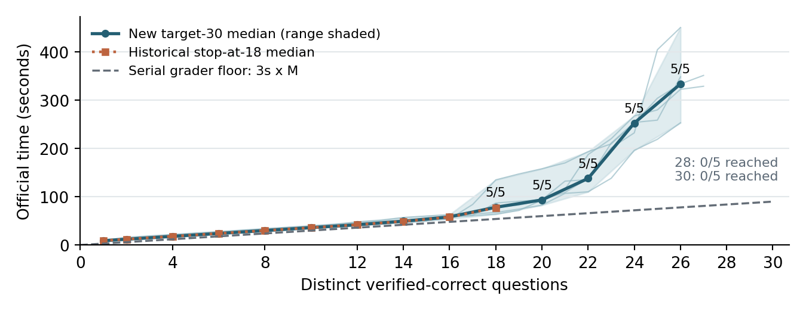

# Post-freeze measurements

Batch: `measurements-v1-20261004T104200Z`. Source: `9258e9875a2504a5ea92ea6778ddd3101fe45738`.

## Task A: immutable core v1, target 30

| Seed | 14 | 16 | 18 | 20 | 22 | 24 | 26 | 28 | 30 |
| --- | ---: | ---: | ---: | ---: | ---: | ---: | ---: | ---: | ---: |
| 20261011 | 57.110 | 63.111 | 78.305 | 93.449 | 138.130 | 232.523 | 450.780 |  |  |
| 20261012 | 51.907 | 57.908 | 63.908 | 93.129 | 187.541 | 267.565 | 322.685 |  |  |
| 20261013 | 49.369 | 58.370 | 87.065 | 93.774 | 135.464 | 254.057 | 348.623 |  |  |
| 20261014 | 48.037 | 54.037 | 135.071 | 158.116 | 193.590 | 252.871 | 333.859 |  |  |
| 20261015 | 46.559 | 58.637 | 67.483 | 82.655 | 110.306 | 196.309 | 253.388 |  |  |

Times are official seconds. A blank is unreached, not zero.

| Milestone | Reached | Median (s) | Minimum (s) | Maximum (s) | Historical E8 median (s) | Difference (s) |
| --- | ---: | ---: | ---: | ---: | ---: | ---: |
| 1 | 5/5 | 9.033 | 7.365 | 9.902 | 9.035 | -0.003 |
| 2 | 5/5 | 12.035 | 10.365 | 15.905 | 12.037 | -0.002 |
| 4 | 5/5 | 18.035 | 16.368 | 21.904 | 18.038 | -0.003 |
| 6 | 5/5 | 24.036 | 22.367 | 27.904 | 24.037 | -0.001 |
| 8 | 5/5 | 30.037 | 28.368 | 33.905 | 30.040 | -0.003 |
| 10 | 5/5 | 36.036 | 34.367 | 39.906 | 36.038 | -0.002 |
| 12 | 5/5 | 42.037 | 40.369 | 48.109 | 42.039 | -0.002 |
| 14 | 5/5 | 49.369 | 46.559 | 57.110 | 49.086 | 0.283 |
| 16 | 5/5 | 58.370 | 54.037 | 63.111 | 57.903 | 0.467 |
| 18 | 5/5 | 78.305 | 63.908 | 135.071 | 77.277 | 1.028 |
| 20 | 5/5 | 93.449 | 82.655 | 158.116 |  |  |
| 22 | 5/5 | 138.130 | 110.306 | 193.590 |  |  |
| 24 | 5/5 | 252.871 | 196.309 | 267.565 |  |  |
| 26 | 5/5 | 333.859 | 253.388 | 450.780 |  |  |
| 28 | 0/5 |  |  |  |  |  |
| 30 | 0/5 |  |  |  |  |  |

Medians and ranges use reached, identity-valid trials. They are not confidence intervals and later milestones may have fewer observations.

| Seed | Solved | Checks / wrong | Service (s) | Later idle (s) | Official total (s) | End condition |
| --- | ---: | ---: | ---: | ---: | ---: | --- |
| 20261011 | 26 | 30 / 4 | 90.004 | 354.671 | 489.246 | request_budget_exhausted_and_checks_drained |
| 20261012 | 27 | 30 / 3 | 90.003 | 235.217 | 450.216 | request_budget_exhausted_and_checks_drained |
| 20261013 | 26 | 32 / 6 | 96.004 | 326.907 | 461.156 | request_budget_exhausted_and_checks_drained |
| 20261014 | 27 | 32 / 5 | 96.004 | 344.426 | 458.924 | request_budget_exhausted_and_checks_drained |
| 20261015 | 26 | 26 / 0 | 78.003 | 170.831 | 441.769 | request_budget_exhausted_and_checks_drained |

Every first-correct rank and grader query ID is in [first-correct-ranks.csv](first-correct-ranks.csv). Request counts and never-solved questions are retained in [analysis.json](analysis.json); every continuation prefix is audited against exact token IDs.

The orange curve is the retained historical stop-at-18 batch, rather than the first section of the new curve. The dashed line is 3 seconds times the number of distinct successes.

### Task A report text

The frozen core reached 18 in 5/5 extended trials, with median 78.305s and range 63.908-135.071s. The historical stop-at-18 median was 77.277s; the new median differs by 1.028s. At 24 correct, 5/5 trials reached the milestone, with median 252.871s. The 28- and 30-answer milestones were reached by 0/5 and 0/5 trials, respectively. These are matched historical-seed comparisons across sequential server batches, not interleaved measurements.

## Task B: complete BF16 final-only pass@4

Seed 20261003; 30 questions, four samples each, 16K total context, 95% GPU allocation. All samples finish naturally or at the token cap; correct verdicts and the eighteenth success never cancel generation.

| Metric | Result | Definition |
| --- | ---: | --- |
| Completed samples | 120/120 | Full batch required for scored accuracy |
| pass@1 | 57/120 (47.50%) | Mean per-question correct fraction |
| pass@4 coverage | 18/30 | At least one correct sample |
| Unique-plurality vote | 18/30 | Missing answers abstain; ties/no votes incorrect |
| Strict 3-of-4 vote | 13/30 | At least three identical correct final votes |
| Token capped | 63/120 | No answer extracted from capped samples |
| No answer | 63/120 | Capped or no eligible final integer |
| Unique grader checks | 18 | One check per question/answer pair |
| All generation finished | 385.848s | Official start to final generation end |
| Generation and grading finished | 385.857s | Includes draining all candidate checks |
| Time to 18 | 366.706s | Eighteenth distinct positive verdict within full run |

See [baseline-samples.csv](baseline-samples.csv) for all sample/verdict mappings and [baseline-questions.csv](baseline-questions.csv) for correct counts out of four and vote outcomes.

### Task B report text

The full BF16 baseline completed all 120 samples with seed 20261003. Pass@1 was 57/120 (47.50%), pass@4 covered 18/30 questions, and unique-plurality voting covered 18/30 (ties and no votes count incorrect). Token-capped and no-answer rates were 52.50% and 52.50%. Generation finished in 385.848s and all grading in 385.857s, with 18 correct reached at 366.706s. This is one seed at 95% allocation with cancellation disabled, whereas the historical timing baseline used 80% allocation and cancellation.

## Provenance, timing and limitations

- [Declared protocol and hashes](config.json), [Task A outcomes](task_a.json), [Task B outcomes](task_b.json), [implementation diff](implementation-diff.patch) and [baseline-policy diff](baseline-policy-diff.patch).
- The frozen v1 manifest is unchanged. The only Task A solving-control override is target 30; the external 900-second deadline excludes setup and warmup.
- Existing startup answer-field provenance validation was explicitly approved. Model inputs and analysis omit reference answers; correctness uses grader verdicts only.
- First after-launch time through 18: 135.249s, including Task A server startup and cheap warmup. This is one cold observation.
- Service already contains wrong-check time. Adding wrong service again would double-count it.
- No replacement trials or tuned seeds. Raw streams, full grader audits and service logs remain on the remote.
- [Time allocation and unattended compute log](time-allocation.md); wall-clock activity intervals are separate from measured human focused hours.
