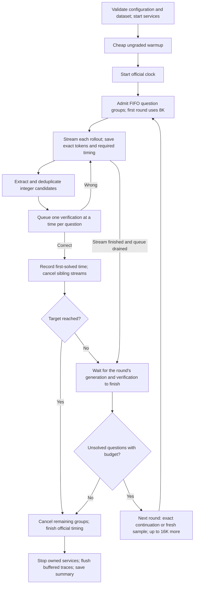

# Canonical v1 runner

Run from the repository root with `python -m runner`. The default is the measured
v1 solving policy with the improved `prompt_adherence` prompt and benchmark mode.
Explicit flags override the preset. `python -m runner --help` launches no services.

```bash
~/.venvs/vllm/bin/python -m runner --seed 20261011
```

This package contains the canonical launch code, libraries, prompts, presets,
reference inference profile, built-in datasets, and vendored grader. Canonical v1
also works if `runner/` alone is copied to a new working directory. Model weights,
vLLM/CUDA, and Python environments are external dependencies; attempts are saved
in `attempts/` alongside `runner/`. Python 3.11+ and Linux are required for GPU runs.

## Install and launch

On the supplied A100 node, follow the model/runtime provisioning in
`~/models/README.md`. The default model is
`r0b0tlab/VibeThinker-3B-NVFP4`. Its profile must exist at
`~/models/r0b0tlab/VibeThinker-3B-NVFP4/vllm-flashinfer.yaml`.
The committed [reference profile](profiles/vllm-flashinfer.yaml) uses 95% GPU
memory, a 65,536-token total context, and a 16,384-token generation ceiling.
Edit the model weight path when provisioning a different machine.

Install runner dependencies into the inference Python environment and provision
the grader separately:

```bash
~/.venvs/vllm/bin/python -m pip install -r runner/requirements.txt
python3 -m venv runner/grader/.venv
runner/grader/.venv/bin/pip install -r runner/grader/requirements-local.txt
nvidia-smi
~/.venvs/vllm/bin/python -m runner --seed 20261011
```

For another environment or model, supply `--vllm-python`, `--vllm-binary`,
`--grader-python`, `--models-dir`, `--model`, and `--model-profile` as needed.
The profile filename is resolved inside `MODELS_DIR/MODEL/`. The served model ID
must match `--model`; the runner obtains the actual total context from the server.
The server must support streaming token IDs and token-ID completion prompts for
exact continuations. Missing or incomplete token evidence causes a visible failure.

Startup rejects occupied ports and an occupied GPU before loading an owned server.
It performs a small CUDA warmup, launches vLLM and a fresh grader, and sends a
short arithmetic warmup batch before starting the official clock. Owned process
groups are shut down on completion or graceful interruption. `--reuse-server`
attaches to an existing matching server and leaves it running; use a dedicated,
idle server for comparable benchmarks. Run long jobs in `tmux`.

## Policy and timing

| Default | Behavior |
| --- | --- |
| Question parallelism / fan-out | 30 question groups, one stream per group |
| Generation budget | First request: 8,192 output tokens; subsequent requests: up to 16,384 additional tokens |
| Per-question ceiling | Four generation requests total, including continuations; four rounds |
| Scheduling | FIFO within a round; barrier before the next round |
| Continuation | Resume a capped, unsolved lane from its exact token IDs when context permits; otherwise start fresh |
| Sampling | Temperature 0.8, top-p 0.95; seed = base seed + question index × request ceiling + rollout number |
| Extraction | Completed integer boxes, complete answer lines, and supported literal answer clauses; values 0–999 |
| Verification | Candidate deduplication across the question's rounds; one in-flight check per question; shared FIFO grader, 3s/check |
| Stop | 18 distinct questions verified, or request/round budgets exhausted |
| Warmup | At most 30 arithmetic requests, 32 output tokens each; no grader queries |



A wrong answer does not interrupt v1 reasoning or inject feedback. A round barrier
includes pending verification, not just generation. A capped request reserves no
live KV slot after completion; exact-prefix continuation can benefit from prefix
caching but does not guarantee a cache hit. Four requests means the initial request
plus at most three further requests. Grader checks have a separate, uncapped budget.

First-solved timestamps are recorded immediately on a positive grader response,
before stream cleanup. `time_to_target_s` is the target-th distinct first-solved
time. Official latency also includes cancellation settlement. Service cleanup and
the final buffered trace flush are outside official timing. A completed attempt
can have `target_reached: false`; inspect both fields when comparing runs.

## Other datasets

Built-in datasets use `--benchmark-year 2024`, `2025` or `2026`; the default is
2025. Use `--questions 1 2 3 --target-correct 2` for a small subset. Question indices
in custom sets can be any unique positive integers; set the solve target to fit
the selected count and set concurrency to fit the intended workload.

For another integer-answer dataset, configure the grader rather than embedding
keys in solver code. See the complete two-question example:

```bash
~/.venvs/vllm/bin/python -m runner \
  --grader-config runner/examples/integer_grader.yaml \
  --system-prompt-file runner/examples/integer_prompt.txt \
  --parallelism 2 --target-correct 2 --seed 17
```

The grader YAML selects a JSONL file with `problem_idx`, `problem`, and `answer`
fields. Its `source` path is relative to `runner/grader/`, or absolute; `idx_field`,
`problem_field`, and `gold_field` can map other column names. JSONL needs only the
bundled grader requirements. Optional CSV, Parquet, and Hugging Face inputs use
the grader's documented loaders and additional dependencies.

Canonical v1 reads custom question statements from the gold-free `GET /questions`
endpoint and saves their fingerprint and snapshot. Owned grader configuration
overrides host, port, toll, and audit destination for this attempt.
`--dataset-manifest FILE` additionally supports a pinned JSON manifest with
repository-relative prompt/key paths and hashes; see [the dataset adapter](lib/datasets.py).
`--reuse-grader` requires a fresh dedicated questions-capable grader at
`--grader-port`; its health must report zero previous queries and the requested
toll. It remains running afterward. Its audit log belongs to that external service;
the client still saves verification timestamps in the attempt.

**V1 extracts only integers from 0 through 999.** Use a v2 extension for fractions,
symbolic expressions, sets, and other mathematical answers. Supply a suitable
system prompt for custom datasets. Correctness always comes from the grader;
built-in AIME answer fields are checked only during startup provenance validation.

## Configuration, profiling, and evidence

```bash
# Reproduce the selected policy with a different declared seed.
python -m runner --preset runner/presets/prompt_adherence.json --seed 20261012

# Original prompt control, with the same scheduling/budgets.
python -m runner --preset runner/presets/baseline.json

# Enable optional CPU, event-loop, engine and GPU sampling.
python -m runner --profile

# Help for a separately versioned policy.
python -m runner --version v2.3 --help
```

The default `--benchmark` preset disables optional profiling and NVML sampling,
buffers required JSON/JSONL evidence in RAM, and flushes after official timing.
VRAM and engine observations are unavailable in that mode. `--profile` enables
those observations while retaining buffered writes. `--buffer-traces` alone is
available for custom presets; `--benchmark-prewarm` is an optional ungraded AIME
2024 workload, but the default retains the cheaper warmup. Graceful interruption
saves partial evidence; a hard kill can lose buffered traces.

Each attempt records `config.json`, `model_profile.json`, `questions.json`,
`summary.json`, `metadata.json`, and `solved.jsonl`. Under `trace/NN/`, the runner
saves each round's state, verification events, and `rollout-NN/` request, response,
token IDs and telemetry. Telemetry retains start/end timestamps, full generation
latency, TTFT, end-to-end settlement latency and prefix-cache observations when
reported by vLLM. Full streams, service logs and grader audits stay outside Git.
Use `python -m runner.lib.metadata ATTEMPT_DIRECTORY` to validate metadata.

## Layout, extensions, and promotion

```text
runner/
  __main__.py, cli.py, config.py   Public entrypoint and validated configuration
  run.py                          Attempt lifecycle and official clock
  scheduler.py                    V1 round scheduling and request budgets
  question.py                     Candidate queue, verification and cancellation
  lib/                            Requests, streaming, extraction, continuations,
                                  services, datasets, warmup, storage and metrics
  grader/, data/                  Vendored grader and built-in benchmark inputs
  prompts/, presets/, profiles/   Explicit configuration
  manifest.json                   Canonical source identity
  extensions/                     Independently versioned policies
    v1_1/, v1_5/, v2/, v2_1/, v2_2/, v2_3/
    variants/                     Former runner_final; historical entrypoints,
                                  validation commands and frozen v1 reference
```

[Extensions and version differences](extensions/README.md) are selected explicitly.
`runner_final` is a compatibility symlink to `runner/extensions/variants`; frozen
core directories there alias their new version locations. Old commands, source
hashes and artifact provenance remain valid. Root `data` and the relocated v1.1/
v1.5 source paths also retain compatibility aliases. Frozen extensions keep their
pinned historical runtime imports; new extensions should reuse `runner.lib`.

The canonical default is declared in `lib/entrypoints.py`, independently of the
highest version number. To propose promotion, add a version under `extensions/`,
reuse the public infrastructure, give it its own preset and source identity, and
test/measure it against v1 with matched datasets, seeds and timing. After an
explicit promotion decision, change the canonical selection and document the
new default; `--version v1` must continue to select v1. Never rewrite a historical
manifest or claim old measurements came from the refactored source. Canonical
source changes get a reviewed snapshot through `python -m runner.tools.pin
--write --reason '...'`, with tests and a commit recording the rationale.

The recorded GPU results belong to the original frozen source. Differential
offline tests validate this package's payloads, parsing, barriers, continuation
lanes, request caps and cancellation; packaging alone is not a new GPU timing.
