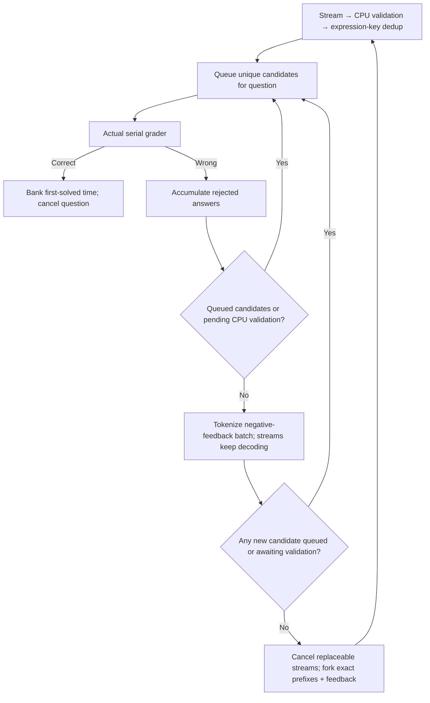

# Frozen core v2.2: queue-aware grader correction

V2.2 retains v2.1's CPU syntax validation, expression deduplication, system prompt,
serial grader, default 30×1 barrier schedule, initial 8,192 output tokens,
16,384 additional tokens per continuation, 65,536 context and four generation
requests per question. It adds negative-verdict feedback during generation.
V1, v2 and v2.1 and their manifests remain unchanged.

```sh
~/.venvs/vllm/bin/python -m pip install -r runner_final/core_v2_2/requirements-syntax.txt
~/.venvs/vllm/bin/python -m runner_final.run_frozen_v2_2 --seed 20261011 --benchmark
~/.venvs/vllm/bin/python -m runner_final.run_frozen_v2_2 \
  --preset runner_final/presets/apex_core_v2_2.json --seed 20261011 --benchmark
```

Service ownership, model profiles, warmup and question provenance follow
[v2.1](../core_v2_1/README.md). Only actual boolean `false` responses from the
actual grader constitute wrong answers; parser rejection, duplicate suppression,
HTTP failures and timeouts do not provide correctness feedback.



The runner counts all candidates detected in one streamed chunk before awaiting
validation, across content and reasoning channels. It grades the queue first,
accumulating wrong answers until the queue and pending validation both empty.
This preserves self-corrections produced while the previous answer spent time
in the grader. The runner rechecks both conditions after feedback tokenization.

For each replaceable active lane, it cancels and settles the parent HTTP stream,
saves its exact prompt/output IDs, and appends feedback IDs obtained from the
same server's `/tokenize` endpoint with `add_special_tokens=false`. It submits
that prefix to `/v1/completions` with a new request ID and seed, and at most
16K additional tokens clipped to remaining context. Feedback is plain annotated
text inside the continued assistant output, not a reconstructed chat turn.
It repeats the complete set of rejected expressions for that question; it never
includes a reference answer or infers correctness locally. Prior candidate keys
remain deduplicated across the branches and subsequent rounds.

Corrections consume the existing four-request budget. If fewer slots remain
than live lanes, eligible lanes in request order are replaced up to that budget;
other lanes continue. Four initial samples leave no correction budget. Missing
exact IDs, tokenization failure, disabled continuations or insufficient context
leave existing streams running and record the reason. A terminal stop/length
chunk is never interrupted for feedback. If streams have already finished,
negative feedback is retained for the next normal scheduler round: appended to
a capped exact prefix, or added to the user problem for a fresh sample. The next
barrier resumes the latest capped branch of each lane. Correct verdicts and the
overall solve target retain the existing cancellation behavior.

Required buffered `trace/NN/feedback.jsonl` records wrong verdicts, queue/validation
deferrals, tokenization latency, branch parents/children, exact-prefix hash,
feedback token IDs and cap/context skips. Requests, exact tokens, validation,
verifications and first-solved timestamps remain available with `--benchmark`;
optional host/GPU/engine profiling remains disabled. Config/metadata record the
runtime-feedback policy separately from the unchanged parser policy.

```sh
.venv/bin/python -m unittest test.test_frozen_core_v2_2 test.test_core_v2_2_plumbing -v
.venv/bin/python -m runner_final.core_v2_2.metadata ATTEMPT_DIRECTORY
```

Offline tests exercise the scheduling and cancellation races. They do not
establish a speed improvement; v2.2 has not yet had a scored GPU benchmark.
