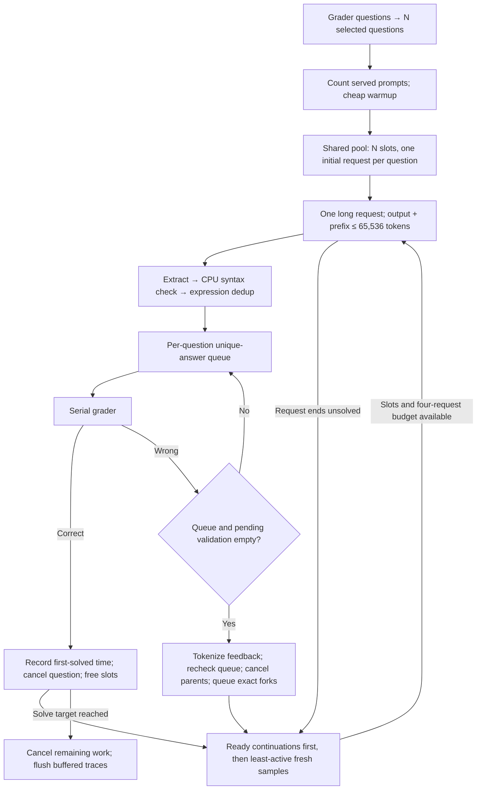

# Frozen core v2.3: input-sized slot pool and long rollouts

V2.3 adopts v1.5's shared inference pool and retains v2.2's queue-aware wrong-answer
feedback, v2.1's CPU syntax validation and expression deduplication, and the v2
system prompt. Earlier cores and their manifests remain unchanged. This version
has offline coverage and [one benchmark trial per dataset](../../../runs/experiments/core-v2_3-benchmarks-20261004T182444Z/README.md):
AIME reached 18 in 84.985s; Apex reached 3/47 at a 300s official cutoff. These
measurements do not establish repeatability or a speed improvement.

The global slot count equals the number of selected questions obtained from the
grader: 30 for full AIME, 47 for full Apex, or the size of a selected subset.
Every question initially gets one sample. As requests finish or questions become
solved, freed slots admit ready continuations first, then fresh samples for the
least-active eligible question, rotating ties. Siblings can run concurrently;
there is no round barrier. Four generation requests per question remain the hard
ceiling, including feedback continuations. The serial grader stops the attempt
at the configured count of distinct solved questions (18 by default).

Each fresh sample uses **one long request**, with a 65,536-token output ceiling
clipped to the server's existing **65,536 total context tokens**. Startup counts
the exact served chat template through `/tokenize` before official timing;
`max_tokens = min(65536, 65536 - prompt_tokens)`. This budget includes reasoning
and final output, so it is slightly less than 64K completion tokens. Natural EOS,
a correct verdict, the overall solve target, or eligible wrong-answer feedback can
end a request sooner. A full-context length stop normally leads to a fresh sample;
there are no scheduled 8K/16K segments. If the server caps output with exact IDs
and context still remains, the pool prioritizes an exact-prefix continuation.

Wrong verdicts accumulate until the question has neither queued unique answers
nor candidates awaiting CPU validation. Tokenization runs while streams continue;
the runner rechecks both conditions afterward. It cancels and settles replaceable
parents, then queues their exact prompt/output IDs plus the server-tokenized batch
of rejected answers. These continuations use remaining context and the same slot
and request limits. Admissions pause for that question during feedback preparation,
so a fresh sibling cannot consume its reserved correction budget. Other questions
continue. Existing negative feedback also accompanies subsequent fresh samples;
their changed chat template is counted again. Only actual boolean false grader
verdicts provide correction information; no reference answer enters generation.



From the checked-out, tested commit on `callosum`, provision the **new** launch
profile and parser dependencies. The new profile raises the generation ceiling
to 65,536 and retains 95% GPU memory, NVFP4/Marlin, BF16 KV, FlashInfer and prefix
caching. Existing profiles are preserved. Check GPU/ports before launching.

```sh
cd /home/azureuser/aime-bench
git pull --ff-only
install -m 644 configs/vllm/r0b0tlab/VibeThinker-3B-NVFP4/vllm-v2_3-long64k.yaml \
  ~/models/r0b0tlab/VibeThinker-3B-NVFP4/vllm-v2_3-long64k.yaml
~/.venvs/vllm/bin/python -m pip install -r runner_final/core_v2_3/requirements-syntax.txt
~/.venvs/vllm/bin/python -m runner_final.run_frozen_v2_3 --seed 20261011 --benchmark
~/.venvs/vllm/bin/python -m runner_final.run_frozen_v2_3 \
  --preset runner_final/presets/apex_core_v2_3.json --seed 20261011 --benchmark
```

Use `--questions 1 2 3 --target-correct 3` for a three-question attempt with three
shared slots. The policy derives concurrency automatically; `--parallelism` and
fan-out overrides are rejected. Service ownership and gold-free question
provenance follow [v2.2](../core_v2_2/README.md). `--reuse-server` requires a matching
64K server whose configured generation ceiling permits these requests.

`allocation.json` records admissions, parents, request kinds, global/per-question
peaks and request counts. Required validation, feedback, verification, token and
first-solved evidence remains buffered under `--benchmark` and flushes after
official timing. GPU/engine/CPU profiling is disabled in that mode. Long prefixes
can cause KV pressure despite the bounded request count; a scored run with engine
metrics is needed to quantify preemption and latency. Context/request limits do
not guarantee that all live prefixes fit simultaneously in the KV cache.

```sh
.venv/bin/python -m unittest test.test_frozen_core_v2_3 test.test_core_v2_3_plumbing -v
.venv/bin/python -m runner_final.core_v2_3.metadata ATTEMPT_DIRECTORY
```

For a sequential two-dataset benchmark with a 300-second Apex official cutoff,
use a clean pinned remote worktree and the external batch harness:

```sh
~/.venvs/vllm/bin/python -m src.experiments.benchmark_core_v2_3 --execute \
  --seed 20261011 --apex-deadline-s 300
```

The default AIME safety deadline is 900 seconds. Both stop immediately upon
reaching 18 verified questions. Deadline cancellation preserves partial traces
and unmet outcomes; setup, warmup, cleanup and trace flush are outside the cutoff.
Omit `--execute` to inspect the plan without launching services.
