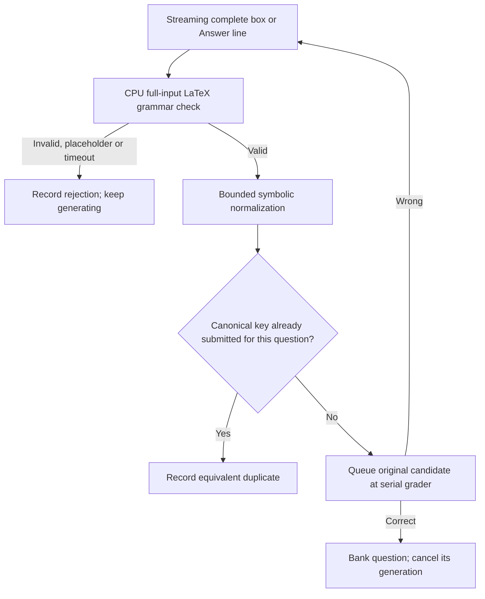

# Frozen core v2.1: CPU validation and expression deduplication

V2.1 keeps v2's prompt, sampling, question API, serial grader and scheduling:
30×1 barrier, 8,192 initial output tokens, up to 16,384 **additional** tokens
per continuation, four total generation requests per question, 65,536 total
context including prompt, cheap warmup and benchmark storage. Fully capped
trajectories can accumulate 8K, 24K, 40K and 56K output across those four requests;
remaining context can clip later requests. Correct verdicts cancel that question,
and the eighteenth distinct positive verdict stops the standard attempt.

The changes are CPU syntax validation and expression-key deduplication before
submission. V1, v2, both manifests, the canonical runner, and grader are preserved.
This is a new independently pinned core, using the user-requested v2.1 name.

## Run

Install the two pinned CPU parser dependencies in the **runner** Python
environment (installing them only in the grader environment is insufficient):

```sh
~/.venvs/vllm/bin/python -m pip install \
  -r runner_final/core_v2_1/requirements-syntax.txt
~/.venvs/vllm/bin/python -m runner_final.run_frozen_v2_1 --seed 20261011

# Pinned Apex shortlist, or the same v2 custom-grader options.
~/.venvs/vllm/bin/python -m runner_final.run_frozen_v2_1 \
  --preset runner_final/presets/apex_core_v2_1.json --seed 20261011
```

Model/profile provisioning and service ownership follow the [v2 contract](../README.md#frozen-core-v2-general-mathematical-answers-and-grader-fed-questions).
The default preset uses **exactly v2's existing prompt**, allowing a comparison
of validation/deduplication without changing prompting. Syntax worker imports and
representative grammar warmups run before official solving. No GPU is used by
the parser and no reference answers are accessed.



## Validation and keys

Syntax uses SymPy 1.14.0's generated ANTLR grammar and ANTLR runtime 4.11.0.
It checks lexical errors, delimiter balance and **complete input consumption**,
without evaluating the parse tree. This avoids the permissive parser behavior
that can accept only a prefix such as `x` from `x -`. The reference is
[SymPy's parsing documentation](https://docs.sympy.org/latest/modules/parsing.html).
An explicit placeholder/multiword-prose guard complements the math grammar;
implicit letter multiplication makes syntax alone unable to identify every
non-answer. Single-letter variables, fractions, radicals, functions, binomials,
relations, finite sets and ordered tuples are supported. Arbitrary TeX macros,
matrix environments and interval notation are not guaranteed.
The gate validates supported mathematical notation, not a complete TeX language.

A separate owned CPU process serializes and caches validation; stream handling
never runs symbolic simplification on the event loop. Syntax has a 1s deadline;
canonicalization has a 250ms deadline. Inputs retain the 4,096-character cap,
with 1,024 lexical tokens and 64 delimiter levels. Every limit is recorded in
`answer_validation_policy`. Timeout/crash handling terminates only that owned
worker, releases its queue lock and permits restart; shutdown leaves no worker.

Normalization uses SymPy `simplify`, then a structural representation hashed
with SHA-256. Examples sharing one key include `1/2`, `2/4`, `\frac{1}{2}`;
`\sqrt{8}` and `2\sqrt{2}`; and `x+x` and `2x`. Finite sets ignore ordering and
repeated elements; tuples preserve order and remain distinct from sets.
Original symbolic denominator constraints remain part of the key: `x/x` and
`1` stay distinct without assuming `x != 0`, and cancelling `(x-1)` does not
silently discard its excluded point. No question-dependent assumptions are
inferred. Different keys can still describe equivalent expressions: this is
conservative normalization, not a universal equivalence proof.

A canonicalization error/timeout **after syntax success** falls back to a
raw-string key and still allows grading. A syntax error/timeout rejects with an
audit reason. Deduplication is per question across rollouts/continuations; the
CPU validation cache can span questions, but grader verdicts are never shared
between questions. The grader receives the **original** expression and remains
the sole authority on correctness.

## Evidence

`trace/NN/candidate_validation.jsonl` is required even in benchmark mode. Each
proposal records its original string/channel/location, observation/validation
timestamps, CPU/queue/wall timings, rejection or duplicate outcome, canonical
key/form and any fallback. `question.json` retains `candidate_keys` across rounds;
verification events also retain the submitted key. Metadata records the policy
and parser package versions. Required logs stay buffered with benchmark mode.

[Offline historical replay](../../runs/analyses/core-v2_1-candidate-validation/README.md)
retained 90/90 recorded positive candidates and rejected 56/62 recorded wrong
submissions. This uses existing client verdicts and cannot predict a changed
run's latency. No new GPU performance claim is made for v2.1.

```sh
.venv/bin/python -m unittest test.test_frozen_core_v2_1 \
  test.test_core_v2_1_plumbing -v
.venv/bin/python -m scripts.audit_v2_1_candidates
.venv/bin/python -m runner_final.core_v2_1.metadata ATTEMPT_DIRECTORY
```
