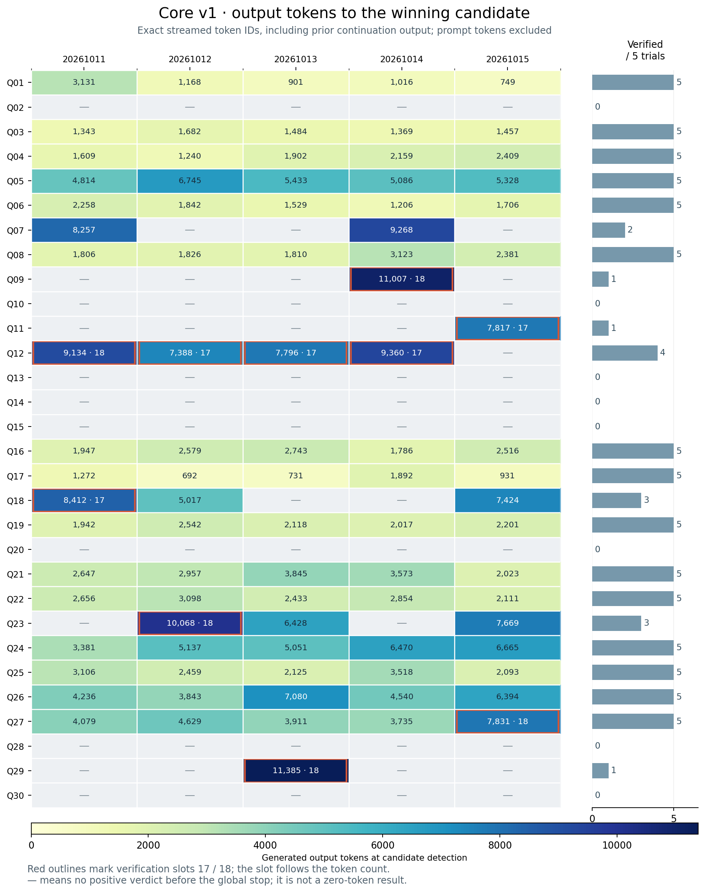
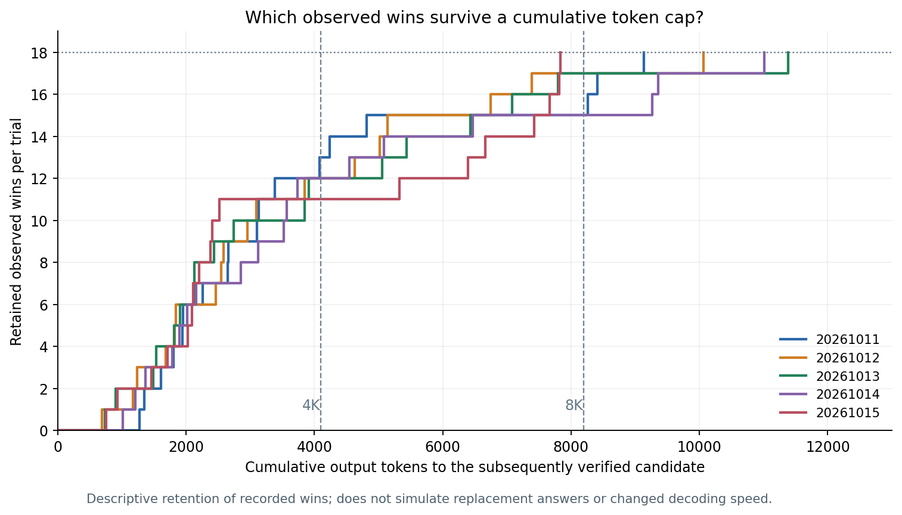

# Core v1: tokens to verified answers and the last two solve slots

Across the selected five core v1 runs, the **90 subsequently verified candidates**
were detected at a median **2,699.5 output tokens**, 90th percentile **7,818.4**,
and maximum **11,385**. Q12 occupies four of the ten verification slots 17/18.
Six tail winners required an exact-prefix continuation; four finished their
initial rollout. This gives a reason to investigate selective pruning, but a
blanket short token cap would discard answers these runs needed to reach 18.

This is the [selected improved-prompt batch](../../experiments/frozen-core-prompt-five-seeds-20261004T005416Z/README.md),
with seeds 20261011–20261015 and median 77.277s. It is separate from the earlier
`runner-final-five-seeds-20261004T000926Z` extraction analysis, v1.1 and v1.5.
No new inference or scored attempts were run for this analysis.



Every number is cumulative **output tokens through the SSE chunk that made the
parser emit the candidate subsequently verified correct**. It includes preceding
continuation output, excludes prompt tokens, and is not the token count at the
later positive verdict. It measures recognized candidate emission rather than
the earliest semantic derivation in the reasoning. Red outlines identify the
17th/18th positive verdicts. A blank means no positive verdict before global stop,
not a zero-token success, proven failure, or proof that the question is hard.

## Which questions supplied slots 17 and 18?

| Seed | Slot | Question | Tokens to candidate | Request | Candidate after start (s) | Positive verdict (s) | Grader queue (s) |
| --- | ---: | --- | ---: | ---: | ---: | ---: | ---: |
| 20261011 | 17 | Q18 | 8,412 | 2 | 60.456 | 65.322 | 1.861 |
| 20261011 | 18 | Q12 | 9,134 | 2 | 65.714 | 71.321 | 2.604 |
| 20261012 | 17 | Q12 | 7,388 | 1 | 51.615 | 60.902 | 6.285 |
| 20261012 | 18 | Q23 | 10,068 | 2 | 74.273 | 77.277 | 0.000 |
| 20261013 | 17 | Q12 | 7,796 | 1 | 53.241 | 56.244 | 0.000 |
| 20261013 | 18 | Q29 | 11,385 | 2 | 79.488 | 82.492 | 0.000 |
| 20261014 | 17 | Q12 | 9,360 | 2 | 65.519 | 73.606 | 5.083 |
| 20261014 | 18 | Q09 | 11,007 | 2 | 78.098 | 81.102 | 0.000 |
| 20261015 | 17 | Q11 | 7,817 | 1 | 53.626 | 59.783 | 3.151 |
| 20261015 | 18 | Q27 | 7,831 | 1 | 53.745 | 62.783 | 6.034 |

Question identifiers match repository `problem_idx`. Request two is a
continuation in this batch, not a fresh retry. The 18th questions are **Q12,
Q23, Q29, Q09 and Q27**. Q12 is 17th in three runs and 18th in one.

In seeds **20261012, 20261013 and 20261014**, the final candidate was emitted
13.371s, 23.244s and 4.492s after slot 17's verdict, respectively. It then spent
almost exactly **3s** in verification, with no grader queue wait. These are
answer-production tails. In seed **20261015**, Q27's candidate already existed
**6.038s before slot 17**; its positive verdict followed slot 17 by just 3.000s.
The last step there is the serial grader toll, not a generation bottleneck.

## Would giving up early help?

The 60 unverified question/run observations consumed **621,091 output tokens by
the target**, about **56.5%** of the 1,099,511 client-observed output tokens.
There is substantial speculative generation to investigate. Eight questions
(Q02, Q10, Q13, Q14, Q15, Q20, Q28, Q30) had no positive verdict in any of the five
runs and consumed **414,088 observed output tokens** in total. These identities
are retrospective development-set observations; they are not an online hardness
signal or evidence that those questions cannot be solved.

A cumulative output cutoff gives the following descriptive retention of the
**same recorded winning trajectories**. The last column counts actual output
beyond that budget on observations still unverified at global stop; it is a
potential-work indicator, not a wall-time estimate.

| Cumulative cutoff | Retained wins by seed 11 / 12 / 13 / 14 / 15 | Total retained wins | Unverified output beyond cutoff |
| --- | --- | ---: | ---: |
| 4,096 | 13 / 12 / 12 / 12 / 11 | 60/90 | 375,331 |
| 6,144 | 15 / 15 / 14 / 14 / 12 | 70/90 | 252,451 |
| 8,192 | 15 / 17 / 17 / 15 / 18 | 82/90 | 129,571 |
| 10,240 | 18 / 18 / 17 / 17 / 18 | 88/90 | 35,136 |
| 12,288 | 18 / 18 / 18 / 18 / 18 | 90/90 | 0 |



**4K is too aggressive for preserving these outcomes:** it retains only 11–13
observed winners per trial. **8K** removes **eight of 90 wins**, leaving four
trials below 18, while also removing 129,571 observed tokens on unverified
trajectories (11.8% of all observed output). **10K** preserves all 18 observed
winners in three runs, but loses the last answer in two. A **12K** cutoff preserves
all 90 wins, yet removes none of the observed unverified output: these runs
already stop before those trajectories consume 12K. None of these is a replayed
alternative policy; replacements and changed decoding/batching remain unknown.

The most promising experiment is **selective pruning or deprioritization near
16 verified answers**, preserving a few useful continuations rather than
abandoning every long trajectory. The actual final answers often need 8–11.4K
output, so length alone cannot identify the requests to abandon. Use information
available during execution (budget consumed, candidate/verdict history or
measured progress), not the eventual answer or a fixed retrospective question
blacklist. Whether fewer active requests accelerate the remaining ones enough
to offset lost opportunities requires new paired measurements. These traces
cannot establish the speedup or choose a validated stopping rule.

Generation after a winning candidate but before cancellation also accounts for
**135,048 observed tokens** (12.3% of total output). Pausing pending-verdict
trajectories is a separate possible optimization; seven wrong checks in the
baseline mean it would need a prompt resume policy and could delay error repair.

## Complete per-question distribution

Values are exact client-observed output counts at recognized candidate emission.
The distribution is conditional on a positive verdict before the global stop.
There are 90 numeric observations and 60 missing success-token values.

| Question | Seed 20261011 | Seed 20261012 | Seed 20261013 | Seed 20261014 | Seed 20261015 |
| --- | ---: | ---: | ---: | ---: | ---: |
| Q01 | 3,131 | 1,168 | 901 | 1,016 | 749 |
| Q02 | — | — | — | — | — |
| Q03 | 1,343 | 1,682 | 1,484 | 1,369 | 1,457 |
| Q04 | 1,609 | 1,240 | 1,902 | 2,159 | 2,409 |
| Q05 | 4,814 | 6,745 | 5,433 | 5,086 | 5,328 |
| Q06 | 2,258 | 1,842 | 1,529 | 1,206 | 1,706 |
| Q07 | 8,257 | — | — | 9,268 | — |
| Q08 | 1,806 | 1,826 | 1,810 | 3,123 | 2,381 |
| Q09 | — | — | — | 11,007 | — |
| Q10 | — | — | — | — | — |
| Q11 | — | — | — | — | 7,817 |
| Q12 | 9,134 | 7,388 | 7,796 | 9,360 | — |
| Q13 | — | — | — | — | — |
| Q14 | — | — | — | — | — |
| Q15 | — | — | — | — | — |
| Q16 | 1,947 | 2,579 | 2,743 | 1,786 | 2,516 |
| Q17 | 1,272 | 692 | 731 | 1,892 | 931 |
| Q18 | 8,412 | 5,017 | — | — | 7,424 |
| Q19 | 1,942 | 2,542 | 2,118 | 2,017 | 2,201 |
| Q20 | — | — | — | — | — |
| Q21 | 2,647 | 2,957 | 3,845 | 3,573 | 2,023 |
| Q22 | 2,656 | 3,098 | 2,433 | 2,854 | 2,111 |
| Q23 | — | 10,068 | 6,428 | — | 7,669 |
| Q24 | 3,381 | 5,137 | 5,051 | 6,470 | 6,665 |
| Q25 | 3,106 | 2,459 | 2,125 | 3,518 | 2,093 |
| Q26 | 4,236 | 3,843 | 7,080 | 4,540 | 6,394 |
| Q27 | 4,079 | 4,629 | 3,911 | 3,735 | 7,831 |
| Q28 | — | — | — | — | — |
| Q29 | — | — | 11,385 | — | — |
| Q30 | — | — | — | — | — |

The pooled winning distribution has minimum **692**, lower quartile **1,854.5**,
median **2,699.5**, upper quartile **5,124.25**, 90th percentile **7,818.4**, and
maximum **11,385**. Quantiles use inclusive linear interpolation. Pooling repeated
questions across five seeds does not make 90 independent samples.

## Evidence and reproduction

- [All 150 question observations](questions.csv), [ten tail observations](tail.csv),
  [per-question summary](question_summary.csv), and [analysis and source hashes](analysis.json).
- The analysis replays **206 original SSE streams** with the frozen core v1
  `CandidateDetector`, checks their exact output IDs and accumulated visible
  text against saved compact evidence, and validates all continuation prefixes.
  All 90 candidate events match the saved positive-verdict event identity and
  detection time (within 50ms, accounting for millisecond UTC trace stamps).
  Output-through-verdict counts are recorded separately; no local answer-key
  comparisons or character/token-rate approximations are used.
- Three offline checks cover triggering-chunk token counts, continuation offsets
  and rejection of token-ID drift. The source runner and manifest are unchanged.
- Replay source commit: `6aa097ebc669def82e4e96f335450f2d0c89ad85`.
  Frozen core manifest: `35d6a06315a0e45441b3ac49bd468a2b94553fb172f378bfebc7ea8cc044070f`.
  Original streams remain in `/home/azureuser/aime-bench-core-prompt-7c40f7a`;
  only compact analysis outputs and plots are versioned here.

Recompute on the machine that holds the original streams:

```bash
~/.venvs/vllm/bin/python -m scripts.analyze_core_v1_answer_tokens \
  --streams-root /home/azureuser/aime-bench-core-prompt-7c40f7a
```

Render from the compact saved analysis locally:

```bash
.venv/bin/python -m scripts.render_core_v1_answer_tokens
```

Vector/PDF exports: [distribution SVG](answer-token-distribution.svg),
[distribution PDF](answer-token-distribution.pdf), [coverage SVG](budget-coverage.svg),
[coverage PDF](budget-coverage.pdf).
