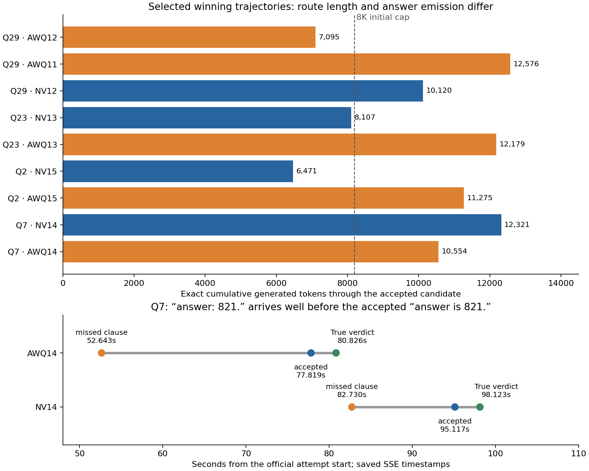

# Why some v1.6 tails finish sooner: reading the generated reasoning

The selected traces show two concrete mechanisms: **taking a shorter mathematical
route**, and **emitting an extractable answer without another round of checking**.
The frozen extractor also misses some explicit answer clauses. These differences
can move a question across the 8K initial cap and into the post-barrier pool.
They are visible in the text, rather than inferred solely from elapsed time.

This review uses nine winning trajectories from the
[five paired AWQ/NVFP4 seeds](../../experiments/core-v1_6-awq-five-seeds-20261004T232747Z/README.md).
Labels such as AWQ12 mean AWQ seed **20261012**. Each case ultimately received
an actual **True** grader verdict. No dataset answer keys were used in this
analysis. Selected examples do not establish prevalence across every question.
The runner, prompt, and extractor have not been changed.



## A correct-looking answer can be present but missed

In AWQ14 Q7, the model reduces the probability to 128/693 and writes:

> Thus answer: 821.

The complete clause arrives at **52.643s**, after **7,834 generated tokens**,
before the initial 8,192-token cap. It then says “But we need to verify if any
subtlety was missed,” and repeats the counting argument. The initial request
reaches its cap, waits for the coverage barrier, and continues. Only at
**77.819s** does it emit:

> Thus answer is 821.

That second form is recognized and receives a True verdict at **80.826s**.
The two explicit clauses are **25.176s apart**, with no change in the answer.
The initial request finishes at 55.424s and the continuation starts at 58.057s;
most of the gap is additional generation, rather than the barrier interval.
The NVFP4 same-seed trajectory similarly emits the missed colon form at
82.730s and the accepted prose form at 95.117s: a **12.387s** gap.

The [frozen detector](../../../runner/lib/extraction.py) accepts a standalone
`Answer: 821` line, a closed integer box, or prose such as `answer is 821.`.
It does **not** accept the prefixed line `Thus answer: 821.` or `answer = 821.`.
The existing prompt asks for boxed prospective answers, but these trajectories
do not reliably comply. The gap is therefore a combination of missing a usable
clause and further model checking; it is not 25 seconds of CPU parsing work.

Source: [AWQ14 initial text](../../../attempts/20261004T233357.876262Z/trace/07/rollout-01/response.json)
and [continuation](../../../attempts/20261004T233357.876262Z/trace/07/rollout-02/response.json);
[NV14 initial text](../../../attempts/20261004T225342.150827Z/trace/07/rollout-01/response.json)
and [continuation](../../../attempts/20261004T225342.150827Z/trace/07/rollout-02/response.json).

## Extra checking is a substantial part of some slow tails

**Q23, coin denominations 1/10/25, seed 20261013.** Both trajectories identify
the same failing residues and count 390 failures, hence 610 successes. NVFP4
emits “Thus answer should be 610.” shortly after finishing the count, at
**8,107 tokens / 55.678s**. AWQ explicitly computes
“1000 - 390 = 610” at **8,991 tokens / 62.111s**, then checks whether dropping
two or three quarters creates additional failures, enumerates residue cases,
and recounts boundary cases. It eventually writes the missed colon and equals
forms before the accepted “Thus answer is 610.” at
**12,179 tokens / 91.211s**. That is **29.100s after its target count**;
only the last **3.262s** is the measured colon-to-accepted-clause gap.
This is repeated validation of the same result, rather than a grader-driven
correction from a different answer.

Source: [NV13 Q23](../../../attempts/20261004T225234.136076Z/trace/23/rollout-01/response.json),
[AWQ13 initial](../../../attempts/20261004T233116.619910Z/trace/23/rollout-01/response.json)
and [continuation](../../../attempts/20261004T233116.619910Z/trace/23/rollout-02/response.json).

**Q29, right-triangle geometry.** AWQ12 reaches a useful product
`pq = 104 sqrt(3)`, solves for the legs, and obtains the target quadrilateral
area by shoelace. It emits an accepted answer at **7,095 tokens / 46.946s**,
within the initial request. NV12 takes the same broad coordinate route but
spends longer on its algebra, reaching the accepted answer at
**10,120 tokens / 74.507s**, after a continuation.
AWQ11 is slower still: it already states
“So area of quadrilateral BKLC = 104 sqrt(3)” at
**9,279 tokens / 66.997s**. It then rederives the signed area, checks
orientations, distances, and point locations, and repeats shoelace. Acceptance
comes at **12,576 tokens / 97.157s**, **30.160s after that target-area statement**.
An earlier occurrence of 104 in a product is not counted as a solved-area
landmark: intermediate quantities can share the final numeral.

Source: [AWQ12 Q29](../../../attempts/20261004T232909.168373Z/trace/29/rollout-01/response.json),
[NV12 initial](../../../attempts/20261004T225113.454134Z/trace/29/rollout-01/response.json)
and [continuation](../../../attempts/20261004T225113.454134Z/trace/29/rollout-02/response.json),
[AWQ11 continuation](../../../attempts/20261004T232342.669339Z/trace/29/rollout-02/response.json).

## A better mathematical representation can avoid the continuation

**Q2, reflected points and a heptagon, seed 20261015.** NVFP4 adopts affine
invariance and maps the triangle to convenient coordinates, preserving area
ratios. It gets an accepted answer at **6,471 tokens / 44.306s**. AWQ instead
uses the actual angle (`sinθ = 6/13`, `cosθ = √133/13`), follows literal diagram
coordinates, and spends substantial text on decimal positions, segment
intersections, polygon simplicity, and repeated shoelace signs. It states that
the target heptagon area equals 588 at **10,116 tokens / 75.232s**, but does
another **10.599s** of checking before acceptance at
**11,275 tokens / 85.831s**.

This is a difference in the generated solution route. NVFP4 is not uniformly
better: AWQ's Q29 route above is shorter. Also, the first appearance of 588 in
Q2 is merely the triangle area; it is not evidence that the target heptagon has
already been solved.

Source: [NV15 Q2](../../../attempts/20261004T225526.955249Z/trace/02/rollout-01/response.json),
[AWQ15 initial](../../../attempts/20261004T233625.124298Z/trace/02/rollout-01/response.json)
and [continuation](../../../attempts/20261004T233625.124298Z/trace/02/rollout-02/response.json).

## What these examples explain, and what remains uncertain

The faster attempts often get enough wins inside the first 8K request to avoid
needing several slow continuations for slots 17/18. AWQ12's **61.211s** attempt
has **17 initial wins and one continuation win**; NV12's **77.512s** attempt
has **16 initial and two continuation wins**. Their first-18 sets also differ:
AWQ includes Q2/Q9 where NVFP4 includes Q12/Q18. Q29 is a useful matched-text
comparison, but is not the final winning question in both attempts.
Similarly, NV15 has 17 initial wins and one continuation; AWQ15 has 16 and two.
The stop-at-18 policy makes the *mix of questions that finish* part of the result.

These cases support a concrete next experiment: in a separately versioned
extractor, accept complete prefixed colon/equals answer clauses while retaining
integer bounds, candidate deduplication, and grader verification. Measure wrong
submissions and paired time-to-18 before claiming a gain. Reading a target
quantity earlier also suggests more reliable prospective-answer emission could
help, but does not justify submitting every intermediate number.

**The measured emission gaps are not counterfactual whole-attempt speedups.**
Earlier grading would change the queue, cancellations, pool occupancy, and
possibly the first-18 cohort. Mathematical-landmark judgments are manual
interpretations of the saved text; correctness comes only from the later True
verdict. Identical seeds across quantizations do not imply identical trajectories,
and the paired batch has differing inference-server lifetimes. This review does
not attribute the text divergence to quantization alone.

## Reproduce the measurements

[analysis.json](analysis.json) records the character boundaries, exact generated
token counts, matching SSE timestamps, request transitions, and SHA-256 hashes
of all selected source files. The actual frozen detector is replayed with the
recorded SSE chunk boundaries, initialized with the previous visible text for
each continuation. Every recognized candidate must match the saved winner's
answer and character offset, and its UTC observation must agree within 10ms.
The selected generated IDs must reproduce the entire saved visible prefix.
Counts exclude prompts, prefix-cache tokens, fresh siblings, and tokens emitted
after the winning clause while grading is underway.

Raw SSE and model tokenizer files are intentionally not committed. The replay
requires `tokenizers` and `matplotlib`, the selected 15 `stream.jsonl` files
under `<stream-root>/<attempt-id>/trace/<question>/rollout-<id>/`, and the
existing NVFP4 tokenizer with SHA-256
`296e081e2f5ecf9d87814aa9b0f4b12d670ed2b2e2be6c84e01a9466c953afb7`.
The preceding batch validated equivalence of the AWQ and NVFP4 token IDs for
these model assets. On this workspace the SSE files are retained in the ignored
cache below; they also remain in the remote experiment checkouts
`/home/azureuser/aime-bench-v16-c0e461c5` (NVFP4),
`/home/azureuser/aime-bench-awq-v16-a9af511f` (AWQ11), and
`/home/azureuser/aime-bench-awq-five-b634e1a7` (AWQ12–15).

```bash
.venv/bin/python runs/analyses/v1_6-quantization-tail-reasoning/reproduce_analysis.py \
  --stream-root .cache/analyses/v1_6-quantization-tail-reasoning/selected-streams \
  --tokenizer /tmp/vibethinker-nvfp4-tokenizer.json
```

Times above use saved SSE UTC timestamps relative to the official attempt
start; sub-millisecond monotonic timestamps in the question records can differ
by a few milliseconds. Correct-verdict receipt additionally includes the
serial grader's queue and three-second service. For example, Q29 AWQ12's
46.946s accepted emission becomes a 53.242s True receipt. This distinction
prevents attributing grader waiting to longer reasoning.
