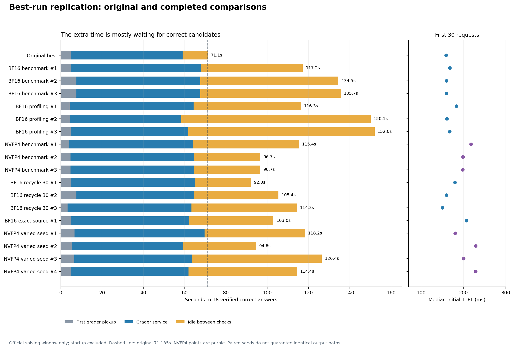

# Replicating the 71-second best run

The 71.135-second result has not been reproduced in seventeen completed follow-ups. Initial TTFT has remained near 0.16–0.23s; the large delay is waiting for correct candidates after normal request startup. The objective remains active.

| Comparison | Trials | First-18 times | Median |
| --- | ---: | --- | ---: |
| BF16 benchmark, matched 30×1 | 3 | 117.17 / 134.52 / 135.65s | 134.52s |
| BF16, original profiling restored through v2 | 3 | 116.28 / 150.07 / 152.01s | 150.07s |
| NVFP4 benchmark, paired 30×1 | 3 | 115.40 / 96.67 / 96.67s | 96.67s |
| BF16 recycle up to 30 streams, new policy | 3 | 92.01 / 105.40 / 114.30s | 105.40s |
| BF16 exact original source, fresh services | 1 | 102.99s | — |
| NVFP4 benchmark, four predeclared different seeds | 4 | 118.19 / 94.59 / 126.43 / 114.44s | 116.31s |

The reference's grader used 54.002s of service and waited 12.076s between checks. These repeats waited 26.964–91.676s between checks. The figure stacks first grader pickup, completed service and idle time; their sum agrees with each first-18 time within 0.03s. Initial TTFT is the conventional median of the first request per question. Startup, cleanup and buffered final writes are outside this solving window.

All nine matched warmed trials retained the original seed, 30×1 barrier, 8K first pass, up to 16K additional output on later requests, temperature 0.8, top-p 0.95 and four-request cap. NVFP4 substitutes model/quantization. Prefix caches were reset before each attempt's normal short warmup, so later trials could not reuse prior solution tokens. Every initial payload matches after that declared model substitution.

The dynamic comparison changes scheduling and continuation semantics: its ladder is 8K then 16K cumulative output and freed slots start fresh samples. It preserves the initial payloads but is a distinct optimization. The exact-source replay restores the original code commit, fresh managed services, profiling and immediate writes; it rules out source integration as a sufficient explanation for recovering 71s.

Paired seeds do not guarantee identical output paths. In the earlier BF16 benchmark repeat, question 1 decoded at 129.5 tokens/s versus the reference's 129.6. New warmed repetitions decoded near 128–130 tokens/s, but two generated 1,344 tokens before cancellation versus 1,030 in the reference. This supports a trajectory/answer-arrival explanation; it is not proof of the underlying numerical or scheduling cause. Neither the TTFT nor stopped-at-18 comparisons establish full reasoning accuracy or a BF16 quality advantage.

An active GPU health observation found SW power capping with a 1395 MHz SM clock versus its 1410 MHz maximum, without thermal/hardware slowdown. Earlier idle checks found zero zombies, no retained GPU allocations and 211 GiB RAM available. Clearing memory caches is unsupported by this evidence.

The report retains every result. The four-seed NVFP4 comparison completed with seeds declared before launch; none recovered 71s. Its fastest result, 94.59s, has not been selected for validation. Any selected fast seed would require separate repeat validation and identification as development tuning, rather than an exact replication or a guarantee across arbitrary draws.

A [fresh health check](../../diagnostics/20261003T232632Z/README.md) after this batch again found zero zombies, no GPU allocations and 211 GiB RAM available. The batch logged at most 9.6% KV usage and no preemption/OOM warnings. EngineDeadError appeared during intentional shutdown after the final completed trial. There is no evidence supporting a memory-cache flush.

[Plot data](analysis.json), [PNG](timing-comparison.png), [SVG](timing-comparison.svg), [PDF](timing-comparison.pdf). Render with `python scripts/render_best_replication.py`.

Batch evidence: [BF16 benchmark](../bf16-best-warm-replicate-20261003T224038Z/README.md), [BF16 profiling](../bf16-best-profiled-replicate-20261003T224630Z/README.md), [NVFP4 benchmark](../nvfp4-best-warm-replicate-20261003T224630Z/README.md), [dynamic 30](../bf16-dynamic30-replicate-20261003T225437Z/README.md), [exact source](../bf16-best-exact-source-20261003T230424Z/README.md).

[Declared-seed batch](../nvfp4-30x1-seed-comparison-20261003T231357Z/README.md).
