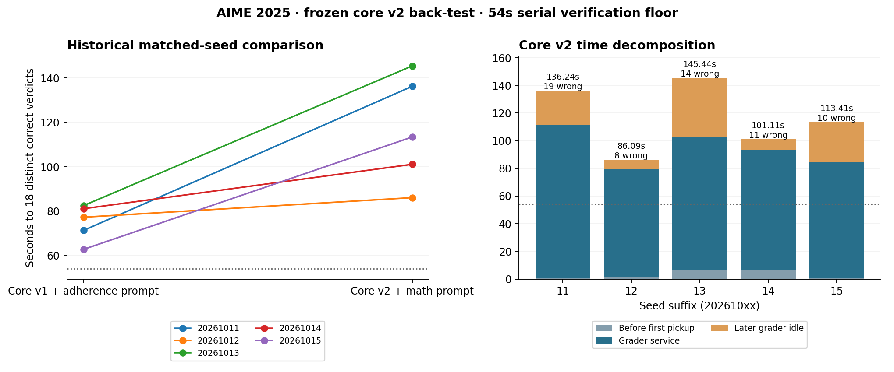

# Frozen core v2: AIME 2025 back-test

**5/5 declared trials reached 18 distinct verified correct.** V2 median
**113.415s**, range **86.088–145.437s**.
The historical same-seed v1 improved-prompt controls had a **77.277s** median.
V2 is slower in this batch; retain v1 as the AIME speed reference. This is a back-test of the new mathematical prompt/extraction bundle, not an
isolated or interleaved parser experiment. All declared outcomes are retained in
[the batch summary](summary.json).



| Seed | V1 control | V2 | Paired change | Wrong checks | Placeholder checks | Requests |
| --- | ---: | ---: | ---: | ---: | ---: | ---: |
| 20261011 | 71.321s | 136.241s | +64.920s | 19 | 16 | 46 |
| 20261012 | 77.277s | 86.088s | +8.811s | 8 | 8 | 44 |
| 20261013 | 82.492s | 145.437s | +62.945s | 14 | 12 | 46 |
| 20261014 | 81.102s | 101.109s | +20.007s | 11 | 9 | 46 |
| 20261015 | 62.783s | 113.415s | +50.632s | 10 | 9 | 44 |

The concrete failure mode is explicit non-answer boxes. Across the valid trials,
**54/62 wrong checks** were the literal strings `EXPRESSION`,
`...`, `?`, `??` or `???`; **31** were exactly `EXPRESSION`, matching the
example in the system prompt. Each wrong completed check occupies three seconds
of the serial grader, so those placeholder checks consumed approximately
**162 seconds** across the batch. Per-question string deduplication
suppresses repeats of the same spelling; distinct placeholders still incur checks.
General mathematical extraction accepts such payloads, while v1's integer
extraction rejected them. These are saved trace observations; this batch did not
change the parser or prompt midway. The full wrong-candidate inventory is in
[analysis.json](analysis.json).

| Seed | First pickup | Completed grader service | Later idle | Exact-ID continuations |
| --- | ---: | ---: | ---: | ---: |
| 20261011 | 0.691s | 111.004s | 24.545s | 16 |
| 20261012 | 1.490s | 78.003s | 6.595s | 14 |
| 20261013 | 6.657s | 96.004s | 42.775s | 16 |
| 20261014 | 6.077s | 87.003s | 8.029s | 16 |
| 20261015 | 0.657s | 84.003s | 28.754s | 14 |

First pickup + completed service + later idle reconciles with each successful
time to target within 0.03 seconds. The first-solved events link to true grader
verdicts; no candidate extraction alone counts as solved. There is a 54-second
floor from eighteen three-second grader checks. Server initialization, cheap
warmup, final trace flushing and service cleanup are outside time to target.

## Reproduce and inspect

```bash
# On callosum, from a clean tested checkout with a free GPU:
~/.venvs/vllm/bin/python -m runner_final.backtest_v2

# Locally, after importing the allowlisted attempt evidence:
.venv/bin/python runs/experiments/core-v2-aime2025-five-seeds-20261004T013100Z/reproduce_analysis.py
```

Source commit `68a79c6c12f79d0d85013dea0e012a012f6b1362`; core manifest
`8e6cf003ae04b063ce5479c43cc72bc6128cd5e828df054334373017e0a7187e`; prompt SHA256
`6499890af0d686e8c0ad76e58ec86c2ab7d117625554509a005e0bef528b6e9e`. The [predeclared protocol](../../../runner_final/five_seeds_core_v2_aime2025.json)
uses seeds 20261011–20261015, the unchanged NVFP4 Marlin / BF16 KV / FlashInfer
95% profile, 65,536-token context, 30×1 barrier coverage, 8,192 initial output
tokens, up to 16,384 additional tokens per continuation, and four requests per
question including continuations. Temperature is 0.8 and top-p is 0.95. Each
trial has a fresh v2 grader, cleared prefix cache and cheap 30×32-token warmup;
one owned inference server is reused across all five. There are no settling
trials, replacement seeds, workload warmups or settings changes between seeds.

The controller checks all thirty initial request payloads against the same-seed
v1 control, allowing only the declared prompt/model substitutions. The local
audit verifies core/prompt/source identity, the gold-free dataset snapshot and
grader key fingerprint, eighteen distinct first-solved verdicts, request caps,
and every saved exact-ID continuation prefix. Attempt metadata links each trial
to its same-seed control in the viewer.

AIME 2025 is development data. The two five-seed batches ran sequentially rather
than interleaved, and each shares one server lifetime; differences do not isolate
prompt, parser or run-state effects. Benchmark mode disables optional CPU/GPU/
engine profiling, so a measured peak VRAM and complete eviction counters are
unavailable. Coarse server logs and cleanup evidence are separate observations
in [server-evidence.json](server-evidence.json); raw SSE and audit/service logs
remain on the remote machine. Both frozen cores remain unchanged.
