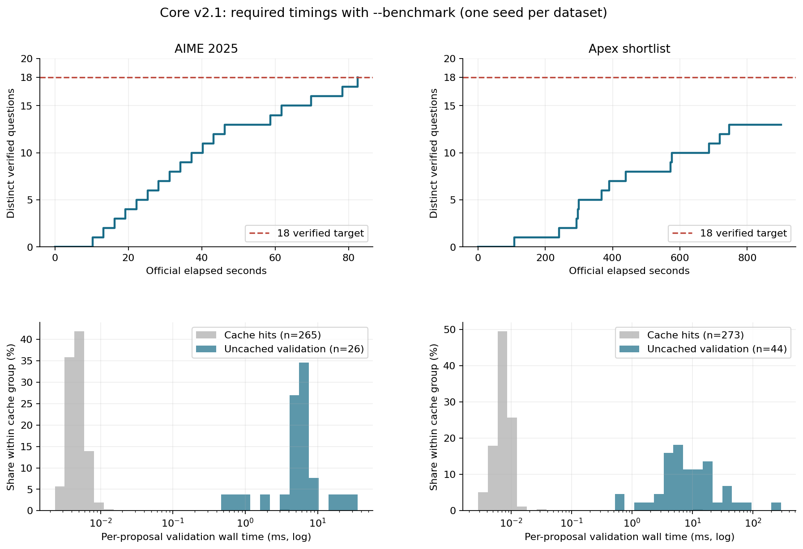

# Core v2.1 benchmark-mode measurements

Measured source `e56419306728913cb883486576d0c9cb20f65d5c`, manifest `7ca23622428105d4d1de78fdd4df0250e07aab3a28c0a842657919903c117948`, seed `20261011`. Two sequential, dedicated-service runs with NVFP4 VibeThinker-3B, 95% configured GPU memory, cheap 30×32 warmup, unchanged v2 prompt, 30×1 barrier, 8K first output / 16K additional continuations / four total requests per question. Each trial has an external 900s official deadline; unmet/deadline outcomes are retained without replacement. Setup/warmup and final flush are outside official solving time.

| Dataset | Verified | Time to 18 | Official duration | Completed / wrong checks | Validation CPU |
|---|---:|---:|---:|---:|---:|
| AIME 2025 | 18 | 82.445s | 82.497s | 20 / 2 | 0.166s |
| Apex shortlist | 13 | unmet | 900.058s | 35 / 22 | 0.809s |

### AIME 2025 — `20261004T162322.975624Z`

Status `completed`; target reached `True`; external deadline reached `False`. 21 unique candidates enqueued; 157 syntax/placeholder rejections; 113 expression duplicates suppressed. Rejection reasons: `{"placeholder": 157}`. Normalization fallbacks: `{}`.

265 cached / 26 uncached proposals. Uncached median/max validation wall: 6.370/32.537ms; cached median: 0.005ms. Validation queue waits summed to 0.003820s (overlapping waits).

Exact token records: 45/45 complete, including saved cancelled streams. Generation statuses: `{"cancelled": 24, "completed": 21}`; 41 observations censored by a cap or cancellation. Observed generation elapsed median/max: 27.982/57.341s; observed end-to-end median/max (through question settlement): 31.211/61.685s. 230625 completion token IDs recorded. Censored elapsed times are not intrinsic completion latencies.

Fresh TTFT median/p95: 196.9/298.7ms (n=30). Continuation TTFT median/p95: 173.9/191.6ms (n=15). The first grader job began at 1.220s; completed jobs occupied 60.002s of grader service, with 21.221s idle between completed jobs. These measurements exclude any service incurred after cancellation.

[Config](../../../attempts/20261004T162322.975624Z/config.json), [summary](../../../attempts/20261004T162322.975624Z/summary.json), [first-solved events](../../../attempts/20261004T162322.975624Z/solved.jsonl).

### Apex shortlist — `20261004T162558.973938Z`

Status `interrupted`; target reached `False`; external deadline reached `True`. 36 unique candidates enqueued; 148 syntax/placeholder rejections; 133 expression duplicates suppressed. Rejection reasons: `{"invalid_latex": 7, "placeholder": 141}`. Normalization fallbacks: `{"LaTeXParsingError": 7}`.

273 cached / 44 uncached proposals. Uncached median/max validation wall: 7.382/264.167ms; cached median: 0.007ms. Validation queue waits summed to 0.015896s (overlapping waits).

Exact token records: 132/132 complete, including saved cancelled streams. Generation statuses: `{"completed": 114, "cancelled": 18}`; 116 observations censored by a cap or cancellation. Observed generation elapsed median/max: 142.694/368.824s; observed end-to-end median/max (through question settlement): 142.714/368.869s. 1511488 completion token IDs recorded. Censored elapsed times are not intrinsic completion latencies.

Fresh TTFT median/p95: 176.3/885.9ms (n=52). Continuation TTFT median/p95: 333.1/846.9ms (n=80). The first grader job began at 82.481s; completed jobs occupied 105.004s of grader service, with 674.834s idle between completed jobs. These measurements exclude any service incurred after cancellation.

[Config](../../../attempts/20261004T162558.973938Z/config.json), [summary](../../../attempts/20261004T162558.973938Z/summary.json), [first-solved events](../../../attempts/20261004T162558.973938Z/solved.jsonl).

## Historical comparison and limits

The historical same-seed v2 AIME control [`20261004T013249.730690Z`](../../../attempts/20261004T013249.730690Z/summary.json) reached 18 in 136.241s, with 37 completed checks and 19 wrong verdicts. The new AIME result is 82.445s, with 2 wrong verdicts. Recorded model/profile, prompt, sampling, seed, schedule and budgets match; v2.1 adds the CPU parser dependencies. These runs occurred at different times. This is one historical comparison, not a replicated isolated effect.

- One new trial per dataset; no repeatability estimate.
- Benchmark mode omits optional host/GPU/engine profiles; no measured VRAM peak or KV eviction trace.
- Apex has 47 questions, including two overlapping AIME 2025 questions; target remains 18.
- Validation wall includes queue/IPC/cache work; overlapping async waits cannot be added to official latency.
- Optional profiling is disabled deliberately: CPU validation's required timers remain, but extraction/IO/event-loop overhead and official VRAM/KV series are unavailable.
- CPU cost is recorded worker process time; cache hits record zero worker CPU. Wall timers also include IPC and waiting. Neither total is an estimate of added critical-path latency.
- Completed client checks may differ from all server work: cancelled/queued jobs can still incur grader service. Required client traces remain in Git; raw SSE, grader audits and service logs remain on the pinned remote worktree.

## V2.2 status

[Queue-aware runtime correction](../../../runner_final/core_v2_2/README.md) is separately frozen and pushed as `550d12eb`. It drains queued answers and pending CPU validation, batches actual wrong verdicts, rechecks after server tokenization, then cancels replaceable live lanes and forks exact prefixes with feedback. All correction requests consume the four-request cap. The prompt and CPU parser remain unchanged. All 320 offline tests passed in a clean source copy with existing ignored legacy fixtures and local socket/macOS sandbox support. No v2.2 GPU speed result is claimed.

Rebuild: `.venv/bin/python -m scripts.profile_v2_1_benchmarks runs/experiments/core-v2_1-benchmarks-20261004T161700Z`. This analysis reads question statements and recorded client verdicts, never reference answers.
