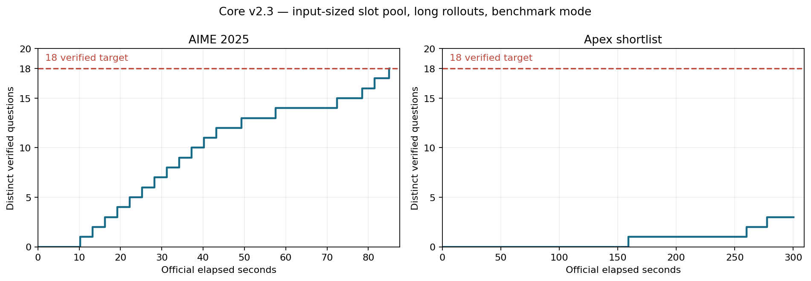

# Core v2.3 benchmark measurements

Measured source `b459e763962f74fe788603d99a07a32459b7ecb8`, manifest `d233ef469ce9a54b1b0f293fba54e34c8d1832cae21f26e0afd20ab4b3dcb73d`, seed `20261011`. Two sequential, independently owned vLLM/grader runs on callosum's A100 80GB, using NVFP4 VibeThinker-3B, 95% configured GPU memory, BF16 KV, FlashInfer, prefix caching and the unchanged v2 prompt. Cheap warmup is 32 tokens per input-sized slot. AIME uses 30 slots; Apex uses 47. One initial long request per question, then ready continuations or least-active fresh samples; 65,536 total context, queue-aware batched wrong-verdict forks and four requests per question. Target remains 18 distinct verified questions. Setup/warmup, cleanup and trace flush are excluded from the official cutoff.

| Dataset | Verified | Time to 18 | Official duration | Completed / wrong checks | Peak slots |
|---|---:|---:|---:|---:|---:|
| AIME 2025 | 18 | 84.985s | 85.091s | 22 / 4 | 30 / 30 |
| Apex shortlist | 3 | unmet | 300.354s | 12 / 9 | 47 / 47 |

### AIME 2025 — `20261004T182509.875138Z`

Status `completed`; deadline reached `False`; official cutoff 900s. Admissions: `{'fresh': 60, 'correction': 3}`. Every question stayed within four generation requests. Candidate outcomes: `{'enqueued': 22, 'duplicate_expression': 102, 'rejected': 188}`. Feedback events: `{'wrong_verdict': 4, 'deferred': 4, 'tokenized': 2, 'fork_queued': 3}`; fork skips: `{}`.

Verified continuation questions: `[5]`. Queued forks are plans; a cutoff can cancel a plan before admission, so queued and executed counts can differ.

Initial template counts agree with served IDs for 30 questions. All 3/3 continuations preserve exact parent prefixes, and every request fits the total context budget. Exact output evidence: 63/63 complete. Generation statuses: `{'cancelled': 58, 'completed': 5}`; 319538 received output token IDs. Required validation CPU: 0.173s; proposal median/max wall: 0.004/35.685ms.

Completed grader jobs occupied 66.003s of service; idle gaps between completed jobs summed to 17.761s.

Fresh / continuation median TTFT: `{'count': 60, 'median_s': 0.10879449400817975, 'p95_s': 0.29692155501106754}` / `{'count': 3, 'median_s': 0.05577246000757441, 'p95_s': 0.05577246000757441}` (seconds; different workloads, not a paired cache speed test).

[Config](../../../attempts/20261004T182509.875138Z/config.json), [summary](../../../attempts/20261004T182509.875138Z/summary.json), [allocation](../../../attempts/20261004T182509.875138Z/allocation.json), [solved events](../../../attempts/20261004T182509.875138Z/solved.jsonl).

### Apex shortlist — `20261004T182748.242613Z`

Status `interrupted`; deadline reached `True`; official cutoff 300s. Admissions: `{'fresh': 52, 'correction': 7}`. Every question stayed within four generation requests. Candidate outcomes: `{'enqueued': 12, 'rejected': 31, 'duplicate_expression': 20}`. Feedback events: `{'wrong_verdict': 9, 'deferred': 2, 'tokenized': 8, 'fork_queued': 8}`; fork skips: `{}`.

Verified continuation questions: `[]`. Queued forks are plans; a cutoff can cancel a plan before admission, so queued and executed counts can differ.

Initial template counts agree with served IDs for 47 questions. All 7/7 continuations preserve exact parent prefixes, and every request fits the total context budget. Exact output evidence: 59/59 complete. Generation statuses: `{'cancelled': 58, 'completed': 1}`; 882346 received output token IDs. Required validation CPU: 0.182s; proposal median/max wall: 0.007/50.000ms.

Completed grader jobs occupied 36.001s of service; idle gaps between completed jobs summed to 253.677s.

Fresh / continuation median TTFT: `{'count': 52, 'median_s': 0.2517718589515425, 'p95_s': 0.40137596195563674}` / `{'count': 7, 'median_s': 0.09136347094317898, 'p95_s': 0.11217048700200394}` (seconds; different workloads, not a paired cache speed test).

[Config](../../../attempts/20261004T182748.242613Z/config.json), [summary](../../../attempts/20261004T182748.242613Z/summary.json), [allocation](../../../attempts/20261004T182748.242613Z/allocation.json), [solved events](../../../attempts/20261004T182748.242613Z/solved.jsonl).

## Historical same-seed comparison

AIME 2025: v2.1 reference `20261004T162322.975624Z` reached 18 in 82.445s; 18 questions were verified within 900s.

Apex shortlist: v2.1 reference `20261004T162558.973938Z` reached an unmet target; 5 questions were verified within 300s.

These historical runs differ in scheduling, long-request budgets and feedback, and Apex changes from 30 to 47 slots. A single comparison does not isolate any one change.

## Default server-log observations

`20261004T182509.875138Z`: 8 periodic samples; maximum observed KV-cache occupancy 9.7%; maximum waiting requests 0; 0 preemption-warning lines and 0 OOM-error lines.

`20261004T182748.242613Z`: 30 periodic samples; maximum observed KV-cache occupancy 38.4%; maximum waiting requests 0; 0 preemption-warning lines and 0 OOM-error lines.

These are existing service logs, including warmup, not an exact eviction counter or physical VRAM peak. [Extracted observations](service_observations.json).

## Limits

- One seed per dataset establishes execution and observed timings, not repeatability or an isolated optimization effect.
- Apex's 300-second cutoff differs from the older v2.1 900-second trial; compare solved counts at equal elapsed time. Two Apex questions overlap AIME 2025.
- Benchmark mode disables GPU/engine/optional host profiles; configured 95% memory is not a measured VRAM peak. No KV eviction rate is inferred from timing alone.
- Required validation CPU is worker process time; wall/queue waits overlap and cannot be added to official latency. Cancelled generation latencies are censored.
- Client verdict counts exclude cancelled checks that may still incur grader service. Full SSE, grader audits and service logs remain in the pinned remote checkout.

Rebuild: `.venv/bin/python -m scripts.profile_v2_3_benchmarks runs/experiments/core-v2_3-benchmarks-20261004T182444Z`. Analysis reads saved candidates and actual grader verdicts, never reference answers.
