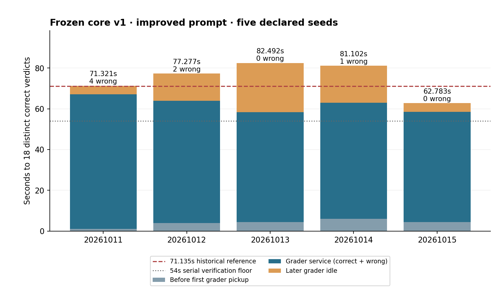

# Frozen core v1: improved-prompt replication

**5/5 reached 18 distinct verified correct questions.** Median **77.277s**, range **62.783–82.492s**. Only **1/5** finished within the predeclared **71.135s** reference: the all-five repeatability gate **failed**. Neither the 71.135s historical result nor the 59.316s FlashInfer best is established as consistently reproducible.

| Seed | Time to 18 | First grader pickup | Grader service | Later idle | Wrong checks | Requests |
| --- | ---: | ---: | ---: | ---: | ---: | ---: |
| 20261011 | 71.321s | 1.102s | 66.002s | 4.216s | 4 | 45 |
| 20261012 | 77.277s | 3.896s | 60.003s | 13.377s | 2 | 43 |
| 20261013 | 82.492s | 4.361s | 54.002s | 24.128s | 0 | 43 |
| 20261014 | 81.102s | 6.034s | 57.002s | 18.065s | 1 | 45 |
| 20261015 | 62.783s | 4.457s | 54.002s | 4.323s | 0 | 30 |

The immutable [core](../../../runner_final/README.md) and [predeclared protocol](../../../runner_final/five_seeds_prompt_core_v1.json) use NVFP4 VibeThinker-3B, Marlin linear kernels, BF16 activations/KV, FlashInfer attention, 95% memory allocation, 65,536-token context, 30×1 barrier scheduling, 8,192 initial output tokens, then up to 16,384 additional tokens per continuation. Four requests per question include continuations. Temperature is 0.8, top-p 0.95. The stronger [system prompt](../../../runner_final/prompts/adherence_v1.txt) requests an immediate prospective boxed integer before rechecking. Benchmark mode buffers required evidence and disables optional profiling. All trials use only the cheap 30×32-token warmup, a fresh serial three-second grader and cleared prefix cache. One owned inference server is reused; server initialization and per-trial warmup are outside the official solve timer.

Source commit `7c40f7af5586bc698b444c6b7934013baf99e5cd`; core manifest `35d6a06315a0e45441b3ac49bd468a2b94553fb172f378bfebc7ea8cc044070f`; prompt SHA256 `26b591c39bcf55f4c94f5359dcc90d3c5626a524478eee1c5ce44b5038162364`. All five seeds, including the first trial, were scored. There was no settling trial, replacement seed, extra warmup or changed preset between trials. Initial request payloads match the historical 71.135s reference after declared model/seed/prompt substitutions; that BF16 reference is a performance threshold, not an isolated prompt control.

Each trial has 30 question records, 18 distinct first-solved events linked to true grader verdicts, at most four generation requests per question, clean tracked source and matching core/prompt hashes. The eighteenth first-solved time equals its target time. First pickup + completed grader service + later idle reconciles with the target time within 0.03s. [Reproduce the audit/figure](reproduce_analysis.py) from the repository root; [all outcomes](summary.json) and [audited data](analysis.json) retain every trial.

The final trial reached 18 during its first coverage round, using only 30 requests and no winning continuations. The other trials needed continuation rounds. Last three solved questions, in order: seed 11 **Q7/Q18/Q12**; seed 12 **Q5/Q12/Q23**; seed 13 **Q26/Q12/Q29**; seed 14 **Q7/Q12/Q9**; seed 15 **Q23/Q11/Q27**. Q12 appears in the late trio in four of five runs, but the eighteenth question changes. This is a small development-data observation, not a stable per-question hardness estimate.

**Format and speculative checks.** Across the 90 winners, 65 were first detected by the unchanged prose parser and 25 by closed boxes. That measures first-detected candidate format; it does not prove that no box appeared later. Seven wrong checks incurred 21 seconds of grader service across the batch. Seed 11 Q18 offered “The answer is 90? Not sure” at 1.08s, incurring a wrong check. Later the text contained `25+16+16+25 = 82` and `So total = 82?`, followed by “the answer is 96?”; the frozen parser submitted 96, another wrong check. The correct 82 was subsequently recognized in continuation prose. Stronger prompt wording alone has not eliminated speculative answer clauses or guaranteed immediate boxing of the computed result. These are trace observations; no parser change was made.

Historical five-seed AIME 2024-warmed trials had a 78.601s median (66.481–105.337s). This batch has a narrower observed range, but changed both prompt and workload warmup, and was not randomized/interleaved with controls. It does not isolate the prompt’s causal effect. All five share one server lifetime; independent-restart repeatability is also untested. AIME 2025 is development data. The original baseline preset remains selected; 30×2/4K has not been run.

[Cleanup evidence](server-evidence.json) confirms exit zero, no remaining compute workers, no owned 8000/8077 listeners and 0 MiB GPU allocation. Coarse server logs observed a maximum 7.3% KV occupancy and no OOM/preemption warning lines; complete eviction counters and a measured VRAM peak are unavailable with optional profiling disabled. Full streams and grader/server logs remain on the remote machine.

One initial bootstrap at commit `9a6cbe5` failed the clean-checkout preflight before inference because a CSV attributes rule made historical files appear modified. Commit `7c40f7a` scoped the rule correctly. No generation trial began in that failed bootstrap; the successful batch used the same original five declared seeds.
