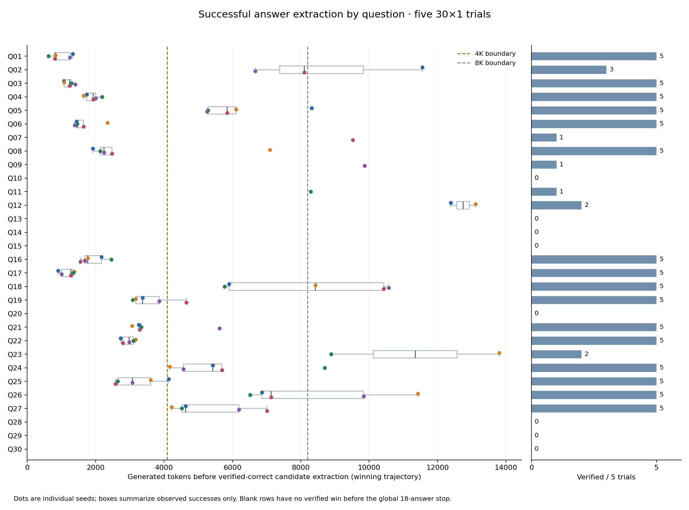
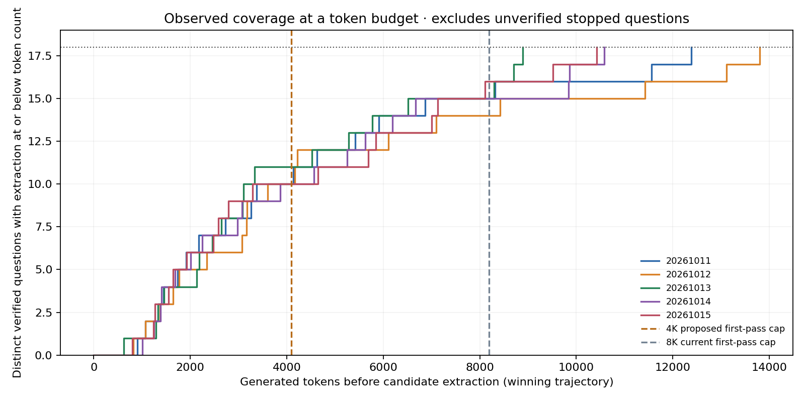

# Tokens to successful extraction: assessing 30×2 with a 4K first pass

The five previous 30×1 trials yield **10–11 distinct verified questions per seed
with extraction by 4,096 generated tokens**, compared with **14–16 by 8,192**.
Across all five seeds, the early-answer union is only **11 questions**: Q01, Q03,
Q04, Q06, Q08, Q16, Q17, Q19, Q21, Q22 and Q25. Seven appear before 4K in every
seed: Q01, Q03, Q04, Q06, Q16, Q17 and Q22. Early success is concentrated in the
same questions; doubling samples does not imply doubling distinct solved questions.

Each dot is one verified winner, with generated tokens accumulated along its
exact-ID continuation ancestry up to the parser's detection of the winning
candidate. Boxes summarize observed successes. The right column counts how many
of five trials verified that question. Prompt tokens and tokens generated while
awaiting the verdict are excluded. Natural completion followed by a fresh sample
starts a new trajectory; the structured data also records total per-question work.

| Seed | Verified questions extracted by 2K | By 4K | By 8K | By 16K |
| --- | ---: | ---: | ---: | ---: |
| 20261011 | 6 | 10 | 15 | 18 |
| 20261012 | 5 | 10 | 14 | 18 |
| 20261013 | 4 | 11 | 15 | 18 |
| 20261014 | 6 | 10 | 15 | 18 |
| 20261015 | 6 | 10 | 16 | 18 |

Of the 90 observed verified successes, 51 (56.7%) are extracted by 4K and 75
(83.3%) by 8K. Median successful extraction is 3,221 generated tokens, with a
625–13,800 range. These figures describe the observed successes, not the chance
that an arbitrary question solves at that budget.

All runs stop at eighteen verified answers. The other 60 question/trial records
are unknown outcomes, not failures or zero-token observations. In particular,
an extracted candidate pending verification at global stop can be correct;
without its verdict we cannot treat the final generated-token count as a
statistical right-censoring point. Blank question rows are not evidence that
those problems cannot be solved. The full-data JSON preserves their statuses
and observed token counts without assigning a successful-extraction count.

## Implication for 30×2

The distribution supports testing two shorter initial trajectories as a way to
obtain more diverse continuation paths. It supplies little evidence for reaching
eighteen directly within 4K: even the five-sample retrospective union covers only
eleven questions there. No independence assumption or pass@2 estimate is justified
from that union. A new prompt and changed batching can also change the paths.

Thirty questions with two 4K rollouts have the same maximum initial output-token
budget as thirty questions with one 8K rollout (245,760 tokens), but 60 versus 30
active requests need a live comparison for elapsed time, scheduling and KV use.
The existing four-request cap permits two fresh requests and one continuation
for each lane; it cannot support repeated continuations of both without raising
the cap. The server's 16K per-request generation ceiling remains intact.

The prepared prompt-adherence preset keeps 30×1 / 8K first pass fixed. It can
separate prompt adherence from a concurrency/budget change in a future comparison.
The user requested freezing the core first; no such comparison was launched.

## Reproduce

`python -m scripts.plot_extraction_tokens --streams-root /tmp/aime-final-solved-streams`
replays the frozen parser on each winning stream, matches answer/kind/channel/end
to its verified event, checks the entire stream's exact output IDs and visible
text against saved records, and counts output IDs at that detection event.
The external artifact archive is `/tmp/aime-final-solved-streams.tar.gz` on the
remote machine, sourced from the historical `aime-bench-final-ccca184` worktree.

[All 150 question/trial records and thresholds](extraction-token-distribution.json),
[distribution SVG](extraction-token-distribution.svg),
[distribution PDF](extraction-token-distribution.pdf),
[coverage PDF](extraction-token-coverage.pdf).
