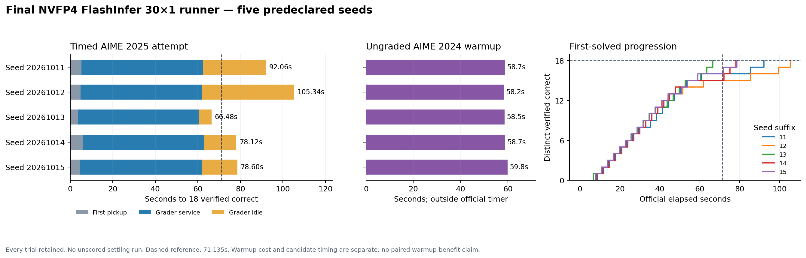

# Final runner: five predeclared seeds

Question-level follow-up: [what the late correct answers share](TAIL_REASONING.md), with audited streamed reasoning milestones and a visual timeline.

Budget follow-up: [generated tokens to successful extraction per question](EXTRACTION_TOKENS.md), with 4K/8K boundaries and observed early-answer overlap across seeds.

**5/5 reached 18 distinct verified correct questions.** Median time: **78.601s**; range **66.481–105.337s**. **1/5** met the predeclared 71.135-second threshold. Consistent sub-reference speed is **not confirmed**.

| Seed | First 18 | Warmup | Init + attempt | Initial TTFT | Grader queries (wrong) | Grader idle | Generation requests |
| --- | ---: | ---: | ---: | ---: | ---: | ---: | ---: |
| 20261011 | 92.061s | 58.670s | 151.593s | 175.2ms | 19 (1) | 29.701s | 45 |
| 20261012 | 105.337s | 58.198s | 164.392s | 197.9ms | 19 (1) | 43.470s | 46 |
| 20261013 | 66.481s | 58.542s | 125.861s | 201.6ms | 19 (1) | 5.766s | 45 |
| 20261014 | 78.123s | 58.725s | 137.690s | 198.7ms | 19 (1) | 15.171s | 45 |
| 20261015 | 78.601s | 59.820s | 139.269s | 200.0ms | 19 (1) | 16.847s | 44 |

The selected policy is frozen in [runner_final](../../../runner_final/README.md): NVFP4 Marlin weights, BF16 activation/KV, FlashInfer attention, 95% GPU allocation, 64K total context, 30×1 barrier coverage, first-pass 8K then up to 16K additional output per continuation, temperature 0.8, top-p 0.95, cap four requests per question including continuations. Benchmark mode buffers required traces and disables optional CPU/GPU/engine profiling.

Source commit: `ccca18445ed2e6b5350e5822c0190fb786c7de41`. The [protocol](config.json) declared every seed before execution. One private inference server is reused; each trial has a fresh serial 3-second grader, successful prefix-cache clearing, all 30 ungraded AIME 2024 generations before grader launch, and the standard 30×32-token warmup. No warmup answers were checked. Warmup uses an 8K output cap, the same sampling controls, and no early candidate cancellation. Warmup and startup are excluded from the official 2025 solving timer; initialization plus attempt is retained to expose their cost. Server startup before the first runner invocation is an additional batch cost recorded in batch timestamps.

All valid initial payloads match the original reference after the declared model and seed substitutions. Each has 30 question records, at most four generation requests per question, 18 distinct first-solved events linked to true grader verdicts and timestamps, and an 18th verdict time equal to the reported target time. The stacked grader timeline sums within 0.03s of that time. Exact token and verdict evidence is retained; full SSE and service/grader logs remain remote. Optional GPU peaks and complete eviction counters are unavailable in benchmark mode.

The workload warmup cost a median **58.670s per trial**, generating a median **204,178 tokens**. It did not require grader service. This workload can exercise longer prompts/decodes, but vLLM already performs graph/kernel initialization warmup. These five different-seed warmed trials are not a paired warmed/unwarmed experiment and cannot establish the warmup's causal benefit. Historical same-seed independent FlashInfer times were 87.356, 59.316 and 86.574s; the 59.316s fastest draw was not consistently replicated.

AIME 2025 remains the development benchmark used for tuning; this is a repeatability check, not a held-out generalization result. All five outcomes, including the first, are scored and retained.

[All results](summary.json), [validated plot data](analysis.json), [PNG](five-seed-timing.png), [SVG](five-seed-timing.svg), [PDF](five-seed-timing.pdf).

The user requested restoring the cheaper warmup after this batch. Current
[final v2](../../../runner_final/README.md) uses only 30 streams × 32 tokens by
default; warmed v1 and its protocol remain separately runnable. All historical
configs and source commit IDs are preserved. **200 offline tests passed** for
the restored default and its reporting support.

[Variance analysis](VARIANCE.md) explains the measured spread. [Server and cleanup
evidence](server-evidence.json) confirms exit zero, no remaining owned workers
or listeners, and 0 MiB GPU allocation after cleanup. Coarse server logs reached
9.0% KV usage and contain no preemption/OOM warnings; they do not provide a
complete eviction counter or VRAM peak.
