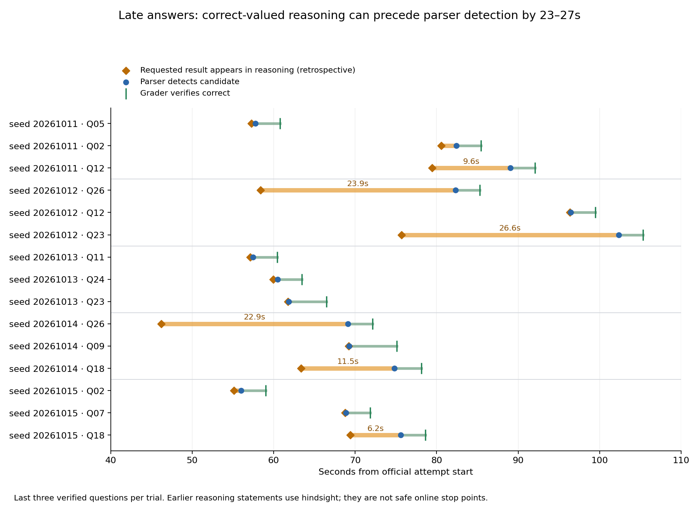

# What the late correct answers share

The strongest recurring behavior is **case enumeration followed by repeated consistency checks after the requested result already appears**. The result is written as an equation (`total = 113`, `successes = 610`, `a+b = 510`) rather than a recognized candidate. The model keeps revisiting cases until it writes `answer is …` or a box. This is a measured trace pattern, not a claim that every earlier equation is a safe online answer.

The **18th correct answer comes from only three questions** across these five seeds: Q12, Q23, Q23, Q18 and Q18, respectively. We read the last three verified questions in each trial: 15 winning trajectories, 14 completed through an exact-ID continuation. The retrospective audit finds four post-result rechecking trajectories, three error-repair trajectories, and eight trajectories whose requested result is computed late and then detected within two seconds. Six of the 15 have a result-to-detection gap over five seconds: all four rechecking cases plus both Q18 error-repair cases.

| Question and seed | Requested result first appears | Parser detects candidate | Gap | What happens between them |
| --- | ---: | ---: | ---: | --- |
| Q26, 20261012 | 58.387s | 82.312s | **23.925s** | Counts equal-chord perfect matchings of a regular 24-gon to 113; rechecks cycle parity, independent matchings and duplicate lengths |
| Q26, 20261014 | 46.222s | 69.119s | **22.897s** | Has `total = 113` during the first 8K pass, then recounts through the continuation |
| Q23, 20261012 | 75.707s | 102.334s | **26.627s** | Has `successes = 610`; revisits residue classes, exclusion of zero, and the exceptional first block N<25 |
| Q12, 20261011 | 79.436s | 89.058s | **9.622s** | Has `a+b = 507+3 = 510`; rechecks finite versus unbounded regions and inequality signs |
| Q18, 20261014 | 63.381s | 74.838s | **11.457s** | Enumeration yields 82 against an earlier 98; diagnoses an incorrect case multiplicity and recounts |
| Q18, 20261015 | 69.420s | 75.598s | **6.178s** | Gets 48+2+32=82 against an earlier 83; repeats all nine case contributions |

These are chunk timestamps relative to each official start, before grader service. The gaps span further reasoning before a recognized marker; Q26 seed 20261014 also crosses the 8K boundary and continuation admission wait. Marker-to-detection itself is 0–1.29s in these six cases, partly because prose extraction waits for a completed line. The structured evidence keeps that smaller delay separately.

## Same problem, different behavior

Q23 is the clearest comparison. In the fastest seed (20261013), it computes `successes = 610` at **61.758s** and detection follows at **61.831s**, only **0.073s** later. In the slowest seed (20261012), it reaches that count at **75.707s** and spends another **26.627s** before detection. The candidate-arrival difference is 40.503s: 13.949s to reach the result plus 26.554s of extra post-result delay. Both derivations use the residue-count and first-block correction, but the slow trajectory keeps questioning that correction.

Q12 shows both kinds of tail. Seed 20261011 derives 510 and rechecks for 9.622s. Seed 20261012 does not reach the requested sum until **96.384s**, then boxes it almost immediately (0.094s to detection). Its region/sign analysis genuinely lasts longer; broader equation extraction would not recover that entire tail.

Q18 needs care: some checking is productive error repair. The 20261014 trace had already submitted the wrong answer 98; later enumeration reveals 82 and finds the wrong multiplicity. Q24 similarly changes a previously submitted 145 to 149 by correcting n=135 to n=139. Suppressing all checking would discard useful work as well as repetition.

## Recurrence and interpretation

Q02, Q12, Q18, Q23 and Q26 each occur twice among the five last-three sets; Q05, Q07, Q09, Q11 and Q24 occur once. No question occurs in all five tails. This small, outcome-selected sample does not establish a mathematical topic as systematically slow. It does show that repeated enumeration, boundary checks and contradictory subtotals are useful behavioral signatures.

The practical optimization candidate is recognizing statements of the **requested quantity** earlier and submitting them while reasoning continues, with existing per-question deduplication and serialized grader checks. Extracting every occurrence of the eventual integer would be misleading: Q02 contains 588 much earlier as the area of triangle ABC, before computing the requested heptagon. Their equality is only learned later. No extraction policy or runner behavior was changed for this analysis.

## Evidence and reproduction

[All 15 manually audited milestones, excerpts and exact timings](tail-reasoning.json), [SVG](tail-reasoning.svg), [PDF](tail-reasoning.pdf). Each row links its question record, verified answer and candidate kind. The script reconstructs every selected initial/continuation stream and asserts exact equality with the saved visible text, checks all milestones against that text, and verifies that detections follow the streamed marker. Audited character positions are explicit and reviewable rather than inferred from every matching numeral.

Run `python scripts/analyze_tail_reasoning.py --streams-root /tmp/aime-final-tail-streams` after extracting the tail SSE archive. Raw streams remain outside Git in `/home/azureuser/aime-bench-final-ccca184/attempts/`; the remote subset is `/tmp/aime-final-tail-streams.tar.gz`. Historical source for all five trials is `ccca18445ed2e6b5350e5822c0190fb786c7de41`.

Earlier statements are identified retrospectively using later verified answers. They can be tentative and followed by a change of mind. These timings demonstrate an opportunity to test a better candidate extractor; they do not measure a guaranteed reduction in time to eighteen under a changed policy, whose grader queue and generation schedule would also change.
