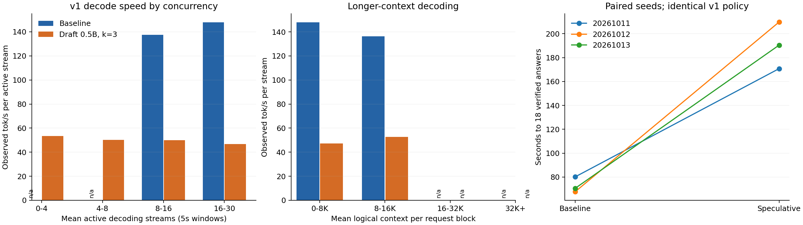

# V1 speculative decoding A/B

Median time to 18: **70.46s baseline, 190.48s speculative** (2.70× baseline latency). 3 completed pairs; see observed decode rates below.

VibeThinker-3B derives from [Qwen2.5-Coder-3B](https://github.com/WeiboAI/VibeThinker). The draft is [Qwen2.5-Coder-0.5B (0.49B parameters)](https://huggingface.co/Qwen/Qwen2.5-Coder-0.5B), revision `8123ea2e9354afb7ffcc6c8641d1b2f5ecf18301`, in BF16, with three greedy draft tokens per verification.

The target retains NVFP4/Marlin, FLASHINFER, BF16 KV, 95% memory, prefix caching and 64K context. Both arms run unchanged canonical v1: prompt adherence, AIME 2025, 30×1 barrier, 8K initial/16K subsequent requests, four-request cap, temperature 0.8/top-p 0.95, 3s serial grader and target18. Each cell uses a fresh server and the same canonical warmup; order is AB, BA, AB across three paired seeds. The runner stays in benchmark mode; public engine counters are polled externally once per second.

| Seed | Baseline s | Speculative s | Difference s | Baseline/speculative | Draft acceptance |
| --- | ---: | ---: | ---: | ---: | ---: |
| 20261011 | 80.07 | 170.78 | 90.71 | 0.47× | 40.6% |
| 20261012 | 67.59 | 209.84 | 142.25 | 0.32× | 42.0% |
| 20261013 | 70.46 | 190.48 | 120.02 | 0.37× | 42.0% |

| Active stream bin | Baseline tok/s | Speculative tok/s | Spec/baseline | Windows A/B | Mean context A/B |
| --- | ---: | ---: | ---: | --- | --- |
| 0-4 | unavailable | 53.3 | unavailable× | 0/3 | unavailable/8380 |
| 4-8 | unavailable | 50.2 | unavailable× | 0/5 | unavailable/8076 |
| 8-16 | 137.6 | 49.9 | 0.36× | 9/26 | 9206/7329 |
| 16-30 | 147.8 | 46.7 | 0.32× | 32/79 | 4007/3004 |

| Mean logical context | Baseline tok/s | Speculative tok/s | Spec/baseline | Request blocks A/B |
| --- | ---: | ---: | ---: | --- |
| 0-8K | 147.8 | 47.2 | 0.32× | 736/2019 |
| 8-16K | 136.3 | 52.8 | 0.39× | 88/88 |
| 16-32K | unavailable | unavailable | unavailable× | 0/0 |
| 32K+ | unavailable | unavailable | unavailable× | 0/0 |

| Request decode-rate distribution | Baseline | Speculative |
| --- | ---: | ---: |
| Requests observed for at least 5s | 120.0 | 104.0 |
| Median tok/s | 144.9 | 47.7 |
| P10 tok/s (slow tail) | 135.3 | 43.4 |

Decode rates count exact token IDs in saved SSE chunks, including multi-token chunks. The first chunk of each request is excluded from rate counting; TTFT and cancellation cleanup are outside decode exposure. Rates pool tokens over summed first-to-last decoding request-seconds in complete five-second windows. Context bins classify each request's block by its time-weighted mean logical context (prompt plus generated IDs), retaining blocks at least 4.5s long. Request-rate quantiles use each request's mean observed rate with at least 5s decode exposure, including policy-censored streams; they are descriptive, without matching trajectories or contexts. Low-concurrency bins describe the observed tail; changing contexts and question mixes prevent a fixed-context causal interpretation. Seeds pair workloads but speculative sampling can change trajectories. Three pairs are exploratory, without a significance claim. No speed is inferred for bins with no exposure. The draft's native context is 32K while the target is 64K; inspect saved serving logs for the installed runtime's limit handling.

Every draft vocabulary entry has the same token ID in the target; the target adds `<think>` and `</think>`. Both LM heads have 151,936 entries. Preflight records tokenizer hashes and vLLM version. Counter deltas labelled `including_warmup` include warmup; sampled official deltas use only snapshots inside the solve interval.

Reproduce on idle Callosum with `~/.venvs/vllm/bin/python scripts/speculative_v1_ab.py --execute`. Render this report locally with `.venv/bin/python scripts/report_speculative_v1_ab.py BATCH_DIRECTORY`. [Analysis](analysis.json) and [window measurements](decode_windows.csv) are adjacent; full streams, weights and service logs stay outside Git.

Validation: 25 focused offline checks passed (`test_runner_package`, `test_refactor_v1_batch`, `test_speculative_v1_ab`). Recorded A/B configs pass matched-control audits, and all six attempts reached target18. Every stream's saved output IDs match SSE token evidence. All seven newly imported v1 metadata records, including the excluded preflight baseline, were validated and annotated. The repository-wide legacy `src.attempt_metadata --all` command rejects an existing v2.1 syntax-parser annotation; those historical files were preserved and the new v1 records validated individually.

The earlier [harness preflight failure](../speculative-v1-ab-20261007T053637Z/README.md) remains saved and is excluded from these statistics. Experimental runtime commit: `188dcae3d2322d39afd73e9c23157561fda2ca0b`; canonical manifest SHA-256: `165d659a47e0f3e789c9a1cfd4ec9fc4184081af91cbda35d719fe41c339d688`. Unrelated historical metadata changes on the node were recorded in batch provenance; the canonical source identity was verified at every attempt startup.

For the observed v1 workload, leave this off-the-shelf k=3 drafter disabled: the 8–16K context rate is 136.3 versus 52.8 tok/s, and P10 request decode rate is 135.3 versus 43.4 tok/s. Draft acceptance is 40.6–42.0%. These measurements concern this target, draft, depth, runtime and workload; they do not rule out a faster distilled drafter or another proposal depth. The baseline has no complete windows with at most eight active decoders, so no paired low-concurrency speed ratio can be estimated. Neither arm has qualifying 16K+ context blocks.
