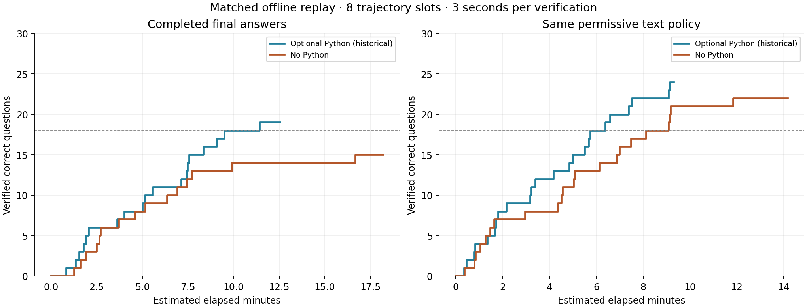

# Matched intermediate-answer extraction: no Python versus optional Python

Same permissive text extraction from reasoning and content, same cached Qwen3.5 tokenizer, and same shared FIFO verifier: three seconds per distinct question-answer pair. All negative checks cost three seconds and leave inference running. The historical replay results were reproduced exactly.

| Answer policy | Historical optional Python | No Python |
|---|---:|---:|
| Strict final answers | 19/30 | 15/30 |
| Boxes / Answer: lines | 20/30 | 15/30 |
| Same permissive text policy | 24/30 | 22/30 |
| Permissive + Python totals | 24/30 | 22/30 |

## Estimated time to 18 verified correct questions

| Capacity | Policy | Historical optional Python | No Python |
|---|---|---:|---:|
| 60 | Completed final answers | 3.39 min | target unmet |
| 60 | Boxes / Answer: lines | 3.23 min | target unmet |
| 60 | Same permissive text policy | 1.27 min | 2.12 min |
| 60 | Permissive + Python totals | 1.27 min | 2.12 min |
| 30 | Completed final answers | 3.63 min | target unmet |
| 30 | Boxes / Answer: lines | 3.62 min | target unmet |
| 30 | Same permissive text policy | 1.77 min | 2.93 min |
| 30 | Permissive + Python totals | 1.77 min | 2.93 min |
| 8 | Completed final answers | 9.50 min | target unmet |
| 8 | Boxes / Answer: lines | 9.50 min | target unmet |
| 8 | Same permissive text policy | 5.73 min | 8.11 min |
| 8 | Permissive + Python totals | 5.70 min | 8.11 min |



## Fixed observed starts, with no rescheduling or cancellation

| Policy | Historical optional Python | No Python |
|---|---:|---:|
| Completed final answers | 9.50 min | target unmet |
| Boxes / Answer: lines | 9.50 min | target unmet |
| Same permissive text policy | 7.49 min | 9.90 min |
| Permissive + Python totals | 7.49 min | 9.90 min |

Newly recovered no-tool questions under the same permissive text policy: [2, 7, 11, 12, 25, 27, 29].

## Eight-slot verification load

| Policy | Correct questions | Checks before 18 | Wrong checks | Peak pending checks |
|---|---:|---:|---:|---:|
| Completed final answers | 15 | None | 0 | 1 |
| Boxes / Answer: lines | 15 | None | 0 | 1 |
| Same permissive text policy | 22 | 25 | 7 | 5 |
| Permissive + Python totals | 22 | 25 | 7 | 5 |

## Limits

This is an offline replay using saved answers as a perfect-verifier stand-in. Intermediate arrival times are estimated from token fractions in non-streaming responses. No live intermediate grading, early cancellation, or billing savings occurred. Actual hosted durations come from different run dates. A target-unmet policy is not ranked.

Python stdout is an additional policy for the historical arm; the baseline has no stdout. The main permissive comparison uses the unchanged text policy in both arms.

Candidate inventories retain incorrect and hypothetical proposals. Correctness annotations are added after extraction and simulation; candidates are not selected using the answer key.

Reproduce:

```sh
.venv/bin/python -m src.experiments.python_tools.report_no_python_early_verify_v1 --run runs/no-python-qwen35-pass2-parasail-20261003
```
