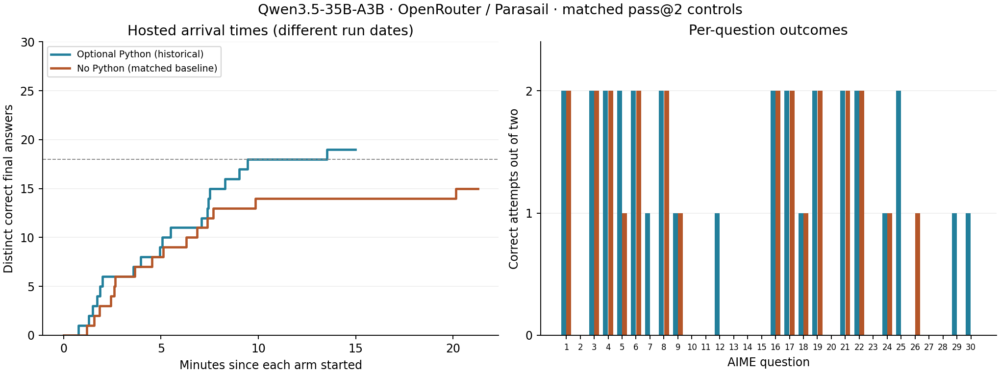

# Qwen3.5-35B-A3B: matched no-Python baseline

Both arms used OpenRouter with Parasail pinned and fallbacks disabled. The no-tool arm ran from the local client.

| Metric | Historical optional Python | No Python |
|---|---:|---:|
| Questions solved, pass@2 | 19/30 | 15/30 |
| Correct attempts | 31/60 | 25/60 |
| Sample 1 correct | 18/30 | 14/30 |
| Sample 2 correct | 13/30 | 11/30 |
| Generated tokens | 789,907 | 836,068 |
| Input tokens | 60,571 | 15,348 |
| Reported cost, USD | 0.798993 | 0.838370 |
| Total hosted wall time, s | 899.16 | 1276.69 |
| Median attempt elapsed, s | 108.26 | 146.89 |
| Time to 18 correct final answers, s | 567.13 | target unmet |



For the same intermediate-answer extraction and three-second verification replay used by the tool arm, see the [paired intermediate-answer report](early_verify_pass2/report.md).

## Matched controls

All 60 saved first requests passed a field-for-field audit against the historical arm, allowing only removal of `tools`, `tool_choice`, and the Python-specific system suffix. The original concise solver prompt remains.

Controls: same 30 questions, two samples each, launch order, per-question/sample seeds (`2026100200 + 100*q + sample`), eight active trajectories, thinking enabled with reasoning retained, temperature 0.6, top-p 0.95, top-k 20, and 16,384 cumulative generated tokens. Both samples run regardless of the first result. No automatic retries or early verification. No answer key enters model inputs.

Routing: `order=["parasail"]`, `allow_fallbacks=false`, `require_parameters=true`. Every response is checked for the expected provider and model. The tool arm permits follow-up tool rounds within the cumulative budget; the no-tool arm has one request per attempt.

The provider control follows [OpenRouter provider routing](https://openrouter.ai/docs/guides/routing/provider-selection).

Optional-Python statuses: `{'complete': 31, 'generation_budget_exhausted': 29}`. No-Python statuses: `{'complete': 25, 'generation_budget_exhausted': 35}`.

Response providers: optional Python `{'Parasail': 76}`; no Python `{'Parasail': 60}`.

Paired attempt outcomes: `{'both_correct': 24, 'neither_correct': 28, 'python_only_correct': 7, 'no_python_only_correct': 1}`. Paired question pass@2 outcomes: `{'both_correct': 14, 'neither_correct': 10, 'python_only_correct': 5, 'no_python_only_correct': 1}`.

## Per-question results

| Q | Python sample 1 | No Python sample 1 | Python sample 2 | No Python sample 2 |
|---|---|---|---|---|
| 1 | 70 / correct | 70 / correct | 70 / correct | 70 / correct |
| 2 | — / generation_budget_exhausted | — / generation_budget_exhausted | — / generation_budget_exhausted | — / generation_budget_exhausted |
| 3 | 16 / correct | 16 / correct | 16 / correct | 16 / correct |
| 4 | 117 / correct | 117 / correct | 117 / correct | 117 / correct |
| 5 | 279 / correct | 279 / correct | 279 / correct | — / generation_budget_exhausted |
| 6 | 504 / correct | 504 / correct | 504 / correct | 504 / correct |
| 7 | 821 / correct | — / generation_budget_exhausted | — / generation_budget_exhausted | — / generation_budget_exhausted |
| 8 | 77 / correct | 77 / correct | 77 / correct | 77 / correct |
| 9 | 62 / correct | 62 / correct | — / generation_budget_exhausted | — / generation_budget_exhausted |
| 10 | — / generation_budget_exhausted | — / generation_budget_exhausted | — / generation_budget_exhausted | — / generation_budget_exhausted |
| 11 | — / generation_budget_exhausted | — / generation_budget_exhausted | — / generation_budget_exhausted | — / generation_budget_exhausted |
| 12 | 510 / correct | — / generation_budget_exhausted | — / generation_budget_exhausted | — / generation_budget_exhausted |
| 13 | — / generation_budget_exhausted | — / generation_budget_exhausted | — / generation_budget_exhausted | — / generation_budget_exhausted |
| 14 | — / generation_budget_exhausted | — / generation_budget_exhausted | — / generation_budget_exhausted | — / generation_budget_exhausted |
| 15 | — / generation_budget_exhausted | — / generation_budget_exhausted | — / generation_budget_exhausted | — / generation_budget_exhausted |
| 16 | 468 / correct | 468 / correct | 468 / correct | 468 / correct |
| 17 | 49 / correct | 49 / correct | 49 / correct | 49 / correct |
| 18 | 82 / correct | 82 / correct | — / generation_budget_exhausted | — / generation_budget_exhausted |
| 19 | 106 / correct | 106 / correct | 106 / correct | 106 / correct |
| 20 | — / generation_budget_exhausted | — / generation_budget_exhausted | — / generation_budget_exhausted | — / generation_budget_exhausted |
| 21 | 293 / correct | 293 / correct | 293 / correct | 293 / correct |
| 22 | 237 / correct | 237 / correct | 237 / correct | 237 / correct |
| 23 | — / generation_budget_exhausted | — / generation_budget_exhausted | — / generation_budget_exhausted | — / generation_budget_exhausted |
| 24 | — / generation_budget_exhausted | — / generation_budget_exhausted | 149 / correct | 149 / correct |
| 25 | 907 / correct | — / generation_budget_exhausted | 907 / correct | — / generation_budget_exhausted |
| 26 | — / generation_budget_exhausted | 113 / correct | — / generation_budget_exhausted | — / generation_budget_exhausted |
| 27 | — / generation_budget_exhausted | — / generation_budget_exhausted | — / generation_budget_exhausted | — / generation_budget_exhausted |
| 28 | — / generation_budget_exhausted | — / generation_budget_exhausted | — / generation_budget_exhausted | — / generation_budget_exhausted |
| 29 | 104 / correct | — / generation_budget_exhausted | — / generation_budget_exhausted | — / generation_budget_exhausted |
| 30 | 240 / correct | — / generation_budget_exhausted | — / generation_budget_exhausted | — / generation_budget_exhausted |

## Interpretation

- Historical and baseline runs took place at different times; provider load and backend revisions are uncontrolled.
- Same seeds and provider do not guarantee identical stochastic output.
- Only two attempts per question; accuracy differences are descriptive.
- Complete final-answer exact match; capped/error answers excluded in both arms.
- The intervention removes both tool availability and its prompt instructions.

Exact requests/responses and local grading are saved in `NN-sample-S.json`; provenance is in `provenance.json`. Full traces remain local. Summary, request hashes, paired metrics, and this report are versioned.

Reproduce the offline comparison:

```sh
.venv/bin/python -m src.experiments.python_tools.report_no_python_baseline_v1 --out runs/no-python-qwen35-pass2-parasail-20261003
```
