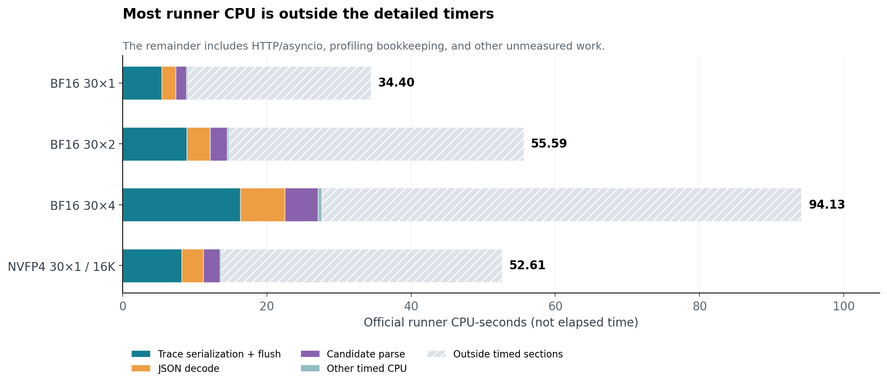
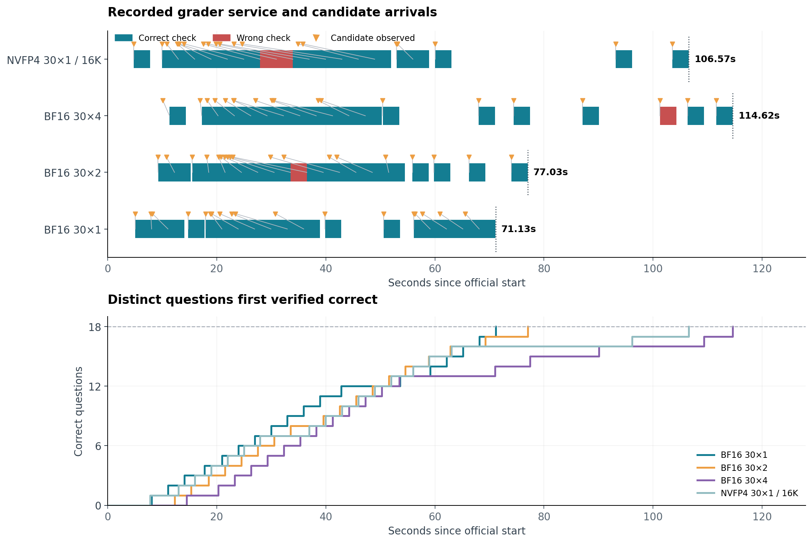
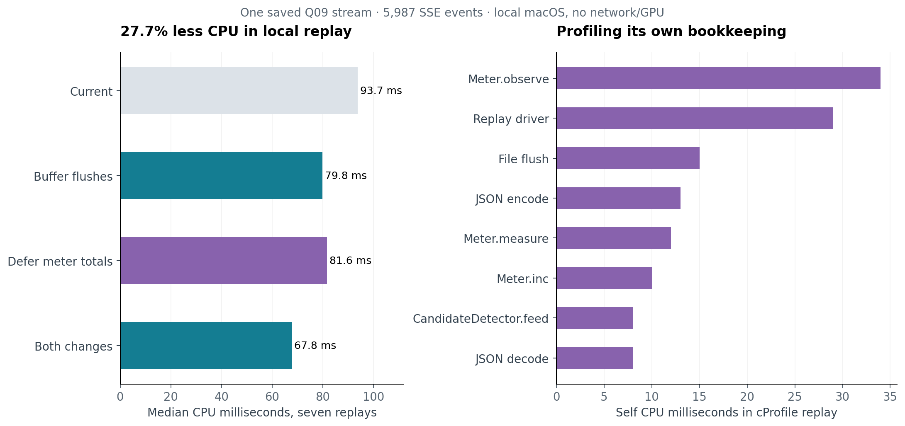

# Runner profiling and benchmarking overhead

The saved profiles identify synchronous trace flushing and profiling bookkeeping
as useful CPU optimization targets. A local replay reduced CPU by 27.7% when
flushes were batched and meter totals were aggregated later. These measurements
do not establish an end-to-end speedup: most of the 30×1 tail was waiting for
candidates and the serial grader still requires at least 54 seconds.

## CPU work during the official attempt



Bars show CPU-seconds, not additional elapsed time to sum with inference. The
hatched remainder includes HTTP/asyncio, profiling bookkeeping, stream handling
and other unmeasured work. It must not be labeled entirely as instrumentation
overhead. Trace serialization/write/flush alone used 5.41 CPU-s at BF16 30×1 and
16.28 CPU-s at 30×4. The figures preserve the original measurements.

## Actual verification timeline



Colored intervals come from the grader's recorded pickup and answer timestamps.
Triangles are the candidates that were subsequently checked; connecting lines
show waiting until pickup. Empty service intervals are grader idle time. The
lower panel uses distinct first-solved timestamps, ending at 18 correct.

This is an observed verification trace. Historical instrumentation recorded
aggregate CPU sections, not per-function CPU spans or sampled call stacks, so a
full chronological CPU flame graph cannot be reconstructed from those files.

## Profiling the profiler



The left panel shows seven-repeat median CPU times for one saved Q09 stream.
Every variant preserved extracted candidates and output token IDs. The right
panel shows self CPU time in a separate cProfile run; profiler-induced overhead
means those times are not interchangeable with the unprofiled replay medians.
Both are local macOS replays without HTTP, async concurrency or GPU execution.

## New benchmarking controls

Canonical and `src.attempt_runners.speedrun_v2` now accept:

```sh
--benchmark
```

This implies `--no-overhead-profile --no-gpu-telemetry --buffer-traces`. It disables
per-token timing/counters, event-loop lag sampling, vLLM metrics polling and NVML
sampling. Disabled meter scopes read no clocks. Required generation/TTFT and
first-solved timestamps, candidates, verification verdicts and exact token IDs
remain available. GPU observations are explicitly null when sampling is disabled.

Client SSE rows, requests/responses, token records, round/question records and
verification/solved events stay in RAM through the attempt. They are serialized
and written after official timing ends and owned services close. Continuations
read the buffered exact IDs and question state directly. Flush duration and
record counts are saved separately in `summary.trace_storage`; flush time is
excluded from both time to 18 and official attempt latency. Startup configuration
and external service logs/audits remain on disk.

For an instrumented run with buffered traces but retained GPU/engine observations,
use `--buffer-traces` alone. It also buffers engine samples and the existing GPU
sampler's output. `--no-overhead-profile` can be used independently when GPU
sampling should remain enabled. The historical `speedrun_v1` and naive runner
snapshots remain the prior comparison versions.

The machine had 211 GiB available system RAM when checked. Previous 30×4 raw SSE
payloads totaled about 211 MB; Python row/string overhead increases resident size.
The full capped request budget can retain more data than those completed runs.
There is no periodic disk spill in buffered mode. Graceful interruption flushes
partial records; SIGKILL, power loss or process OOM can lose the unflushed client
buffer. Grader audits remain independent of that buffer.

Example, using the existing NVFP4 model profile:

```sh
~/.venvs/vllm/bin/python -m src.attempt_runners.speedrun_v2 \
  --model r0b0tlab/VibeThinker-3B-NVFP4 \
  --parallelism 30 --rollouts 1 --schedule barrier \
  --first-pass-max-tokens 16384 --max-tokens 16384 \
  --target-correct 18 --max-attempts-per-question 4 --benchmark
```

The ready-to-use [benchmark configuration](../../../configs/experiments/vibe-nvfp4-30x1-16k-benchmark-v2.json)
records these controls. Benchmark trials are recorded as a distinct
telemetry/storage configuration; historical results retain their original settings.

## Remote benchmark-mode result

The matched NVFP4 30×1 / 16K rerun reached 18 correct in **106.931s**, compared
with 106.570s for the profiling-on control. Official runner CPU fell from
52.606 to 37.509 CPU-s (28.7%), while final trace flushing took 1.943s outside
official timing. Peak runner RAM was 269.8 MiB. The grader waited 45.808s between
checks; the final two answers arrived late.

All 30 request JSONs and prompt IDs match, but all 30 observed output paths
changed. This pair supports lower measured CPU use and correct buffered storage;
it does not demonstrate a wall-time improvement attributable to instrumentation.
See the [benchmark result and paired audit](../../experiments/nvfp4-30x1-16k-benchmark-20261003T215349Z/README.md).

## Decode throughput under concurrency

The [observed throughput report](../20261003-decode-throughput/README.md)
uses prior BF16 sweep engine counters to plot aggregate and per-active-request
decoding rates against sampled running concurrency. Those historical observations
include changing contexts and cancellations; they are not a fixed-context scaling
benchmark.

## Evidence and reproduction

- [Prior sweep analysis](../../speedrun_sweeps/bf16-95pct-20261003T210226Z/analysis.json)
- [NVFP4 attempt and CPU review](../../experiments/nvfp4-30x1-16k-20261003T212811Z/README.md)
- [Replay timings, source code and cProfile output](../../experiments/nvfp4-30x1-16k-20261003T212811Z/cpu_replay_audit.json)
- [Chart input data](analysis.json)

Each chart also has an adjacent SVG and PDF export. Regenerate using a Python
environment with matplotlib:

```sh
.venv/bin/python scripts/render_attempt_profile_report.py
```

Validation covers in-memory continuation, snapshots and append ordering, exact
token/candidate behavior, cancelling all sibling streams at the target, managed
success/interruption cleanup, disabled GPU polling and clock reads, and atomic
flush retries. The full offline suite passed before deployment.
