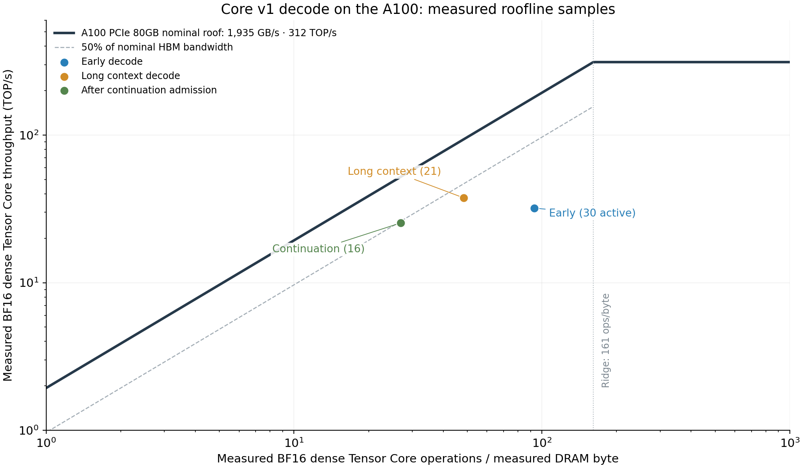
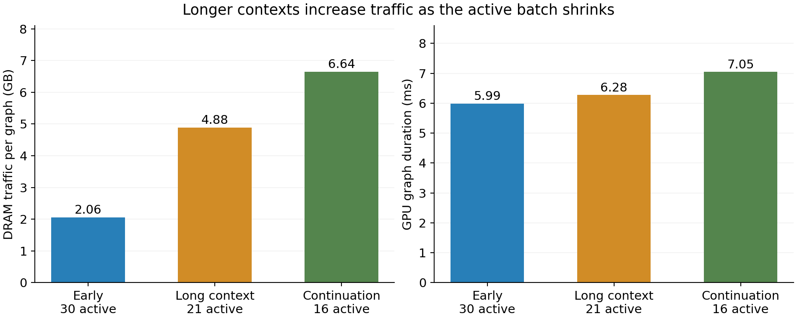

# Core v1: Nsight Compute and the decode roofline

**Measured decode is below the bandwidth roof, with substantial efficiency
headroom. Longer contexts increase DRAM traffic even as the active batch shrinks.**
All three samples lie on the bandwidth-sensitive side of the nominal A100
roofline. They reach **18–49% of nominal HBM bandwidth** and **8–12% of nominal
dense BF16 Tensor Core throughput**. This does not establish bandwidth saturation
or identify a single limiting kernel.

One completed diagnostic attempt reached 18 grader-confirmed answers in
**112.086s**, with three wrong checks. Its timing is **unranked**: Nsight injection,
counter collection and external metrics polling perturb execution. The submission
headline remains the independently measured **5/5 successes, median 77.277s**.
An earlier instrumentation attempt was aborted after a profiling timeout and is
[retained separately](../core-v1-ncu-20261004/README.md).

## Measured roofline



Each dot is one complete CUDA decode graph from the same attempt, collected in a
single pass. The solid line uses the A100 **PCIe 80GB** specifications: 1,935 GB/s
HBM bandwidth and 312 trillion dense BF16 floating-point operations/s. Its ridge
is **161.24 operations/byte**. These are nominal hardware ceilings, not an
empirically calibrated sustained roof. The dashed line is 50% of nominal HBM
bandwidth. [NVIDIA A100 specifications](https://resources.nvidia.com/en-us-gpu/nvidia-a100-datashee-1)

| Sample | Active requests before capture | GPU graph time | DRAM read + write | BF16 Tensor throughput | Tensor ops / DRAM byte | Nominal HBM bandwidth |
| --- | ---: | ---: | ---: | ---: | ---: | ---: |
| Early decode | 30 | 5.986 ms | 2.059 GB | 32.016 TOP/s | 93.07 | 344 GB/s, **17.8%** |
| Long-context decode | 21 | 6.277 ms | 4.885 GB | 37.577 TOP/s | 48.29 | 778 GB/s, **40.2%** |
| After continuation admission | 16 | 7.048 ms | 6.643 GB | 25.390 TOP/s | 26.94 | 943 GB/s, **48.7%** |

The samples were requested at 0.972s, 43.823s and 93.305s after official start.
The middle window followed about 100,000 generated tokens; the last followed the
barrier and admission of exact-token continuations. Request counts are adjacent
serving snapshots, rather than kernel input shapes or useful tokens per graph.
Graph padding and backend work can make executed operations differ from useful
model FLOPs.
The graph-to-window association follows the profiler log order: exactly one
graph was recorded in each of the three start/stop windows.

The y-axis counts **executed dense BF16→FP32 Tensor Core operations**, with
multiply-add counted as two operations. It excludes SIMT arithmetic, conversions,
dequantization, integer/address work and other tensor precision paths. This is a
hardware tensor roofline, not a model FLOP/s estimate. The serving log confirms
NVFP4 weight compression through **Marlin**, BF16 activations and BF16 FlashInfer
KV cache on SM80. A100 has no native FP4 compute path here; neither an FP4 roof
nor the 624 TOP/s sparse BF16 roof applies.

## What the samples imply



**Context traffic is a stronger concern than KV capacity.** DRAM bytes per graph
increase **3.23×**, while the adjacent active-request count falls from 30 to 16.
Graph duration grows by 17.7%, and tensor arithmetic intensity falls from 93.1 to
26.9 operations/byte. Growing attention/KV reads are a plausible explanation;
the aggregate counters do not separate attention traffic from weights,
intermediates or other graph operations. The model has 36 layers, two KV heads
and head dimension 128; BF16 K+V occupy 36,864 bytes per cached token before
allocator overhead. This supports investigating long-context attention traffic,
but is not a per-kernel attribution.

The maximum sampled active KV usage was **7.066% of the allocated KV cache**.
The backend allocated capacity for 2,095,440 tokens. There was no sustained
admission queue: 422 of 423 samples showed zero waiting requests; the initial
0.198s sample showed ten waiting during coverage admission. All three profiling
snapshots had zero waiting requests. Reserving 95% of VRAM is therefore not
evidence of memory-bandwidth saturation or a capacity bottleneck.

**There is a gap below the roof that this capture cannot attribute.** At the
measured intensities, nominal bandwidth permits roughly 180, 93 and 52 TOP/s;
the samples attain 32, 38 and 25. Low intensity limits the nominal attainable
compute rate, but the remaining gap could involve kernel instruction mix,
Marlin dequantization, attention efficiency, occupancy, dependencies or launch
behavior. These measurements do not establish which explanation dominates.

**The grader is still an application-level limit.** In the unprofiled same-seed
control, 18 successes and four wrong checks consumed 66.002s of serial grader
service within a 71.321s result. With those 22 checks retained, even arbitrarily
fast generation cannot remove the 66s toll; only about 5.3s remain outside that
service. Eliminating wrong checks can change that bound. The absolute target
floor is 54s. In this instrumented attempt the grader had 46.173s of idle gaps,
versus 4.216s in the control, illustrating why the profiled timing must not be
used to rank solver performance. Generation and grading overlap; their durations
must not be added as independent stages.

## Where to investigate next

1. **Split attention and Marlin costs.** Collect a few named graph nodes with
   minimal counters, plus a separate Nsight Systems timeline to measure CPU
   scheduling, sampling, HTTP delivery and GPU gaps. This capture measures three
   whole graphs; it cannot supply a kernel-frequency ranking or CPU attribution.
2. **Test ways to reduce long-context traffic.** A supported smaller KV
   representation or an attention backend change is worth a matched-seed
   experiment, measuring both verified accuracy and time. Quantization may add
   conversion costs, so smaller storage alone is not a speed result.
3. **Prioritize earlier correct candidates and fewer wrong checks.** These affect
   the serial grader floor directly. More fresh requests also add attention work:
   the existing v1.5 series used 71.8% more requests without improving the median.
   The roofline does not justify increasing concurrency on its own.

These are proposed investigations; this report adds no serving or solving-policy
optimization to the frozen submission.

## Collection and reproducibility

- Source commit: `d29f05d4850b6c74acea4f8a8ff8033583d9041e`; recorded in
  [config.json](config.json). The tracked source checkout was clean.
- Attempt: [20261004T081606.987701Z](../../../attempts/20261004T081606.987701Z/README.md),
  seed **20261011**, final `prompt_adherence.json` preset. All 30 initial request
  payloads and the compared core settings match the unprofiled same-seed control.
  There were 46 generation requests: 30 initial and 16 continuations, zero later
  fresh starts, with every question within the four-request cap.
- Frozen core manifest: `35d6a06315a0e45441b3ac49bd468a2b94553fb172f378bfebc7ea8cc044070f`.
  Prompt SHA256: `26b591c39bcf55f4c94f5359dcc90d3c5626a524478eee1c5ce44b5038162364`.
- Nsight Compute **2026.1.1.0**, driver **580.178.04**, A100 80GB PCIe, 300W.
  The profiler package was extracted into a user-local tools directory.
  Counter access used a root-owned workload; `RmProfilingAdminOnly: 1` stayed set.
- vLLM **0.30.1rc1.dev623+g4ac0d0eac**, the standard FlashInfer serving profile,
  BF16 KV, prefix caching, 65,536-token context and 95% GPU-memory utilization.
  CUDA graphs remained enabled. The owned fresh server added only
  `--profiler-config '{"profiler":"cuda","max_iterations":1}'`.
- External profiler start/stop calls followed solving counters. Collection used
  `--profile-from-start no --replay-mode kernel --graph-profiling graph
  --kernel-name graph --launch-count 6 --kill no --disable-extra-suffixes`.
  Each of the three captured graphs required **one pass**. No application replay
  or scored-run replay was used. Startup, arithmetic warmup, prefill and kernels
  outside the selected decode graphs are outside the counter scope.
- `--cache-control none --clock-control none` preserved application cache and
  clock behavior. Results are cache/state dependent and are three snapshots,
  not confidence intervals or phase averages. Nsight hook overhead persists
  outside the short collection windows. [NVIDIA profiling and replay guidance](https://docs.nvidia.com/nsight-compute/ProfilingGuide/index.html)

The essential counters were `gpu__time_duration.sum`, `dram__bytes_read.sum`,
`dram__bytes_write.sum`, and
`sm__ops_path_tensor_src_bf16_dst_fp32_sparsity_off.sum`. For operation count O,
read+write bytes B and GPU duration t, the plotted point is `(O/B, O/t)` and
achieved bandwidth is `B/t`. No allocator sizes or model-FLOP estimates enter
those calculations. The synthetic 1024³ BF16 matmul probe returned exactly
2,147,483,648 operations, validating the operation-count convention.

Rebuild the figures from the saved CSV and phase mapping:

```bash
python -m src.profiling.analyze_ncu \
  runs/profiling/core-v1-ncu-20261004-single-pass
```

To repeat collection on an idle node, use a clean checkout and a durable session.
The driver launches one owned server and one frozen attempt; the default batch
name is unique. The administrative invocation preserves access to the user-local
model environment and allows Git to read the user-owned checkout:

```bash
sudo -n env HOME=/home/azureuser \
  GIT_CONFIG_COUNT=1 GIT_CONFIG_KEY_0=safe.directory GIT_CONFIG_VALUE_0="$PWD" \
  /home/azureuser/.venvs/vllm/bin/python -m src.profiling.core_v1_ncu \
  --ncu /home/azureuser/.local/nsight-compute-2026.1.1/opt/nvidia/nsight-compute/2026.1.1/ncu \
  --seed 20261011
```

See [raw counters](ncu_raw.csv), [derived points](roofline_points.csv),
[analysis and control audit](analysis.json), [serving samples](serving_samples.csv),
[backend and hardware evidence](service_metrics.json), and
[attempt outcome and window timestamps](summary.json).
The original 4.7 MiB `decode.ncu-rep` is retained beside these artifacts locally
and on the node at
`/home/azureuser/aime-bench-ncu-d29f05d4/runs/profiling/core-v1-ncu-20261004-single-pass/`;
it is excluded from Git. SHA256:
`3764b2e3d140a5883771774b074d7067be7785ef3b15dd670234baaf6add0682`.

Validation: the 15 frozen-core offline tests passed; the core manifest, payload
comparison, request caps, successful verdicts and raw-profile hash were checked.
The profiling processes exited and released the GPU after collection.
