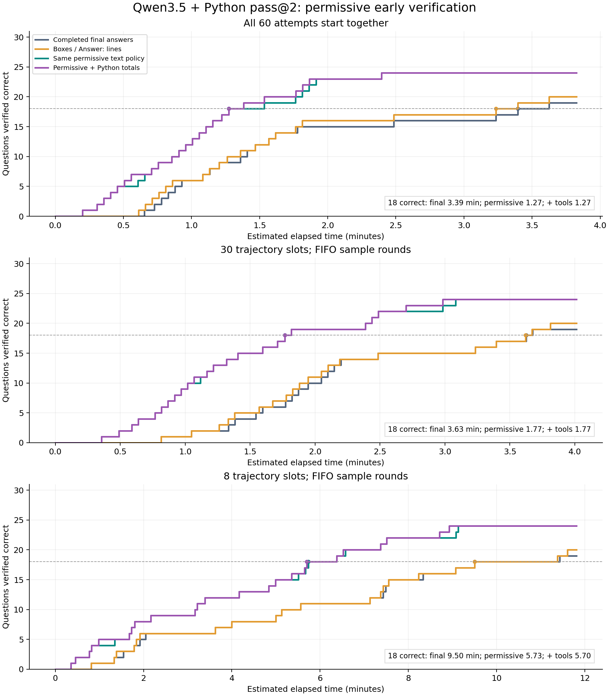

# Permissive early extraction: Qwen3.5 + Python pass@2

60 fixed traces, two per question. Strict final answers cover **19/30**.

| Policy | Recoverable questions | Newly recovered |
|---|---:|---|
| Boxes / Answer: lines | 20 | [26] |
| Same permissive text policy | 24 | [2, 11, 23, 26, 27] |
| Permissive + Python totals | 24 | [2, 11, 23, 26, 27] |

## Time to 18 verified correct questions

| Capacity | Final only | Boxes / Answer: | Same permissive | + Python totals |
|---|---:|---:|---:|---:|
| 60 | 3.39 min | 3.23 min | 1.27 min | 1.27 min |
| 30 | 3.63 min | 3.62 min | 1.77 min | 1.77 min |
| 8 | 9.50 min | 9.50 min | 5.73 min | 5.70 min |



All policies use the same three-second verification queue and retire a question only after a correct completed check. Every wrong candidate costs three seconds. Repeated (question, integer) pairs are checked once. No candidates are selected by correctness.

## Fixed observed starts, without generation rescheduling

| Policy | Time to 18 | Checks before 18 | Wrong checks overall |
|---|---:|---:|---:|
| Completed final answers | 9.50 min | 18 | 0 |
| Boxes / Answer: lines | 9.50 min | 18 | 0 |
| Same permissive text policy | 7.49 min | 22 | 6 |
| Permissive + Python totals | 7.49 min | 22 | 6 |

## Eight-slot verification load

| Policy | Correct questions | Checks before 18 | Wrong checks overall | Peak pending checks |
|---|---:|---:|---:|---:|
| Completed final answers | 19 | 18 | 0 | 1 |
| Boxes / Answer: lines | 20 | 18 | 0 | 1 |
| Same permissive text policy | 24 | 23 | 6 | 1 |
| Permissive + Python totals | 24 | 23 | 6 | 1 |

The same permissive policy reduces time to 18 by **39.7%** in the eight-slot replay. It charges 23 checks before the threshold: 18 positive and 5 negative.

## Recovered source claims

| Question | Sample | Kind | Earlier proposed answer | Approx. seconds into that trace |
|---|---:|---|---|---:|
| 2 | 1 | prose | answer should be 588. | 126.83 |
| 11 | 2 | target_equation | a+b+c+d = 1 + 5 + 185 + 68 = 259$ | 88.17 |
| 23 | 2 | prose | answer should be 610. | 102.95 |
| 26 | 2 | prose | Answer: 113. | 102.81 |
| 27 | 1 | target_equation | m + n + p + q = 9 + 5 + 1 + 4 = 19$ | 81.34 |

## Wrong checks and false-positive audit

The wide net retains hypothetical examples and intermediate quantities. For instance, Q5 discusses a hypothetical N=2200, yielding a proposed difference of 175; Q26 says the answer is 1 for the diameter-only subcase. Neither is the requested final answer. Both consume a negative check and leave inference running. Q24 also contributes an incorrect 150 and a toy/intermediate 20. No approval is inferred from a claim or successful Python execution.

| Question | Proposed integer | Source quote | Charged result |
|---|---:|---|---|
| 5 | 175 | N=2200$ | negative, 3 s |
| 15 | 223 | N = 19683 + 39366 + 721710 + 157464$ | negative, 3 s |
| 24 | 150 | n + t = 150$ | negative, 3 s |
| 24 | 20 | n+t = 20$ | negative, 3 s |
| 26 | 1 | answer is 1. | negative, 3 s |
| 13 | 212 | answer is $212$ | negative, 3 s |

## Python-output extension and timing sensitivity

Q26 sample 2 has Total: 113 in Python output available by **79.96 s**, after 11,984 generated tokens. Its later reasoning contains Answer: 113. around **102.81 s**, after approximately 15,225 tokens. Thus both policies recover Q26; tool-output checking can expose it about **22.85 s earlier** within that trace. Standalone Answer-line detection also recovers Q26, so literal marker coverage is 20/30.

The marker comparison is independently scanned because the original permissive extractor deduplicates some overlapping Answer-line matches into prose. This correction does not change the original permissive candidates or their replay results.

Sensitivity changes only text delivery inside each API round; it does not move a Python result before execution. This varies the illustrative decode exponent across 1, 1.5, 2 and first-token delay across 0, 5, 15 seconds (clipped for short rounds).
- Same permissive text policy: **4.84–6.27 min** to 18; final-only stays 9.50 min.
- Permissive + Python totals: **4.84–5.90 min** to 18; final-only stays 9.50 min.

## Assumptions and reproducibility

- No model requests, remote grader, SSH, or local inference used.
- Original permissive extract_events unchanged; all toy/formatting/negated proposals retained.
- Marker comparison scans literal boxes/Answer lines independently so overlapping prose deduplication cannot hide them; no change to permissive inventory.
- Python-total/bare-number extension reported separately; only literal arithmetic and explicitly requested transforms.
- Tool code literals are excluded from extraction; actual printed stdout is scanned.
- Intermediate text delivery estimated per API round from completed-line Qwen3.5 token fractions; no original SSE timestamps.
- Tool outputs available at the next API-round start, a measured conservative upper bound.
- One shared FIFO verifier, 3s per distinct question-answer pair; wrong candidates charged; saved keys are a perfect-verifier stand-in.
- Negative checks preserve inference. Only a correct completed check stops/skips a question.
- FIFO capacity replays reuse fixed saved full-trajectory durations; actual throughput under changed scheduling is unknown.
- Observed-start shadow retains measured start times and every original attempt, without rescheduling after positive checks.
- No actual cancellation or billing savings measured.

```bash
.venv/bin/python -m unittest test.test_python_early_verify test.test_backtest_early_verify
.venv/bin/python -m src.experiments.python_tools.backtest_python_early_verify
```

Raw candidates, source quotes, per-round offsets and token audits are in `candidate_inventory.json`. All charged checks, milestones, generation starts and timing-sensitivity results are in `summary.json`. Original traces remain unchanged.
