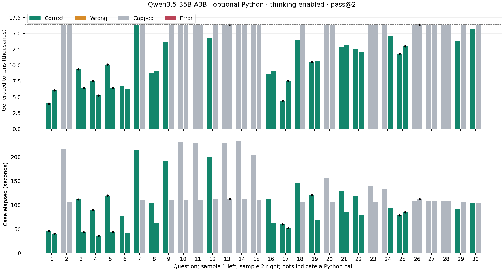
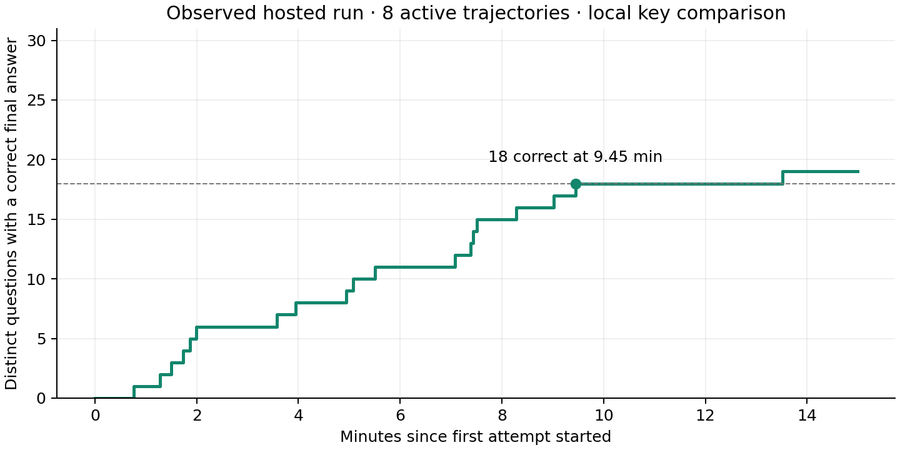

# Optional Python, thinking enabled: all 30 questions, pass@2

Observed 60/60 terminal attempts. Empirical pass@2: **19/30**; correct attempts: **31/60**.

Python used by **15 attempts**; **15/16** tool calls succeeded.

Profile wall time: 899.2 s. Generated tokens: 789907; input tokens: 60571. Reported cost: $0.798993.

Model API rounds across all attempts: 76.

Status counts: {'complete': 31, 'generation_budget_exhausted': 29}.

Median tokens through first tool call: 6239; median first-call arrival: 54.583051125053316 s.

Total isolated Python wall time: 1.793 s.

Native Python execution time: 0.0225 s. First-sample correct questions: 18; second-sample correct questions: 13. Questions rescued by sample 2: [24].

Questions capped in both samples: [2, 10, 11, 13, 14, 15, 20, 23, 26, 27, 28]. Questions with any Python call: [1, 3, 4, 5, 13, 17, 19, 25, 26].





The step graph uses actual final-response arrival times and local exact-key comparisons. It does **not** include the hypothetical three-second verifier from the earlier back-test.

Thinking is enabled and tool_choice is auto on every round. There is no forced first call or separate reasoning-token budget. The existing 16,384 cumulative output ceiling remains, with broad 16-round/16-tool guards and the existing restricted math worker.

Eight hosted trajectories can be active, with two concurrent CPU workers. This is not a local A100 measurement. Both samples run even when the first is correct.

## Per-question outcomes

| Question | Sample 1: answer / outcome | Sample 2: answer / outcome | Python calls (1 / 2) | Pass@2 |
|---|---|---|---|---|
| 1 | 70 / correct | 70 / correct | 1 / 1 | yes |
| 2 | — / generation_budget_exhausted | — / generation_budget_exhausted | 0 / 0 | no |
| 3 | 16 / correct | 16 / correct | 1 / 1 | yes |
| 4 | 117 / correct | 117 / correct | 1 / 1 | yes |
| 5 | 279 / correct | 279 / correct | 1 / 1 | yes |
| 6 | 504 / correct | 504 / correct | 0 / 0 | yes |
| 7 | 821 / correct | — / generation_budget_exhausted | 0 / 0 | yes |
| 8 | 77 / correct | 77 / correct | 0 / 0 | yes |
| 9 | 62 / correct | — / generation_budget_exhausted | 0 / 0 | yes |
| 10 | — / generation_budget_exhausted | — / generation_budget_exhausted | 0 / 0 | no |
| 11 | — / generation_budget_exhausted | — / generation_budget_exhausted | 0 / 0 | no |
| 12 | 510 / correct | — / generation_budget_exhausted | 0 / 0 | yes |
| 13 | — / generation_budget_exhausted | — / generation_budget_exhausted | 0 / 1 | no |
| 14 | — / generation_budget_exhausted | — / generation_budget_exhausted | 0 / 0 | no |
| 15 | — / generation_budget_exhausted | — / generation_budget_exhausted | 0 / 0 | no |
| 16 | 468 / correct | 468 / correct | 0 / 0 | yes |
| 17 | 49 / correct | 49 / correct | 1 / 1 | yes |
| 18 | 82 / correct | — / generation_budget_exhausted | 0 / 0 | yes |
| 19 | 106 / correct | 106 / correct | 1 / 0 | yes |
| 20 | — / generation_budget_exhausted | — / generation_budget_exhausted | 0 / 0 | no |
| 21 | 293 / correct | 293 / correct | 0 / 0 | yes |
| 22 | 237 / correct | 237 / correct | 0 / 0 | yes |
| 23 | — / generation_budget_exhausted | — / generation_budget_exhausted | 0 / 0 | no |
| 24 | — / generation_budget_exhausted | 149 / correct | 0 / 0 | yes |
| 25 | 907 / correct | 907 / correct | 1 / 1 | yes |
| 26 | — / generation_budget_exhausted | — / generation_budget_exhausted | 0 / 2 | no |
| 27 | — / generation_budget_exhausted | — / generation_budget_exhausted | 0 / 0 | no |
| 28 | — / generation_budget_exhausted | — / generation_budget_exhausted | 0 / 0 | no |
| 29 | 104 / correct | — / generation_budget_exhausted | 0 / 0 | yes |
| 30 | 240 / correct | — / generation_budget_exhausted | 0 / 0 | yes |

## Interpretation limits

This profiles optional tool use; it has no matched no-tool arm across all 30 questions. Questions where the model elects to use Python differ from questions where it does not, so group medians are descriptive and cannot establish a causal speedup. The earlier historical pass@8 used a different Qwen model. Two samples per question provide limited precision and no conclusion about the best reasoning budget.

Capped, errored, and unfinished answers are excluded from successful solves. Any matching extracted integer in a capped response is retained as answer_correct in its raw record, separately from the strict correct flag.

No SSH, provided grader, local llama inference, or answer key in model inputs.

## Tool errors

```json
{
  "ValueError: Only the listed mathematical standard-library modules may be imported": 1
}
```

## Q26: correct tool output, no final answer

Q26 asks for equal-length perfect matchings on the vertices of a regular 24-gon. Sample 2 generated a Python program that computed the sum of the matching counts for each chord length and printed **Total: 113**, matching the saved key. A second Python call summed the counts again and printed **113**. The model then used its remaining tokens on reasoning and never emitted a final answer.

The first result arrived after 11,984 generated tokens and approximately 79.96 seconds. The second call arrived after 15,339 generated tokens. The complete attempt exhausted 16,384 tokens.

This is a concrete post-hoc recovery opportunity, **excluded from strict pass@2**. Accepting arbitrary tool stdout as a final answer would need a separate extraction and verification policy; a successful execution alone does not prove a computation answers the requested question correctly.

[Raw Q26 trajectory](26-sample-2.json)
